# Airline Management System — Low Level Design (LLD) Study Guide

> **Purpose:** Revision-ready LLD document for a **1-hour interview** scope. Combines patterns from your **Car Rental** (payment strategy, booking lifecycle), **Book My Show** (seat locking, concurrent booking), and **ParkingLot** (manual wiring, factory pattern).
>
> **Stack context:** Java / Spring Boot (`com.airline.airline`) — design is framework-agnostic; persistence shown as relational schema + in-memory repositories.

---

## Table of Contents

1. [Problem Statement](#1-problem-statement)
2. [Requirements (8–10 Core)](#2-requirements-810-core)
3. [Assumptions & Out of Scope](#3-assumptions--out-of-scope)
4. [Design Patterns Used](#4-design-patterns-used)
5. [High-Level Architecture](#5-high-level-architecture)
6. [Class Diagram](#6-class-diagram)
7. [Database Schema Diagram](#7-database-schema-diagram)
8. [Core Flows](#8-core-flows)
9. [Book Flight — Step by Step (Interview Cheat Sheet)](#9-book-flight--step-by-step-interview-cheat-sheet)
10. [Strategy Patterns — Deep Dive](#10-strategy-patterns--deep-dive)
11. [Seat Locking & Concurrency](#11-seat-locking--concurrency)
12. [State Machines](#12-state-machines)
13. [Suggested Package Structure](#13-suggested-package-structure)
14. [API Sketch](#14-api-sketch)
15. [Edge Cases & Validation](#15-edge-cases--validation)
16. [1-Hour Interview Time Plan](#16-1-hour-interview-time-plan)
17. [Interview Talking Points](#17-interview-talking-points)
18. [Cross-Project Mapping](#18-cross-project-mapping)
19. [Quick Revision Checklist](#19-quick-revision-checklist)

---

## 1. Problem Statement

Design an **airline ticket booking system** where:

- Passengers **search flights** by origin, destination, and travel date
- Passengers **view available seats** on a flight (Economy / Business / First)
- Passengers **book seats**, pay via a pluggable payment method, and receive a **PNR** (booking reference)
- The system prevents **double booking** of the same seat
- Passengers can **cancel** a confirmed booking (with refund rules)
- Passengers can **check in** before departure and get a **boarding pass**

The design must be **extensible** — adding a new payment method or fare class should not require changing core booking logic.

---

## 2. Requirements (8–10 Core)

### Functional Requirements

| ID | Requirement | Interview one-liner |
|----|-------------|---------------------|
| **FR-1** | Admin can register **airports** and **aircraft** (with seat layout) | Static catalog setup |
| **FR-2** | Admin can schedule **flights** (route, aircraft, departure/arrival time, base fare per class) | Flight = one instance of a route on a date |
| **FR-3** | Passenger can **search flights** by source airport, destination airport, and date | Like car search by location + date |
| **FR-4** | Passenger can view **available seats** on a flight, grouped by **seat class** | Like BMS show seat map |
| **FR-5** | Passenger can **hold seats** temporarily (soft lock ~10 min) while paying | Borrowed from BMS `BLOCKED` + `lockedAt` |
| **FR-6** | Passenger can **book seats** — payment succeeds → seats confirmed, PNR generated | Atomic booking + payment |
| **FR-7** | System calculates **total fare** based on seat class pricing (Strategy pattern) | Economy vs Business multiplier |
| **FR-8** | Passenger can **cancel** a confirmed booking before departure; refund per policy | Reuse payment strategy refund |
| **FR-9** | Passenger can **check in** (24h before flight) and receive a **boarding pass** | State transition CONFIRMED → CHECKED_IN |
| **FR-10** | Passenger can view **booking history** by passenger ID | Simple read via repository |

### Non-Functional Requirements

| ID | Requirement |
|----|-------------|
| **NFR-1** | Payment methods pluggable without modifying `BookingService` |
| **NFR-2** | In-memory storage acceptable for LLD; schema provided for production |
| **NFR-3** | No two confirmed bookings for the same `FlightSeat` |
| **NFR-4** | Idempotent payment attempts (same idempotency key → same result) |

> **Tip in interview:** State FR-1 to FR-6 first (must-have for 1 hr). Add FR-7–FR-10 if interviewer agrees or time permits.

---

## 3. Assumptions & Out of Scope

### Assumptions

- Single airline (single tenant)
- **Direct flights only** (no connecting flights / layovers)
- One passenger books for themselves (no multi-passenger PNR split in v1)
- Payment at booking time (prepaid)
- Seat = `(flightId, seatNumber)` — each flight gets its own seat inventory copied from aircraft layout at schedule time
- Currency is single (INR)
- Check-in opens **24 hours** before departure

### Out of Scope (say this explicitly)

- Multi-city / round-trip itineraries
- Dynamic pricing, coupons, loyalty miles
- Baggage weight / excess baggage fees
- Real payment gateway (mock/stub is fine)
- Crew scheduling, maintenance, fuel management
- Flight delay/cancellation notifications (Observer is a bonus mention only)
- Visa / passport validation
- Web UI — API or `Client.java` test driver is enough

---

## 4. Design Patterns Used

| Pattern | Where | Why |
|---------|-------|-----|
| **Strategy** | `PaymentStrategy` (+ CreditCard, UPI, Wallet) | Open/Closed — new payment types without touching booking code |
| **Strategy** | `FareCalculationStrategy` (+ Economy, Business, First) | Different fare rules per seat class |
| **Factory / Registry** | `PaymentStrategyFactory`, `FareStrategyFactory` | Central lookup by enum; no if-else chains |
| **Repository** | `FlightRepository`, `FlightSeatRepository`, `BookingRepository`, etc. | Decouple domain from storage |
| **State** | `BookingStatus`, `FlightSeatStatus`, `FlightStatus` | Enforce valid lifecycle transitions |
| **Singleton** *(optional)* | Factories as Spring `@Component` | One registry in app context |
| **Observer** *(bonus)* | `BookingEventPublisher` on CONFIRMED/CANCELLED | Decouple notifications |

### Primary patterns to explain in interview

1. **Payment Strategy** — same as Car Rental (`PaymentStrategyFactory` + implementations)
2. **Fare Strategy** — `FareCalculationStrategy.calculate(baseFare, seatClass)` 
3. **Seat locking** — same idea as Book My Show `ShowSeatStatus.BLOCKED` + timeout

> *"BookingService depends on interfaces, not concrete classes. Payment and fare logic are separate bounded contexts. Adding Net Banking or Premium Economy = new strategy class + factory registration — zero change to booking flow."*

---

## 6. Class Diagram

### 6.1 Core Entities & Services

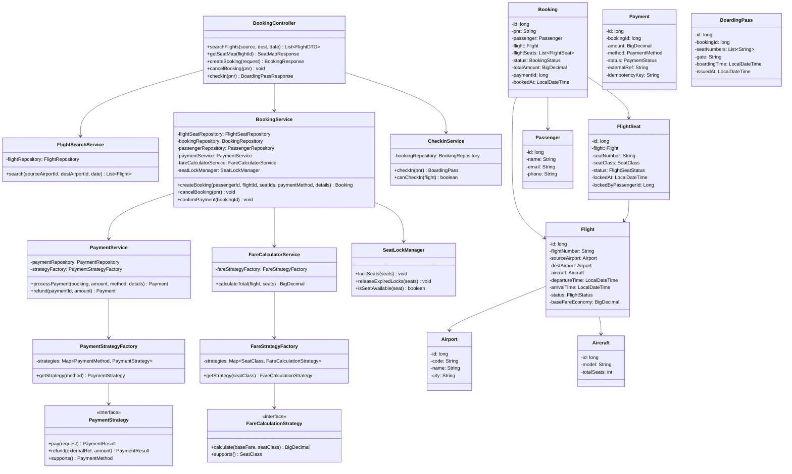

### 6.2 Enums

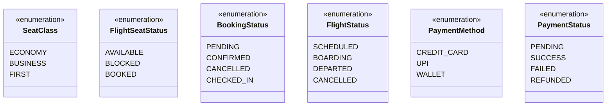

### 6.3 How to explain the class diagram in 2 minutes

1. **Entities:** `Flight` has many `FlightSeat` (inventory per flight). `Booking` links `Passenger` + `Flight` + selected `FlightSeat`s.
2. **Services:** Controller delegates to `FlightSearchService`, `BookingService`, `CheckInService`.
3. **Strategies:** Payment and fare are pluggable via factories — booking service never sees if-else on payment type or seat class.
4. **SeatLockManager:** Encapsulates BMS-style soft lock logic — keeps `BookingService` clean.
5. **Repositories:** All persistence behind interfaces — swap in-memory `TreeMap` for JPA later.

---

## 7. Database Schema Diagram

```mermaid
erDiagram
    AIRPORT ||--o{ FLIGHT : "source/dest"
    AIRCRAFT ||--o{ FLIGHT : operates
    FLIGHT ||--o{ FLIGHT_SEAT : contains
    PASSENGER ||--o{ BOOKING : makes
    FLIGHT ||--o{ BOOKING : "for"
    BOOKING ||--o{ BOOKING_SEAT : includes
    FLIGHT_SEAT ||--o| BOOKING_SEAT : "assigned via"
    BOOKING ||--|| PAYMENT : "paid by"
    BOOKING ||--o| BOARDING_PASS : "may have"

    AIRPORT {
        bigint id PK
        varchar code UK
        varchar name
        varchar city
        timestamp created_at
    }

    AIRCRAFT {
        bigint id PK
        varchar model
        int total_seats
        timestamp created_at
    }

    FLIGHT {
        bigint id PK
        varchar flight_number
        bigint source_airport_id FK
        bigint dest_airport_id FK
        bigint aircraft_id FK
        timestamp departure_time
        timestamp arrival_time
        decimal base_fare_economy
        varchar status
        timestamp created_at
    }

    FLIGHT_SEAT {
        bigint id PK
        bigint flight_id FK
        varchar seat_number
        varchar seat_class
        varchar status
        timestamp locked_at
        bigint locked_by_passenger_id FK
        unique_flight_seat "UNIQUE(flight_id, seat_number)"
    }

    PASSENGER {
        bigint id PK
        varchar name
        varchar email UK
        varchar phone
        timestamp created_at
    }

    BOOKING {
        bigint id PK
        varchar pnr UK
        bigint passenger_id FK
        bigint flight_id FK
        varchar status
        decimal total_amount
        bigint payment_id FK
        timestamp booked_at
        timestamp updated_at
    }

    BOOKING_SEAT {
        bigint id PK
        bigint booking_id FK
        bigint flight_seat_id FK UK
    }

    PAYMENT {
        bigint id PK
        bigint booking_id FK UK
        decimal amount
        varchar method
        varchar status
        varchar external_ref
        varchar idempotency_key UK
        timestamp paid_at
    }

    BOARDING_PASS {
        bigint id PK
        bigint booking_id FK UK
        varchar gate
        timestamp boarding_time
        timestamp issued_at
    }
```

### Schema Notes

| Table | Key constraints |
|-------|-----------------|
| `FLIGHT_SEAT` | `UNIQUE(flight_id, seat_number)` — one row per seat per flight; index on `(flight_id, status)` for seat map queries |
| `BOOKING_SEAT` | `flight_seat_id` unique — a seat can belong to at most one active booking |
| `BOOKING` | `pnr` unique (6-char alphanumeric, e.g. `AB12CD`) |
| `PAYMENT` | One payment per booking; `idempotency_key` prevents duplicate charges |
| `FLIGHT` | Index on `(source_airport_id, dest_airport_id, departure_time)` for search |

### Seat availability query (conceptual)

```sql
-- Seat is available if status = AVAILABLE
-- OR status = BLOCKED and locked_at older than 10 minutes
SELECT fs.*
FROM flight_seat fs
WHERE fs.flight_id = :flightId
  AND (
    fs.status = 'AVAILABLE'
    OR (fs.status = 'BLOCKED' AND fs.locked_at < NOW() - INTERVAL '10 minutes')
  );
```

### How to explain schema in interview

1. Start with **catalog** (`AIRPORT`, `AIRCRAFT`, `FLIGHT`) — admin/setup tables.
2. **Inventory** is `FLIGHT_SEAT` — created when flight is scheduled (copy from aircraft template).
3. **Transaction tables:** `BOOKING` → `BOOKING_SEAT` (junction) → `PAYMENT`.
4. Highlight **`BOOKING_SEAT.flight_seat_id UNIQUE`** — DB-level guard against double booking.
5. Mention `BOARDING_PASS` as 1:1 optional extension of confirmed booking.

---

## 8. Core Flows

### 8.1 Search Flights

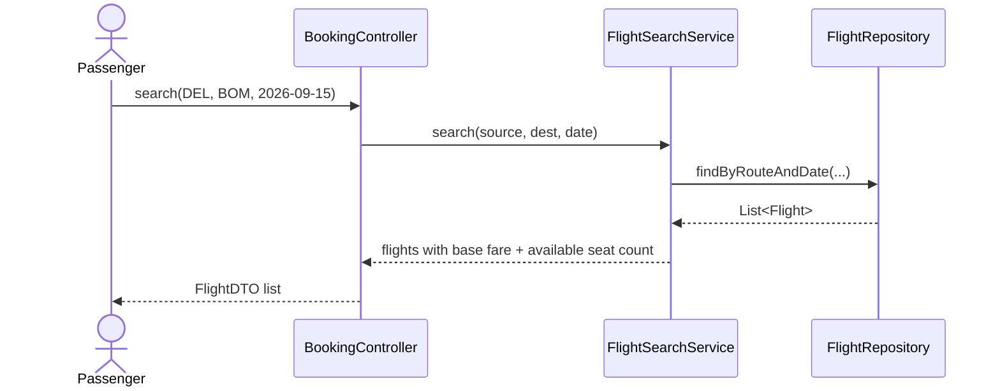

### 8.2 View Seat Map

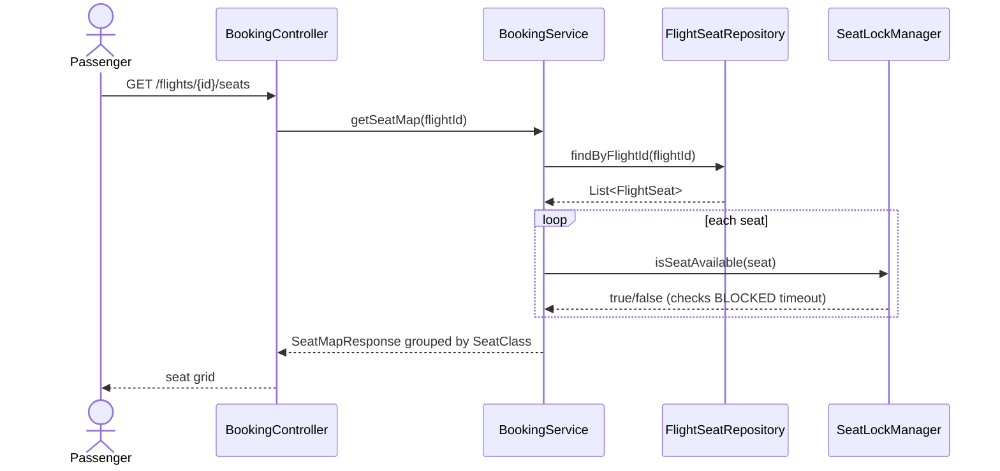

### 8.3 Book Seats + Payment (main flow)

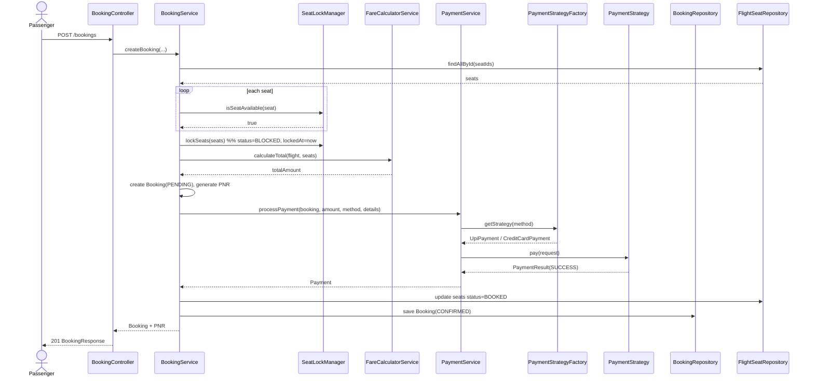

### 8.4 Cancel Booking + Refund

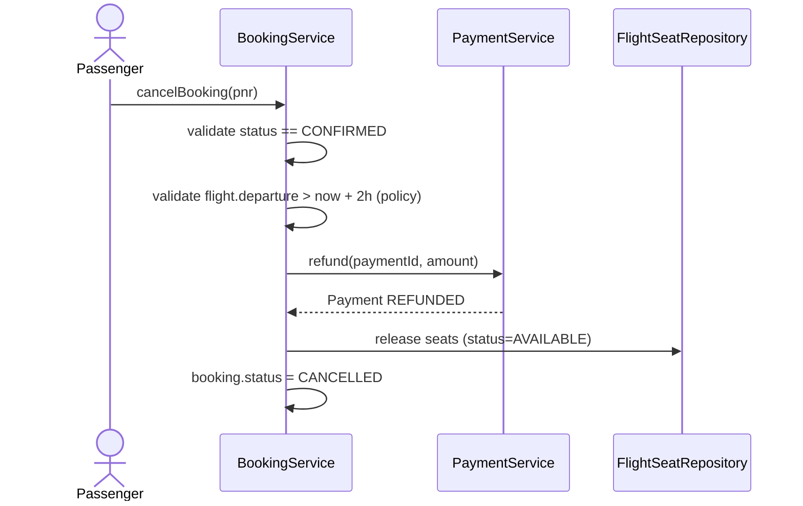

### 8.5 Check-In

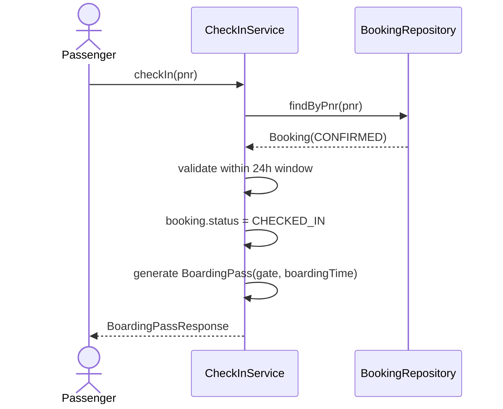

---

## 9. Book Flight — Step by Step (Interview Cheat Sheet)

> **This is the ONE feature to memorize and code in a 1-hour interview.**
> Code reference: `BookingService.createBooking()` in the airline project.

### 9.1 The 10 Steps (memorize in order)

| Step | What happens | Class / method | State change |
|------|--------------|----------------|--------------|
| **1** | Validate passenger exists | `PassengerRepository.findById()` | — |
| **2** | Validate flight exists and is not cancelled | `FlightRepository.findById()` | — |
| **3** | Fetch all seats by seat IDs | `FlightSeatRepository.findAllById()` | — |
| **4** | Check each seat belongs to this flight and is available | `SeatLockManager.isSeatAvailable()` | Expired BLOCKED → AVAILABLE |
| **5** | Soft-lock seats while payment runs (10 min TTL) | `SeatLockManager.lockSeats()` | AVAILABLE → **BLOCKED** |
| **6** | Calculate total fare per seat class | `FareCalculatorService.calculateTotal()` | — |
| **7** | Create booking in PENDING state (not confirmed yet) | `BookingRepository.save()` | Booking = **PENDING** |
| **8** | Process payment via Strategy pattern | `PaymentStrategyFactory` → `pay()` | Payment = SUCCESS / FAILED |
| **9** | On payment success: confirm seats, generate PNR | `confirmSeats()`, save booking | Seats → **BOOKED**, Booking → **CONFIRMED** |
| **10** | On payment failure: release seats | `SeatLockManager.releaseSeats()` | BLOCKED → **AVAILABLE** |

### 9.2 Step 8 breakdown (payment sub-steps)

| Sub-step | What happens |
|----------|--------------|
| **8a** | Check idempotency key — return existing payment if retry |
| **8b** | `PaymentStrategyFactory.getStrategy(method)` → call `pay(amount)` |
| **8c** | Save payment record with SUCCESS status |

### 9.3 Seat status during book flow

```
Step 4 check:  AVAILABLE  (or BLOCKED if lock expired → auto-release)
Step 5 lock:   BLOCKED    (held for this passenger, 10 min timer starts)
Step 9 confirm: BOOKED    (permanent — no one else can take it)
Step 10 fail:  AVAILABLE   (rollback — seat freed for others)
```

### 9.4 Booking status during book flow

```
Step 7 create:  PENDING     (seats locked, payment not done yet)
Step 9 success: CONFIRMED   (payment OK, PNR assigned e.g. PNR0001)
Step 10 fail:   (no booking saved as CONFIRMED — seats released)
```

### 9.5 Pseudo-code (write this in interview)

```
createBooking(passengerId, flightId, seatIds, paymentMethod):

  // Steps 1–2: Validate
  passenger = passengerRepo.find(passengerId)  OR throw
  flight      = flightRepo.find(flightId)      OR throw
  if flight.cancelled → throw

  // Steps 3–4: Seats
  seats = seatRepo.findAll(seatIds)
  for seat in seats:
    if seat.flightId != flightId → throw
    if !seatLockManager.isAvailable(seat) → throw

  // Step 5: Lock
  seatLockManager.lock(seats, passengerId)
  seatRepo.saveAll(seats)

  // Step 6–7: Fare + pending booking
  amount  = fareCalculator.calculate(flight, seats)
  booking = save Booking(PENDING, amount)

  try:
    // Step 8: Pay
    payment = processPayment(booking.id, amount, paymentMethod)

    // Step 9: Confirm
    booking.status = CONFIRMED
    booking.pnr    = generatePnr(booking.id)
    seatLockManager.confirmSeats(seats)
    save booking + seats
    return booking

  catch PaymentFailed:
    // Step 10: Rollback
    seatLockManager.releaseSeats(seats)
    throw
```

### 9.6 What to code vs what to skip (1 hour)

| Must code | Can skip (mention only) |
|-----------|-------------------------|
| Steps 1–10 in `BookingService` | Search flight (`FlightSearchService`) |
| `SeatLockManager` (Steps 4, 5, 9, 10) | Check-in |
| 1 `PaymentStrategy` + Factory | Cancel + refund |
| In-memory repos | DTOs / Controller (call service from `main`) |
| `Client` with 2 test cases | 3 fare strategies (inline multiplier OK) |

### 9.7 Two test cases to demo

```
Test 1 (happy path):
  Book seats 12A + 12B → PNR0001, CONFIRMED, amount printed

Test 2 (failure):
  User A books 14C → SUCCESS
  User B books 14C → FAILURE "Seat 14C is not available"
```

### 9.8 Key files to read in the codebase

| File | Why |
|------|-----|
| `services/BookingService.java` | All 10 steps with inline comments |
| `services/SeatLockManager.java` | Seat lock logic (Steps 4, 5, 9, 10) |
| `services/FareCalculatorService.java` | Step 6 fare calculation |
| `factories/PaymentStrategyFactory.java` | Step 8b strategy lookup |
| `Client.java` | End-to-end demo |

---

## 10. Strategy Patterns — Deep Dive

### 10.1 Payment Strategy (reuse from Car Rental)

Same structure as `carrental/paymentStrategies/`:

| Class | Metadata | Mock decline rule |
|-------|----------|-------------------|
| `CreditCardPayment` | `cardToken` | Token ending in `0000` |
| `UpiPayment` | `upiId` | Blank UPI ID |
| `WalletPayment` | `walletId` | Insufficient balance flag |

**Interface sketch (no full impl needed in interview):**

```
PaymentStrategy
  + pay(PaymentRequest) → PaymentResult
  + refund(externalRef, amount) → PaymentResult
  + supports() → PaymentMethod

PaymentStrategyFactory
  + getStrategy(PaymentMethod) → PaymentStrategy
```

### 10.2 Fare Calculation Strategy (airline-specific)

| Class | Rule |
|-------|------|
| `EconomyFareStrategy` | `baseFare × 1.0` |
| `BusinessFareStrategy` | `baseFare × 2.5` |
| `FirstClassFareStrategy` | `baseFare × 4.0` |

```
FareCalculationStrategy
  + calculate(BigDecimal baseFare) → BigDecimal
  + supports() → SeatClass

FareCalculatorService.calculateTotal(flight, seats):
  for each seat:
    strategy = factory.getStrategy(seat.seatClass)
    total += strategy.calculate(flight.baseFareEconomy)
  return total
```

> **Interview line:** *"Base fare is stored on Flight for Economy. Business and First use multipliers via Strategy — same Open/Closed benefit as payment."*

### 10.3 Why two Strategy patterns?

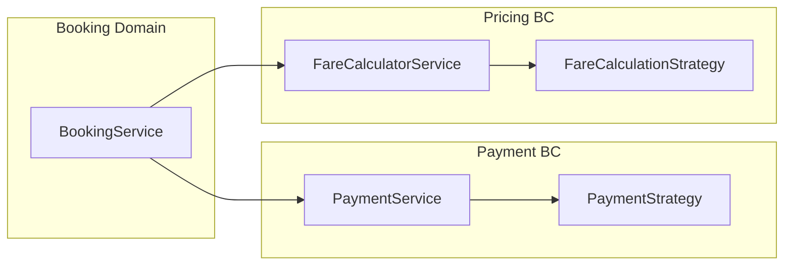

Each bounded context evolves independently. Interviewer sees you understand **separation of concerns**, not just pattern names.

---

## 11. Seat Locking & Concurrency

Borrowed directly from **Book My Show** `BookingServices.bookMovie()`:

### Rules

| Status | Meaning |
|--------|---------|
| `AVAILABLE` | Can be selected |
| `BLOCKED` | Soft-locked during payment (10 min TTL) |
| `BOOKED` | Confirmed after payment |

### Availability check

```
seat is available IF:
  status == AVAILABLE
  OR (status == BLOCKED AND lockedAt + 10min < now)
```

### Concurrency talking points

| LLD (1 hr) | Production |
|------------|------------|
| `synchronized` on `flightId` in `BookingService` | `SELECT FOR UPDATE` on seat rows |
| In-memory lock in `SeatLockManager` | Redis distributed lock with TTL |
| Validate then update in same method | DB transaction with SERIALIZABLE isolation (like BMS) |

### Prevent double booking (3 layers — good interview answer)

1. **Application:** `SeatLockManager.isSeatAvailable()` before lock
2. **Database:** `UNIQUE(flight_id, seat_number)` + `BOOKING_SEAT.flight_seat_id UNIQUE`
3. **Transaction:** Lock seats → pay → confirm in one logical unit; rollback seats on payment failure

---

## 12. State Machines

### Booking lifecycle

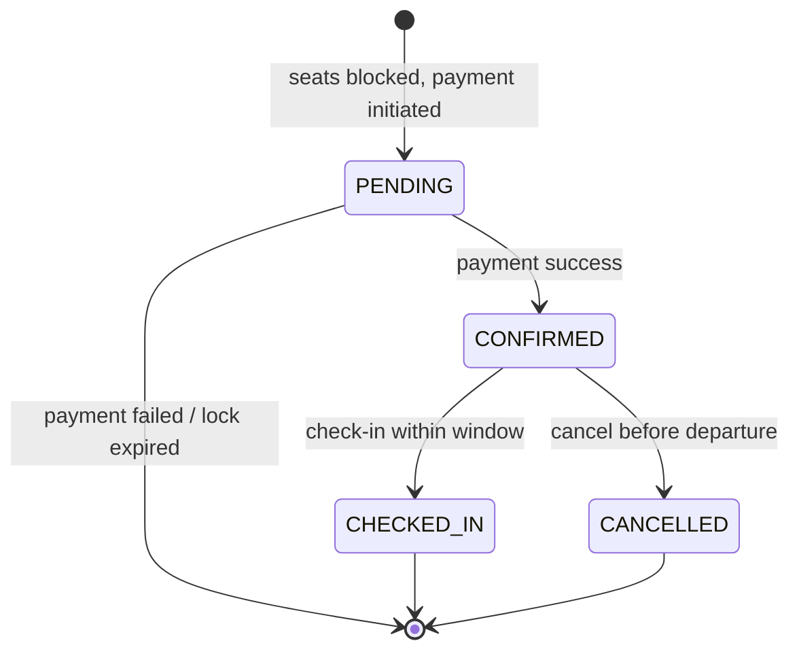

### FlightSeat lifecycle

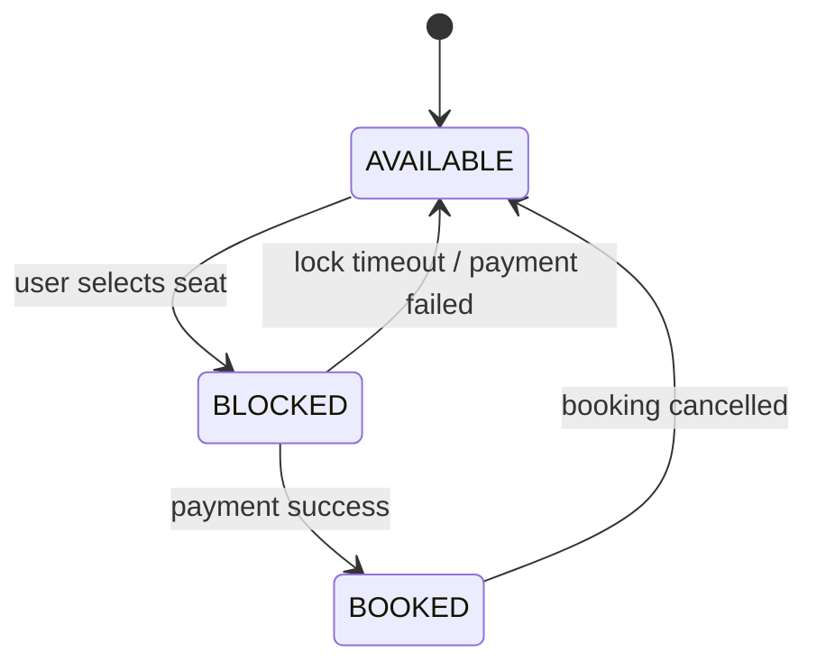

### Flight lifecycle (admin / ops — mention only)

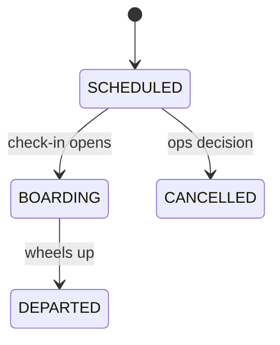

---

## 13. Suggested Package Structure

Aligned with **carrental** and **ParkingLot** style (manual wiring, no REST required for LLD):

```
com.airline.airline/
├── AirlineApplication.java       ← main + initialiseDatabase()
├── Client.java                   ← testCase1: search → book → checkIn
├── controller/
│   └── BookingController.java
├── services/
│   ├── FlightSearchService.java
│   ├── BookingService.java
│   ├── CheckInService.java
│   ├── FareCalculatorService.java
│   ├── PaymentService.java
│   └── SeatLockManager.java
├── paymentStrategies/            ← from carrental
│   ├── PaymentStrategy.java
│   ├── CreditCardPayment.java
│   ├── UpiPayment.java
│   └── WalletPayment.java
├── fareStrategies/               ← airline-specific
│   ├── FareCalculationStrategy.java
│   ├── EconomyFareStrategy.java
│   ├── BusinessFareStrategy.java
│   └── FirstClassFareStrategy.java
├── factories/
│   ├── PaymentStrategyFactory.java
│   └── FareStrategyFactory.java
├── models/
│   ├── BaseModel.java            ← long id, createdAt (like carrental)
│   ├── Airport.java
│   ├── Aircraft.java
│   ├── Flight.java
│   ├── FlightSeat.java
│   ├── Passenger.java
│   ├── Booking.java
│   ├── Payment.java
│   └── BoardingPass.java
├── enums/
│   ├── SeatClass.java
│   ├── FlightSeatStatus.java
│   ├── BookingStatus.java
│   ├── FlightStatus.java
│   ├── PaymentMethod.java
│   └── PaymentStatus.java
├── repository/
│   ├── FlightRepository.java
│   ├── FlightSeatRepository.java
│   ├── BookingRepository.java
│   ├── PaymentRepository.java
│   └── PassengerRepository.java
├── dto/
│   ├── SearchFlightRequestDTO.java
│   ├── BookFlightRequestDTO.java
│   ├── BookFlightResponseDTO.java
│   └── SeatMapResponseDTO.java
└── exceptions/
    ├── FlightNotFoundException.java
    ├── SeatNotAvailableException.java
    ├── PaymentFailedException.java
    ├── InvalidBookingStateException.java
    └── CheckInNotAllowedException.java
```

### What to code in 1 hour (priority order)

| Priority | Classes | ~Minutes |
|----------|---------|----------|
| P0 | Enums, `BaseModel`, `Flight`, `FlightSeat`, `Passenger`, `Booking` | 10 |
| P0 | Repositories (in-memory `TreeMap`) | 8 |
| P0 | `SeatLockManager`, `BookingService.createBooking()` | 15 |
| P1 | `PaymentStrategy` + 1 impl + `PaymentStrategyFactory` + `PaymentService` | 12 |
| P1 | `FareCalculationStrategy` + `FareCalculatorService` | 8 |
| P2 | `BookingController`, `Client.java` demo | 7 |

Skip `CheckInService` if running out of time — mention it verbally.

---

## 14. API Sketch

| Method | Endpoint | Description |
|--------|----------|-------------|
| GET | `/api/v1/flights?source=DEL&dest=BOM&date=2026-09-15` | Search flights |
| GET | `/api/v1/flights/{flightId}/seats` | Seat map with availability |
| POST | `/api/v1/bookings` | Block seats + pay + confirm |
| GET | `/api/v1/bookings/{pnr}` | Get booking details |
| POST | `/api/v1/bookings/{pnr}/cancel` | Cancel + refund |
| POST | `/api/v1/bookings/{pnr}/check-in` | Check in + boarding pass |
| GET | `/api/v1/passengers/{id}/bookings` | Booking history |

### Sample booking request

```json
{
  "passengerId": 1,
  "flightId": 101,
  "seatIds": [1001, 1002],
  "paymentMethod": "UPI",
  "paymentDetails": {
    "upiId": "passenger@upi",
    "idempotencyKey": "req-xyz-789"
  }
}
```

### Sample booking response

```json
{
  "pnr": "XK7M2P",
  "status": "CONFIRMED",
  "totalAmount": 8500.00,
  "seats": ["12A", "12B"],
  "flightNumber": "AI-202"
}
```

---

## 15. Edge Cases & Validation

| Scenario | Expected behavior |
|----------|---------------------|
| Seat already BOOKED | `SeatNotAvailableException` |
| Seat BLOCKED by another user (< 10 min) | `SeatNotAvailableException` |
| Payment fails | Release seats (BLOCKED → AVAILABLE); no CONFIRMED booking |
| Duplicate request (same idempotency key) | Return existing payment/booking |
| Cancel after check-in | Reject — only `CONFIRMED` can cancel |
| Cancel within 2h of departure | Reject or partial refund (state policy) |
| Check-in before 24h window | `CheckInNotAllowedException` |
| Check-in on CANCELLED booking | Reject |
| Book seats from different flights in one request | Reject — one flight per booking |
| Flight status CANCELLED | Reject new bookings |

### Transaction boundary (critical talking point)

> Seat lock → payment → seat confirm → booking save must be **one logical unit**. If payment fails, seats must revert. In production: DB transaction or saga; in LLD: enforce ordering in `BookingService` and never save CONFIRMED before payment SUCCESS.

---

## 16. 1-Hour Interview Time Plan

| Minutes | Activity |
|---------|----------|
| **0–5** | Clarify requirements; state assumptions & out-of-scope |
| **5–12** | List entities + enums; draw **ER diagram** (7 tables) |
| **12–22** | Draw **class diagram** — services, strategies, repositories |
| **22–35** | Walk through **book + pay sequence diagram**; explain seat locking |
| **35–45** | Explain **Payment Strategy** + **Fare Strategy** + factories |
| **45–52** | State machines (Booking + FlightSeat); edge cases |
| **52–60** | Code: enums → models → repo → BookingService → one payment strategy → Client demo |

### If interviewer splits design vs code (45 + 45)

- **Design round:** Sections 2–11 + edge cases
- **Code round:** Package structure P0 + P1 only; stub `CheckInService`

---

## 17. Interview Talking Points

### "How is this different from Book My Show?"

| Book My Show | Airline |
|--------------|---------|
| `Show` | `Flight` |
| `ShowSeat` | `FlightSeat` |
| `Movie` | Route (source → dest) |
| Block 15 min | Block 10 min |
| No PNR | PNR generated on confirm |
| No check-in | Check-in + boarding pass |

Same seat-lock pattern; airline adds **fare class strategy** and **PNR**.

### "How is this similar to Car Rental?"

| Car Rental | Airline |
|------------|---------|
| Search by location + dates | Search by airports + date |
| `Car` availability (date overlap) | `FlightSeat` availability (discrete seats) |
| `PaymentStrategy` | Same pattern, copy factory |
| `Reservation` lifecycle | `Booking` lifecycle |
| Return car | Check-in (optional extension) |

### "Why not put fare logic inside FlightSeat?"

Seat knows its class; **pricing rules** are business policy that changes (promotions, dynamic pricing). Strategy keeps `FlightSeat` a pure inventory entity.

### "How do you generate PNR?"

6-character alphanumeric, unique. LLD: `UUID` truncated or random string + uniqueness check in repository. Production: dedicated PNR service / DB sequence.

### SOLID mapping

| Principle | Example |
|-----------|---------|
| **S** | `SeatLockManager` only handles lock TTL logic |
| **O** | New `NetBankingPayment` without editing `BookingService` |
| **L** | Any `PaymentStrategy` works in factory |
| **I** | Small interfaces: pay + refund only |
| **D** | `BookingService` → `PaymentService` interface, not `UpiPayment` |

---

## 18. Cross-Project Mapping

Use this table to reuse code mentally during the interview:

| ParkingLot | Car Rental | Book My Show | **Airline** |
|------------|------------|--------------|-------------|
| `ParkingLotApplication` | `CarRentalApplication` | `BookMyShowApplication` | `AirlineApplication` |
| `Client` | `Client` | — | `Client` |
| `TicketController` | `BookingController` | `BookingController` | `BookingController` |
| `TicketService` | `BookingService` | `BookingServices` | `BookingService` |
| `SlotAllocationStrategyFactory` | `PaymentStrategyFactory` | — | `PaymentStrategyFactory` + `FareStrategyFactory` |
| `TicketRepository` | `ReservationRepository` | `BookingRepository` | `BookingRepository` |
| Slot allocation strategy | Payment strategy | Seat BLOCKED status | `SeatLockManager` + `FlightSeatStatus` |
| — | Availability overlap | ShowSeat lock 15 min | FlightSeat lock 10 min |
| — | `PricingService` | `PriceCalculatorService` | `FareCalculatorService` |

---

## 19. Quick Revision Checklist

- [ ] **Memorize Book Flight Steps 1–10** (Section 9)
- [ ] Draw ER diagram from memory (7 tables + junction `BOOKING_SEAT`)
- [ ] Explain seat lock: AVAILABLE / BLOCKED (10 min) / BOOKED
- [ ] Draw booking sequence: lock → fare → pay → confirm
- [ ] Name 2 Strategy patterns: Payment + Fare
- [ ] List booking states: PENDING → CONFIRMED → CHECKED_IN / CANCELLED
- [ ] Explain idempotency key on payment
- [ ] State 3 things out of scope (connecting flights, baggage, crew scheduling)
- [ ] Explain `BOOKING_SEAT.flight_seat_id UNIQUE` for double-booking prevention
- [ ] Map one concept each to Car Rental and Book My Show
- [ ] P0 coding order: enums → models → repo → BookingService → payment strategy

---

## Appendix: Sample `Client.java` Test Flow

```
testCase1:
  1. Search DEL → BOM on 2026-09-15
  2. Get seat map for flight AI-202
  3. Book seats 12A (Economy) + 12B (Economy) via UPI
  4. Print PNR + total amount
  5. Check-in → print boarding pass

testCase2 (negative):
  1. User A blocks seat 14C
  2. User B tries to book 14C immediately → SeatNotAvailableException
  3. Wait 10 min (or mock time) → User B succeeds
```

---

*Last updated: Sep 2026 — aligned with carrental/docs/CAR_RENTAL_LLD.md and Book_My_Show seat-lock pattern.*
