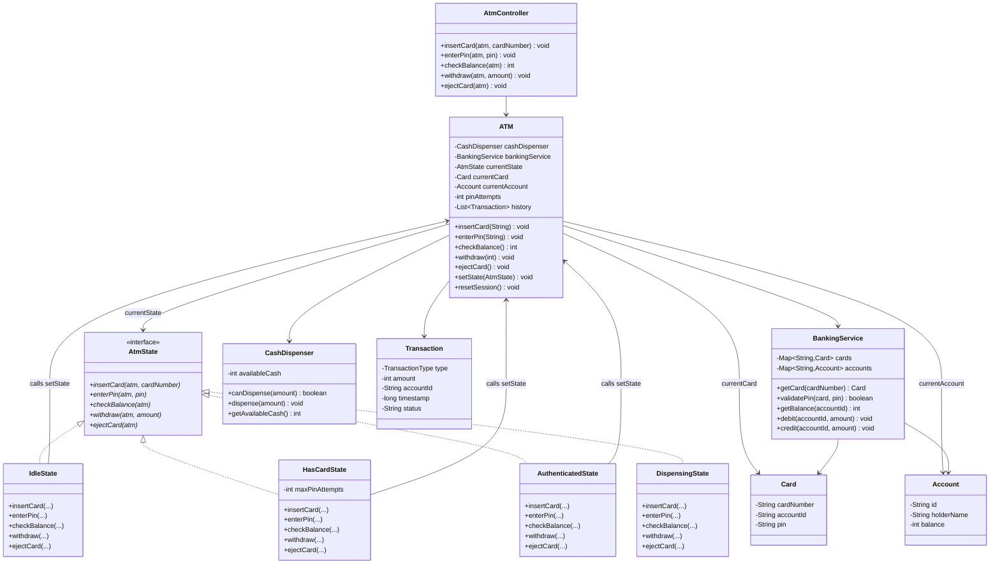
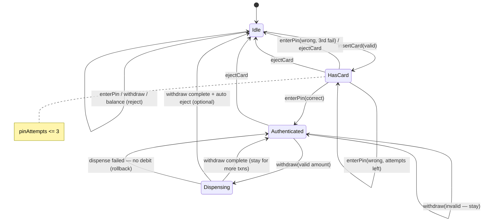
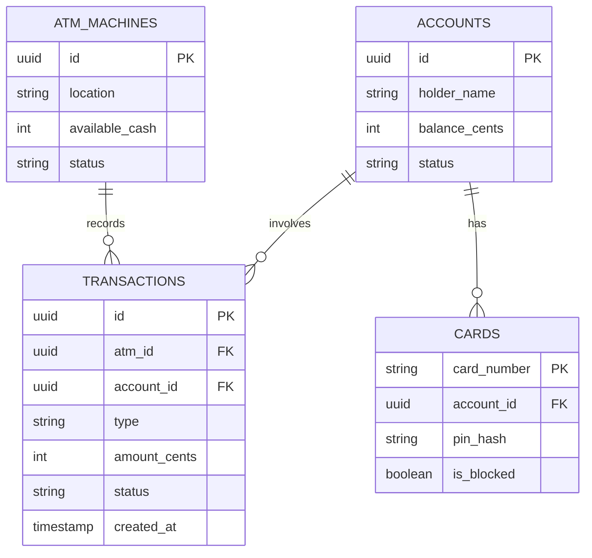
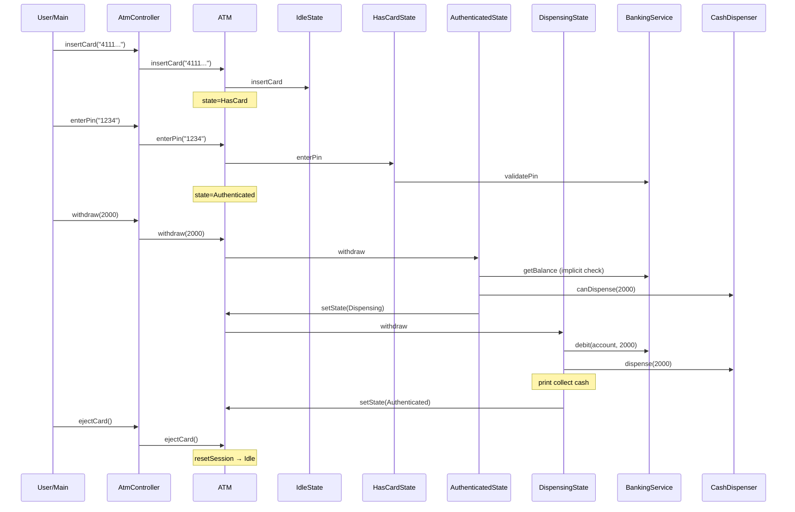

# ATM Machine — Low Level Design (Interview Guide)

> **Goal:** Understand, explain, and code this in ~60 minutes during an LLD interview.  
> **Signature pattern:** **State** — behavior changes based on ATM session state (Idle → HasCard → Authenticated → Dispensing → Idle).  
> **Reference style:** Mirrors your [Vending Machine](../vending/LLD_VENDING_MACHINE.md) / [Chess](../chess/LLD_CHESS.md) / [Snake & Ladder](../snakeandladder/LLD_SNAKE_AND_LADDER.md) guides — requirements → class/schema → patterns → 60-min coding plan.

---

## Code map (implemented)

Study order: `AtmApplication` (scripted demo) → `models/ATM` → `states/*` → `services/BankingService`.

| Feature | What | Where to read |
|---------|------|---------------|
| **1. Insert card + PIN auth** | Validate card; 3 PIN attempts; lock on failure | `IdleState`, `HasCardState`, `BankingService.validatePin` |
| **2. Balance inquiry** | Read-only balance after auth | `AuthenticatedState.checkBalance` |
| **3. Withdraw cash** | Debit account + dispense if ATM has cash | `AuthenticatedState.withdraw`, `DispensingState`, `CashDispenser` |

**Run the scripted demo** (walks all scenarios automatically):

```bash
cd atm
.\mvnw.cmd -q -DskipTests compile exec:java
```

**Run interactive demo** (drive the ATM yourself):

```bash
.\mvnw.cmd -q -DskipTests compile exec:java "-Dexec.mainClass=com.atmmachine.atm.demo.AtmDemo"
```

---

## Table of Contents

1. [Problem Statement](#1-problem-statement)
2. [Functional Requirements (8–10)](#2-functional-requirements-810)
3. [Out of Scope (say this upfront)](#3-out-of-scope-say-this-upfront)
4. [Clarify With Interviewer First](#4-clarify-with-interviewer-first)
5. [Package Structure](#5-package-structure)
6. [Class Diagram](#6-class-diagram)
7. [Schema Design](#7-schema-design)
8. [Design Patterns — State (deep dive)](#8-design-patterns--state-deep-dive)
9. [Core Classes — Responsibilities & Key Methods](#9-core-classes--responsibilities--key-methods)
10. [ATM Flow & Sequence Diagrams](#10-atm-flow--sequence-diagrams)
11. [Validation Rules](#11-validation-rules)
12. [60-Minute Coding Plan](#12-60-minute-coding-plan)
13. [How to Explain in Interview](#13-how-to-explain-in-interview)
14. [Sample Interview Q&A](#14-sample-interview-qa)
15. [Extension Hooks (bonus points)](#15-extension-hooks-bonus-points)
16. [Cross-Project Mapping](#16-cross-project-mapping)

---

## 1. Problem Statement

Design an **ATM (Automated Teller Machine)** that serves **one customer at a time**. A user inserts a card, enters a PIN, selects a transaction (withdraw, deposit, balance check), and receives cash or confirmation. The machine must reject invalid actions based on its **current session state** (e.g. cannot withdraw before PIN verification).

**Interview framing:** This is a **finite state machine** — almost identical in shape to a Vending Machine, but instead of inventory + coins you have **authentication + banking + cash dispenser**. The hard part is not arithmetic — it is **illegal transitions** (withdraw in Idle) and **consistent money movement** (debit account only when cash is actually dispensed).

---

## 2. Functional Requirements (8–10)

| # | Requirement | Interview one-liner |
|---|-------------|---------------------|
| **R1** | **Idle / welcome** — ATM waits for card insertion. | "`IdleState`; no session data." |
| **R2** | **Insert card** — User inserts card; ATM reads card number. | "Transition Idle → HasCard; store `currentCard`." |
| **R3** | **PIN verification** — User enters PIN; max 3 attempts. | "`BankingService.validatePin(card, pin)`; on success → Authenticated." |
| **R4** | **Balance inquiry** — Show account balance (read-only). | "Only in Authenticated; no state change." |
| **R5** | **Withdraw cash** — User enters amount; debit account; dispense cash. | "Validate balance + ATM cash; Authenticated → Dispensing → Idle." |
| **R6** | **Deposit cash** *(optional MVP)* — Accept cash; credit account. | "Authenticated → ProcessingDeposit → Authenticated." |
| **R7** | **Transaction menu** — After auth, user picks withdraw / balance / deposit / exit. | "Menu lives in AuthenticatedState or controller." |
| **R8** | **Eject card** — End session; return card; reset to Idle. | "`ejectCard()` clears session → Idle." |
| **R9** | **ATM cash inventory** — Machine tracks physical cash available for withdrawal. | "`CashDispenser` with `availableCash`; reject if insufficient." |
| **R10** | **Transaction log** *(optional)* — Record successful operations. | "`List<Transaction>` or DB table — good for schema talk." |

### Recommended MVP for 1 hour (pick with interviewer)

Agree on **3 working functionalities** to code:

1. **Insert card + PIN authentication** (with retry limit + invalid card handling)  
2. **Balance inquiry** after successful auth  
3. **Withdraw cash** (validate account balance + ATM cash, debit, dispense, eject card)

Say explicitly: *deposit, transfer, cheque deposit, receipt printing, multi-ATM network, fraud detection, and persistence are extensions unless time remains.*

---

## 3. Out of Scope (say this upfront)

Keep v1 small — interviewers respect scope control:

- Fund transfer to another account (mention as extension)
- Cheque / envelope deposit
- Receipt printer / email receipt
- Card chip/NFC hardware protocol
- Bank core integration (use mock `BankingService`)
- Multi-currency / forex
- Concurrent users on one ATM (single session)
- ATM replenishment scheduling / CIT trucks
- Full fraud / velocity rules
- Persistence / DB required for MVP (still discuss schema)
- PIN encryption at rest (mention hash in production)

---

## 4. Clarify With Interviewer First

Ask these in the first **2–3 minutes** (shows product thinking):

| Question | Good default for interview |
|----------|----------------------------|
| Cash only or also deposit? | **Withdraw + balance** for MVP; deposit if extra time |
| PIN attempts before block? | **3 attempts** → eject card, stay Idle |
| ATM runs out of cash? | Reject withdraw; account **not** debited |
| Partial withdraw denominations? | **Any integer amount** in multiples of 100 (or any int) |
| One transaction per session? | **Multiple** after auth until user ejects card |
| Who owns account data? | **Mock `BankingService`** with in-memory accounts |
| Money unit? | Integer **paise/cents** — no floats |

**Assumptions to state aloud:**

1. Single customer at a time.  
2. Card maps 1:1 to an account (no multi-account selection).  
3. Withdraw is atomic: validate → debit → dispense → log; rollback if dispense fails.  
4. Invalid PIN does **not** change account balance.  
5. Session ends with **eject card** → Idle.

---

## 5. Package Structure

Mirror Vending / Chess layout:

```
atm/
├── AtmApplication.java                 # Spring entry (optional)
├── demo/
│   └── AtmDemo.java                    # CLI demo — primary for interview
├── controller/
│   └── AtmController.java              # thin: insertCard, enterPin, withdraw, balance, eject
├── models/
│   ├── ATM.java                        # context for State; holds session + cash dispenser
│   ├── Card.java                       # cardNumber, linked accountId
│   ├── Account.java                    # id, holderName, balance
│   ├── CashDispenser.java              # availableCash, dispense(amount)
│   └── Transaction.java                # type, amount, accountId, timestamp, status
├── states/
│   ├── AtmState.java                   # interface
│   ├── IdleState.java
│   ├── HasCardState.java
│   ├── AuthenticatedState.java
│   └── DispensingState.java            # optional; can fold into Authenticated
├── services/
│   └── BankingService.java             # validatePin, getBalance, debit, credit (mock)
├── enums/
│   ├── TransactionType.java            # WITHDRAW, DEPOSIT, BALANCE_INQUIRY
│   └── AtmSessionStatus.java           # optional mirror of state name
├── exceptions/
│   ├── InvalidCardException.java
│   ├── InvalidPinException.java
│   ├── InsufficientBalanceException.java
│   ├── InsufficientCashException.java
│   └── InvalidOperationException.java  # wrong action for current state
└── factories/
    └── AccountFactory.java             # seed demo accounts + cards
```

**Design choice to state clearly:**

| Approach | Pros | Cons |
|----------|------|------|
| **A. State pattern** — `AtmState` + Idle/HasCard/Authenticated/… | Classic interview answer; same as Vending; OCP for new states | More classes |
| **B. Enum + switch** — `SessionStatus` + big methods | Faster to code | Ugly; violates OCP; hard to extend |

**Recommend Approach A for interview.** If severely short on time, start with enum + switch, then say *"I'd refactor to State — same as my Vending Machine design."*

---

## 6. Class Diagram

### 6.1 Mermaid Class Diagram (draw this on whiteboard)



### 6.2 Relationships to explain verbally

| From | To | Relationship | Why |
|------|----|--------------|-----|
| `AtmController` | `ATM` | Dependency | Thin API for CLI / interviewer demo |
| `ATM` | `AtmState` | Composition | **Context** holds current session state |
| `IdleState`… | `AtmState` | Implementation | Each state owns allowed behavior |
| `ATM` | `BankingService` | Dependency | External bank logic (mock in interview) |
| `ATM` | `CashDispenser` | Composition | Physical cash inventory at this machine |
| `BankingService` | `Card` / `Account` | Aggregation | Bank owns customer data |
| `Card` | `Account` | Association | Card links to one account |

### 6.3 Simplified whiteboard version (if short on time)

```
AtmController → ATM
ATM → BankingService (cards, accounts, debit/credit)
    → CashDispenser (availableCash)
    → currentState: Idle | HasCard | Authenticated | Dispensing

AtmState.insertCard / enterPin / checkBalance / withdraw / ejectCard
  Idle:           insert → HasCard; pin/withdraw reject
  HasCard:        enterPin ok → Authenticated; fail 3x → eject → Idle
  Authenticated:  balance ok; withdraw → Dispensing; eject → Idle
  Dispensing:     debit + dispense cash → Authenticated (or eject → Idle)
```

### 6.4 State transition diagram (draw this — interviewers love it)



**One-liner:** *"Illegal operations are rejected inside the state class — the ATM context never grows a mega-switch."*

---

## 7. Schema Design

Interviewers may ask for **in-memory structure** or **DB design**. Cover both briefly.

### 7.1 In-Memory Object Schema (primary for 1-hr coding)

```
ATM
├── cashDispenser: CashDispenser
├── bankingService: BankingService
├── currentState: AtmState
├── currentCard: Card | null
├── currentAccount: Account | null
├── pinAttempts: int
└── history: List<Transaction>          // optional

CashDispenser
└── availableCash: int                    // e.g. 50_000 = ₹500.00

BankingService
├── cards: Map<String, Card>              // key = cardNumber
└── accounts: Map<String, Account>        // key = accountId

Card
├── cardNumber: String
├── accountId: String
└── pin: String                           // plain in demo; hash in production

Account
├── id: String
├── holderName: String
└── balance: int                          // paise/cents

Transaction (optional)
├── type: TransactionType                 // WITHDRAW, DEPOSIT, BALANCE_INQUIRY
├── amount: int
├── accountId: String
├── timestamp: long
└── status: String                        // SUCCESS / FAILED
```

### 7.2 Database Schema (if interviewer asks "production / persistence")

```text
┌──────────────────┐       ┌──────────────────┐
│   atm_machines   │       │    accounts      │
├──────────────────┤       ├──────────────────┤
│ id (PK)          │       │ id (PK)          │
│ location         │       │ holder_name      │
│ available_cash   │       │ balance_cents    │
│ status           │       │ status           │
└────────┬─────────┘       └────────┬─────────┘
         │                          │
         │         ┌────────────────▼─────────┐
         │         │         cards            │
         │         ├──────────────────────────┤
         │         │ card_number (PK)         │
         └────────►│ account_id (FK)          │
                   │ pin_hash                 │
                   │ is_blocked               │
                   └──────────────────────────┘

┌──────────────────┐
│  transactions    │
├──────────────────┤
│ id (PK)          │
│ atm_id (FK)      │
│ account_id (FK)  │
│ type             │  // WITHDRAW / DEPOSIT / BALANCE
│ amount_cents     │
│ status           │  // SUCCESS / FAILED / REVERSED
│ created_at       │
└──────────────────┘
```

### 7.3 ER Diagram (Mermaid)



**Note:** Runtime `currentState`, `currentCard`, and `pinAttempts` are **session-scoped** — not persisted mid-session. Persist transactions + account balance updates atomically in production.

---

## 8. Design Patterns — State (deep dive)

### 8.1 Why State here?

Without State:

```
void withdraw(amount) {
  if (status == IDLE) reject;
  else if (status == HAS_CARD) reject;
  else if (status == AUTHENTICATED) { ... }
  else if (status == DISPENSING) reject;
}
```

Every new state multiplies conditionals across **all** methods → brittle.

With State: **each state class** implements the same interface; only legal transitions call `atm.setState(...)`.

**Compare to Vending Machine:**

| Vending | ATM |
|---------|-----|
| Idle (no money) | Idle (no card) |
| HasMoney | HasCard (awaiting PIN) |
| Dispense | Dispensing (cash out) |
| balance on machine | account balance + ATM cash |

Same pattern, different domain nouns.

### 8.2 Pattern roles (say this)

| Role | In this design |
|------|----------------|
| **Context** | `ATM` — holds state + session data (`currentCard`, `currentAccount`, `pinAttempts`) |
| **State interface** | `AtmState` — `insertCard`, `enterPin`, `checkBalance`, `withdraw`, `ejectCard` |
| **Concrete states** | `IdleState`, `HasCardState`, `AuthenticatedState`, `DispensingState` |

### 8.3 Behavior matrix (memorize — whiteboard gold)

| Action \ State | Idle | HasCard | Authenticated | Dispensing |
|----------------|------|---------|---------------|------------|
| `insertCard` | ✓ → HasCard | ✗ (already has card) | ✗ | ✗ |
| `enterPin` | ✗ | ✓ → Authenticated or retry | ✗ (already authed) | ✗ |
| `checkBalance` | ✗ | ✗ | ✓ read-only | ✗ |
| `withdraw` | ✗ | ✗ | ✓ validate → Dispensing | ✗ (in progress) |
| `ejectCard` | no-op | ✓ → Idle | ✓ → Idle | ✗ until done |

### 8.4 Other patterns (mention, don't over-build)

| Pattern | Where | Why |
|---------|-------|-----|
| **State** | ATM session lifecycle | Core of this problem |
| **Facade** | `BankingService` | Hides bank core complexity from ATM |
| **Strategy** | `TransactionStrategy` (Withdraw vs Deposit) | Extension if interviewer asks many transaction types |
| **Chain of Responsibility** | PIN attempt → lock card | Optional; simple counter is enough for 1 hr |
| **Singleton** | One ATM instance | Usually **avoid** unless asked |
| **MVC-ish** | Controller + ATM | Matches your other LLD projects |

### Patterns to mention but NOT implement in 1 hour

| Pattern | When |
|---------|------|
| **Observer** | Notify bank on suspicious activity |
| **Command** | Undo failed transaction / compensating transaction |
| **Decorator** | Audit logging wrapper on BankingService |
| **Factory** | Create transaction objects by type |

---

## 9. Core Classes — Responsibilities & Key Methods

> Pseudocode signatures — **no full implementation** (you will code this yourself).

### 9.1 `AtmController` (stateless)

```
insertCard(atm, cardNumber) → void
enterPin(atm, pin) → void
checkBalance(atm) → int
withdraw(atm, amount) → void
ejectCard(atm) → void
```

### 9.2 `ATM` (Context)

```
ATM(BankingService bank, CashDispenser dispenser):
  this.bankingService = bank
  this.cashDispenser = dispenser
  this.currentState = new IdleState()
  this.pinAttempts = 0

// Delegate ALL user actions to current state:
insertCard(cardNumber):
  currentState.insertCard(this, cardNumber)

enterPin(pin):
  currentState.enterPin(this, pin)

checkBalance():
  return currentState.checkBalance(this)

withdraw(amount):
  currentState.withdraw(this, amount)

ejectCard():
  currentState.ejectCard(this)

// Helpers used BY states:
setState(AtmState s)
resetSession():
  currentCard = null
  currentAccount = null
  pinAttempts = 0
  setState(new IdleState())
```

### 9.3 `AtmState` interface

```
insertCard(ATM atm, String cardNumber)
enterPin(ATM atm, String pin)
checkBalance(ATM atm) → int
withdraw(ATM atm, int amount)
ejectCard(ATM atm)
```

### 9.4 `IdleState`

```
insertCard(atm, cardNumber):
  card = atm.bankingService.getCard(cardNumber)
  if card == null → throw InvalidCardException
  atm.currentCard = card
  atm.pinAttempts = 0
  atm.setState(new HasCardState())
  print "Please enter PIN"

enterPin(...):       throw InvalidOperationException("Insert card first")
checkBalance(...):   throw InvalidOperationException(...)
withdraw(...):       throw InvalidOperationException(...)
ejectCard(...):      no-op
```

### 9.5 `HasCardState`

```
enterPin(atm, pin):
  if atm.bankingService.validatePin(atm.currentCard, pin):
    atm.currentAccount = atm.bankingService.getAccount(atm.currentCard.accountId)
    atm.setState(new AuthenticatedState())
    print "Welcome, " + atm.currentAccount.holderName
  else:
    atm.pinAttempts++
    if atm.pinAttempts >= 3:
      print "Card blocked for this session — ejecting"
      atm.resetSession()                    // → Idle
    else:
      throw InvalidPinException(attemptsLeft)

insertCard(...):     throw InvalidOperationException("Card already inserted")
checkBalance(...):   throw InvalidOperationException("Enter PIN first")
withdraw(...):       throw InvalidOperationException(...)
ejectCard(atm):
  print "Card ejected"
  atm.resetSession()
```

### 9.6 `AuthenticatedState`

```
checkBalance(atm):
  return atm.bankingService.getBalance(atm.currentAccount.id)

withdraw(atm, amount):
  if amount <= 0 → reject
  if amount > atm.currentAccount.balance → throw InsufficientBalanceException
  if !atm.cashDispenser.canDispense(amount) → throw InsufficientCashException
  atm.setState(new DispensingState())
  atm.withdraw(amount)                      // delegate to Dispensing (or inline)

ejectCard(atm):
  print "Card ejected — thank you"
  atm.resetSession()

insertCard(...):     reject
enterPin(...):       reject ("Already authenticated")
```

### 9.7 `DispensingState`

```
withdraw(atm, amount):
  try:
    atm.bankingService.debit(atm.currentAccount.id, amount)
    atm.cashDispenser.dispense(amount)
    print "Please collect cash: " + amount
    // optional: atm.history.add(new Transaction(WITHDRAW, amount, ...))
    atm.setState(new AuthenticatedState())  // allow more transactions
  catch Exception e:
    // if debit succeeded but dispense failed → credit back (compensating)
    atm.setState(new AuthenticatedState())
    throw e

checkBalance / enterPin / insertCard:
  reject ("Transaction in progress")

ejectCard:
  reject until dispensing completes (or allow cancel before debit — state clearly)
```

### 9.8 `BankingService` (mock)

```
getCard(cardNumber) → Card?
validatePin(card, pin) → boolean
getAccount(accountId) → Account
getBalance(accountId) → int
debit(accountId, amount):
  if balance < amount → throw InsufficientBalanceException
  balance -= amount
credit(accountId, amount):
  balance += amount
```

### 9.9 `CashDispenser`

```
canDispense(amount) → availableCash >= amount
dispense(amount):
  if !canDispense(amount) → throw InsufficientCashException
  availableCash -= amount
getAvailableCash() → int
```

### 9.10 Minimal happy-path algorithm (say this in 30 seconds)

```
1. Idle → user inserts card → HasCard
2. User enters correct PIN → Authenticated
3. User checks balance → print balance (stay Authenticated)
4. User withdraws 500 → validate account + ATM cash → debit → dispense → Authenticated
5. User ejects card → Idle
```

---

## 10. ATM Flow & Sequence Diagrams

### 10.1 CLI main loop (demo)

```
main():
  bank = AccountFactory.createBankingService()   // 2–3 demo accounts
  dispenser = new CashDispenser(100_000)         // ₹1000 in machine
  atm = new ATM(bank, dispenser)
  controller = new AtmController()

  loop:
    print menu based on implied state OR generic:
      1.Insert Card  2.Enter PIN  3.Balance  4.Withdraw  5.Eject  6.Exit
    switch choice:
      1 → controller.insertCard(atm, cardNumber)
      2 → controller.enterPin(atm, pin)
      3 → print controller.checkBalance(atm)
      4 → controller.withdraw(atm, amount)
      5 → controller.ejectCard(atm)
```

### 10.2 Successful withdraw sequence



### 10.3 Failed PIN (3 attempts) sequence

```
insertCard → HasCard
enterPin(wrong) → attempt 1, stay HasCard
enterPin(wrong) → attempt 2, stay HasCard
enterPin(wrong) → attempt 3 → resetSession → Idle (card ejected)
```

### 10.4 Insufficient ATM cash sequence

```
Authenticated
withdraw(50000) → account ok but cashDispenser.availableCash < 50000
→ InsufficientCashException
→ account NOT debited
→ stay Authenticated
```

---

## 11. Validation Rules

| Rule | When | Behavior |
|------|------|----------|
| Unknown card | insert | `InvalidCardException`; stay Idle |
| Wrong PIN | enterPin | Increment attempts; stay HasCard until 3 → reset |
| amount ≤ 0 | withdraw | Reject; stay Authenticated |
| balance < amount | withdraw | `InsufficientBalanceException`; no debit |
| ATM cash < amount | withdraw | `InsufficientCashException`; no debit |
| Wrong state action | any | `InvalidOperationException` with clear message |
| After eject | — | session cleared, Idle |

**Invariant to state:** *Never debit account unless cash dispense succeeds (or implement compensating credit on failure).*

**Second invariant:** *Never dispense cash without debiting account first (or in same atomic block).*

---

## 12. 60-Minute Coding Plan

| Time | What to do |
|------|------------|
| **0–5 min** | Requirements + out of scope + MVP 3 features + assumptions |
| **5–15 min** | Draw state diagram + class sketch (ATM, State, BankingService, CashDispenser) |
| **15–25 min** | Code `Account`, `Card`, `BankingService`, `AccountFactory`, seed data |
| **25–40 min** | Code `AtmState` + `IdleState` + `HasCardState` + `AuthenticatedState` |
| **40–50 min** | Code `DispensingState`, `CashDispenser`, wire `ATM` + controller + CLI |
| **50–55 min** | Demo: insert → PIN → balance → withdraw → eject; wrong PIN 3x |
| **55–60 min** | Mention deposit Strategy, transfer, DB schema, rollback as extensions |

### Must-demo scripts (practice these)

```
# Happy path
Insert card 4111 → PIN 1234 → Balance 10000 → Withdraw 2000 → Collect cash → Eject → Idle

# Wrong PIN then success
Insert → wrong PIN ×2 → correct PIN → Balance → Eject

# Insufficient balance
Auth → Withdraw 999999 → error, balance unchanged

# ATM out of cash
Auth → Withdraw more than cashDispenser.availableCash → error, no debit

# Block after 3 PIN failures
Insert → wrong PIN ×3 → session reset → Idle
```

### If running behind (cut order)

1. Drop `DispensingState` — withdraw inline in `AuthenticatedState`  
2. Drop `Transaction` history  
3. Drop deposit entirely  
4. Keep State interface with **Idle + HasCard + Authenticated only** — still shows the pattern  
5. Single transaction per session: eject automatically after withdraw  

---

## 13. How to Explain in Interview

### Opening (60 seconds)

> "I'll design an ATM as a state machine. Core entities: ATM (context), BankingService for accounts, CashDispenser for physical cash, and State classes for session phases. User inserts card, enters PIN, performs transactions, then ejects card. I'll use the **State pattern** — same idea as a Vending Machine — so each state decides which operations are allowed."

### While drawing

1. Draw **state circles** first (Idle → HasCard → Authenticated → Dispensing → Authenticated → Idle).  
2. Then boxes: ATM, BankingService, Account, CashDispenser.  
3. Show `ATM` delegates to `currentState`.  
4. Highlight **two balances**: account balance (bank) vs ATM cash (machine).  
5. Only then dive into method signatures.

### While coding

- Narrate transitions: *"Insert in Idle loads card and sets HasCard."*  
- Show one rejection: *"Withdraw in Idle throws — forces correct flow."*  
- Show atomic withdraw: *"Debit only when dispense can succeed."*  
- Prefer clear exceptions/messages over silent no-ops.

### Closing (30 seconds)

> "MVP covers card insert, PIN auth with retry limit, balance inquiry, cash withdraw with dual validation, and eject. Extensions: deposit via Strategy, fund transfer, receipt Observer, compensating transactions on hardware failure, persistence of accounts and transaction log."

---

## 14. Sample Interview Q&A

**Q: Why not a single class with an enum state?**  
A: Works for 2–3 states; explodes as rules grow. State classes localize behavior and keep ATM thin. Enum+switch is a fine first draft I'd refactor — I did the same on Vending Machine.

**Q: Where do you store PIN attempts — in ATM or HasCardState?**  
A: In **ATM (context)**. States are behavior; session data stays on context so states can stay stateless/singleton if needed.

**Q: How is ATM different from Vending Machine LLD?**  
A: Same State skeleton. Vending tracks `balance` inserted by user and `inventory`. ATM tracks `authenticated session`, **bank account balance**, and **ATM cash inventory**. Vending dispenses product; ATM dispenses cash after debit.

**Q: What if debit succeeds but cash jam happens?**  
A: Production needs **compensating credit** + failed transaction log. MVP: try/catch with `credit()` rollback; mention saga/two-phase in extensions.

**Q: Two balances — why?**  
A: Account balance is the customer's money at the bank. `CashDispenser.availableCash` is physical notes in this machine. Withdraw needs **both** sufficient.

**Q: Thread safety?**  
A: One session per ATM for MVP. Production: lock per machine; debit + dispense must be atomic.

**Q: Floats for money?**  
A: No — use **integer paise/cents**.

**Q: How do you validate PIN securely?**  
A: Demo: plain compare. Production: hash + salt, rate limit, block card in DB.

**Q: Open/Closed?**  
A: New state (e.g. `MaintenanceState`) = new class; ATM methods stay as delegations.

**Q: Can user do multiple transactions per session?**  
A: Yes — after withdraw return to `AuthenticatedState` until `ejectCard()`. Say this upfront.

---

## 15. Extension Hooks (bonus points)

| Extension | Hook in design |
|-----------|----------------|
| Deposit cash | `DepositState` or `TransactionStrategy.deposit()` |
| Fund transfer | `BankingService.transfer(from, to, amount)` |
| Change PIN | New menu option in Authenticated + bank API |
| Receipt | `Observer` on successful `Transaction` |
| Denomination mix | `CashDispenser.dispenseBreakdown(amount)` — greedy algorithm |
| Card block | `BankingService.blockCard(cardNumber)` after 3 fails |
| Multi-ATM | `atm_machines` table + shared accounts |
| Maintenance mode | `MaintenanceState` rejects customer ops |
| Persistence | Tables in §7; load accounts at startup |

---

## 16. Cross-Project Mapping

| Concept | Chess | Vending Machine | **ATM** |
|---------|-------|-----------------|---------|
| Orchestrator | `Game` | `VendingMachine` | `ATM` |
| Controller | `GameController` | `VendingController` | `AtmController` |
| Key pattern | Piece polymorphism | **State** | **State** |
| External service | — | — | `BankingService` |
| Physical resource | Board cells | Product inventory | `CashDispenser` |
| Session data | current player | balance, selected product | card, account, pinAttempts |
| Illegal action | Invalid move | Wrong-state op | Withdraw before PIN |
| End / reset | Game over | Idle after dispense | Idle after eject card |

**Study tip:** Learn Vending Machine State first, then ATM is mostly **renaming states + adding BankingService + CashDispenser**. Chess teaches polymorphism; Snake & Ladder teaches Strategy; Vending + ATM teach **State** for workflow machines.

---

## Quick Revision Card (read night before)

```
REQUIREMENTS: insert card, PIN auth, balance, withdraw, eject card
MVP CODE:     insert+PIN (3 tries) + balance + withdraw with State
PATTERN:      State — Context=ATM, States=Idle/HasCard/Authenticated/Dispensing
DATA:         BankingService(cards, accounts) + CashDispenser(availableCash)
TRANSITIONS:  Idle --card--> HasCard --PIN--> Auth --withdraw--> Dispensing --done--> Auth --eject--> Idle
TWO BALANCES: account.balance AND cashDispenser.availableCash — both checked on withdraw
INVARIANT:    debit account IFF cash dispensed (rollback on failure)
SCHEMA:       atm_machines, accounts, cards, transactions
SKIP:         transfer, deposit, receipt, chip hardware, concurrency
```

---

## Overall Interview Approach (1 hour timeline)

Use this as your **default runbook** in any LLD round:

| Phase | Minutes | What to say / do |
|-------|---------|------------------|
| **1. Requirements** | 0–8 | Restate problem; list 8–10 reqs; agree **3 MVP features**; state out-of-scope |
| **2. Clarifications** | 8–12 | Ask 4–5 questions (PIN retries, one session, mock bank, integer money) |
| **3. Class diagram** | 12–22 | Draw states first, then context + services; explain delegation |
| **4. Schema** | 22–28 | In-memory maps first; ER diagram if they ask persistence |
| **5. Code MVP** | 28–52 | Factory seed → State classes → ATM delegates → controller → demo |
| **6. Demo + extensions** | 52–60 | Run happy path + one failure; mention deposit, transfer, rollback |

**Phrases that score well:**

- *"I'll delegate all actions to `currentState` so the ATM class doesn't grow switches."*  
- *"Two sources of truth for withdraw: account balance and ATM cash."*  
- *"BankingService is a Facade — real system would be HTTP/RPC to core banking."*  
- *"Same State pattern I used for Vending Machine — Idle maps to Idle, HasMoney maps to Authenticated."*

---

*Practice: explain the state diagram in 2 minutes, then code Idle + HasCard + Authenticated + one withdraw path without looking. That alone covers a strong 1-hour ATM interview.*
