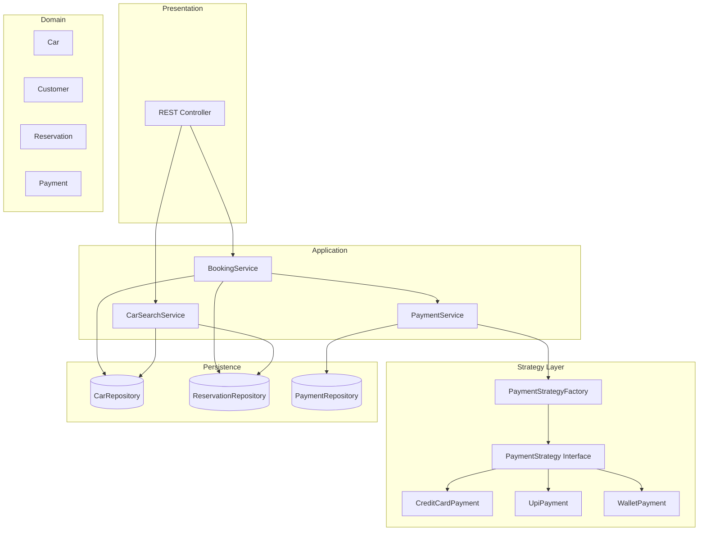
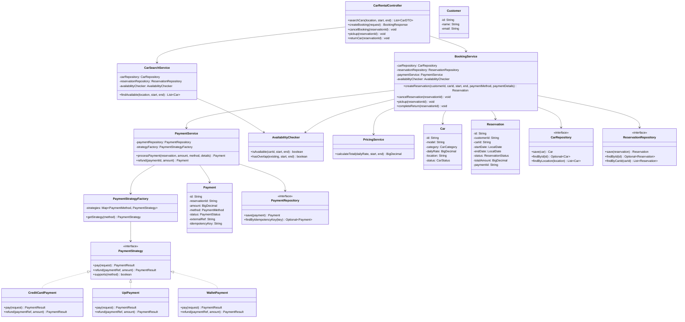
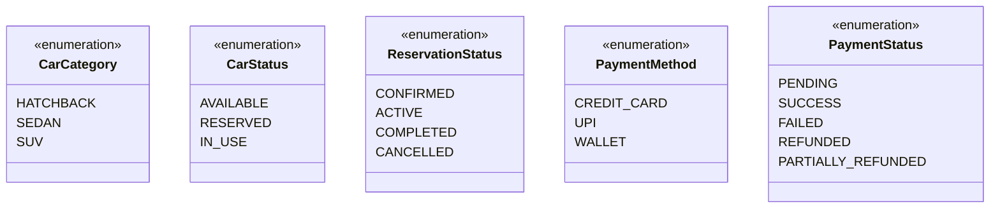
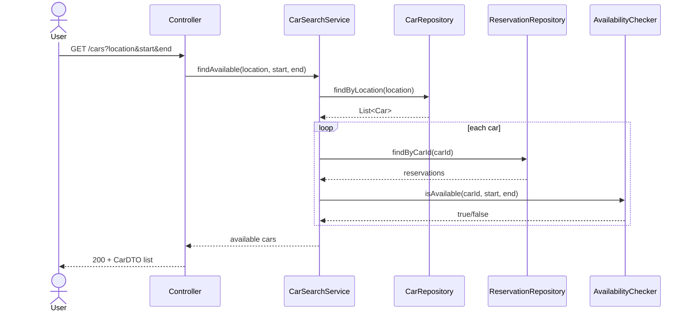
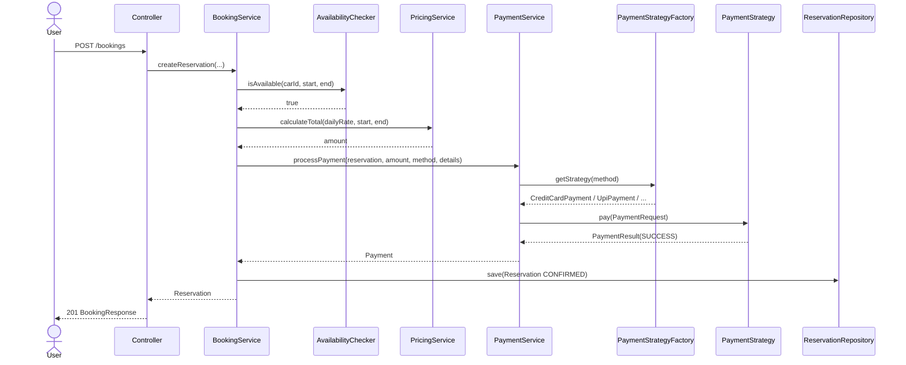
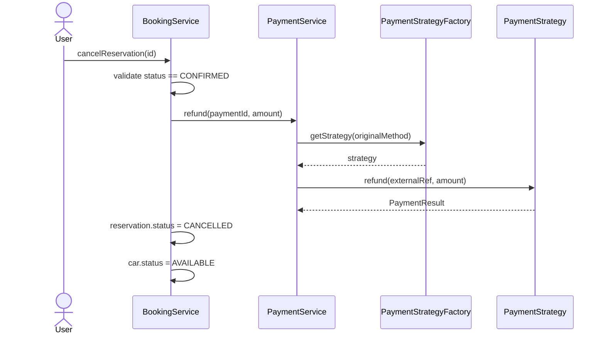
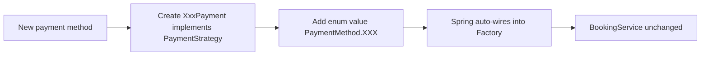
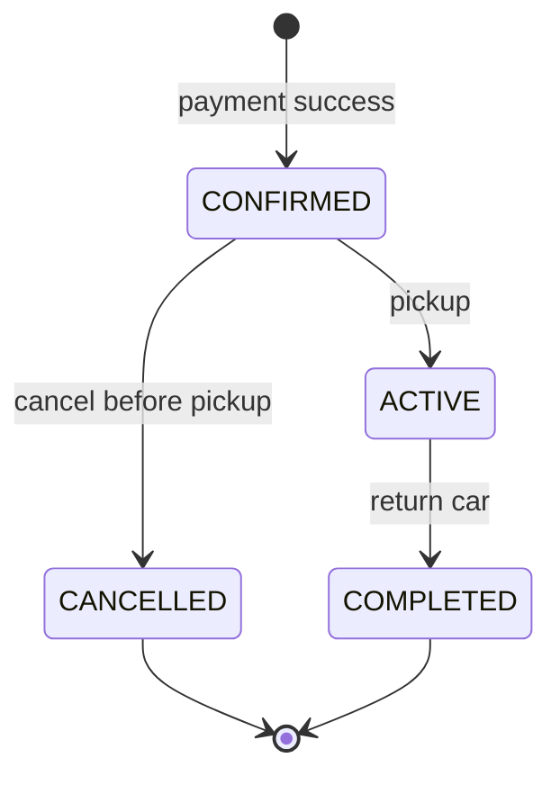
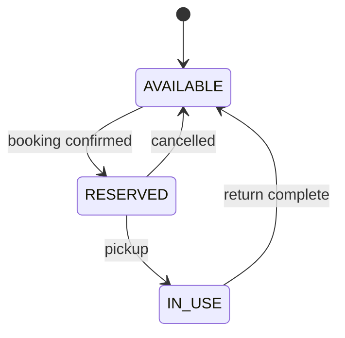
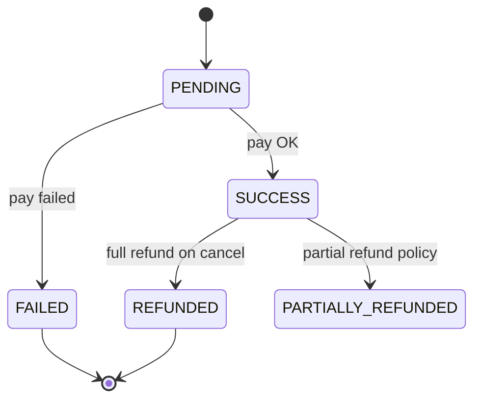

# Car Rental System — Low Level Design (LLD) Study Guide

> **Purpose:** Revision-ready LLD document for a 1-hour interview scope, extended with **Payment Strategies** using the **Strategy design pattern** to demonstrate scalable, extensible design.
>
> **Stack context:** Java / Spring Boot (`com.zoomcar.carrental`) — design is framework-agnostic; persistence shown as relational schema.

---

## Table of Contents

1. [Problem Statement](#1-problem-statement)
2. [Requirements](#2-requirements)
3. [Assumptions & Out of Scope](#3-assumptions--out-of-scope)
4. [Design Patterns Used](#4-design-patterns-used)
5. [High-Level Architecture](#5-high-level-architecture)
6. [Class Diagram](#6-class-diagram)
7. [Database Schema Diagram](#7-database-schema-diagram)
8. [Core Flows](#8-core-flows)
9. [Payment Strategy — Deep Dive](#9-payment-strategy--deep-dive)
10. [Pricing & Availability](#10-pricing--availability)
11. [State Machines](#11-state-machines)
12. [Suggested Package Structure](#12-suggested-package-structure)
13. [API Sketch](#13-api-sketch)
14. [Edge Cases & Validation](#14-edge-cases--validation)
15. [Scalability & Extension Points](#15-scalability--extension-points)
16. [1-Hour Interview Time Plan](#16-1-hour-interview-time-plan)
17. [Interview Talking Points](#17-interview-talking-points)

---

## 1. Problem Statement

Design an in-memory (or DB-backed) **car rental booking system** where:

- Customers search for available cars by **location** and **date range**
- Customers **book** a car and **pay** using a pluggable payment method
- The system prevents **double booking** for overlapping dates
- Bookings can be **cancelled** (with refund rules) and cars can be **returned**

The payment layer must be **extensible** — adding UPI, Wallet, or Net Banking later should not require changing booking logic.

---

## 2. Requirements

### Functional Requirements

| ID | Requirement |
|----|-------------|
| FR-1 | Add cars to fleet (model, category, daily rate, location) |
| FR-2 | Search available cars by location + date range |
| FR-3 | Create reservation for a car (customer, dates) |
| FR-4 | Calculate rental price (daily rate × days) |
| FR-5 | Process payment at booking time via selected payment method |
| FR-6 | Cancel reservation before pickup (refund per policy) |
| FR-7 | Pick up car (reservation becomes active) |
| FR-8 | Return car (reservation completes) |

### Non-Functional Requirements

| ID | Requirement |
|----|-------------|
| NFR-1 | Payment methods pluggable without modifying `BookingService` |
| NFR-2 | In-memory storage acceptable for LLD; schema provided for production |
| NFR-3 | Prevent overlapping bookings for the same car |
| NFR-4 | Idempotent payment attempts (same request → same result) |

---

## 3. Assumptions & Out of Scope

### Assumptions

- One rental company (single tenant)
- Pickup and drop-off at the **same location**
- Payment happens **at booking time** (prepaid)
- Customer already exists or is created with minimal info (id, name, email)
- Currency is single (INR / USD — pick one and stick to it)

### Out of Scope (say this explicitly in interview)

- Dynamic surge pricing, coupons, loyalty points
- Multi-city one-way rental
- Vehicle damage assessment, insurance claims
- Real payment gateway integration (mock/stub is fine)
- Admin fleet management UI
- Notifications (email/SMS)

---

## 4. Design Patterns Used

| Pattern | Where | Why (scalability angle) |
|---------|-------|-------------------------|
| **Strategy** | `PaymentStrategy` + implementations (`CreditCardPayment`, `UpiPayment`, `WalletPayment`) | Open/Closed Principle — add new payment types without touching booking code |
| **Factory / Registry** | `PaymentStrategyFactory` | Central lookup of strategy by `PaymentMethod` enum; avoids `if-else` chains |
| **Repository** | `CarRepository`, `ReservationRepository`, `PaymentRepository` | Decouple domain logic from storage (in-memory today, JPA tomorrow) |
| **State** *(optional)* | `ReservationStatus` transitions enforced in `Reservation` | Clear lifecycle; easy to add rules per state |
| **Singleton** *(optional)* | `PaymentStrategyFactory` as Spring `@Component` | One registry instance in app context |

### Primary pattern to explain in interview: **Strategy**

> *"BookingService depends on the `PaymentStrategy` interface, not concrete payment classes. At runtime we inject the correct strategy via factory based on user choice. Adding BNPL or Net Banking = new class + register in factory — zero change to booking flow."*

---

## 5. High-Level Architecture



---

## 6. Class Diagram



### Enums



---

## 7. Database Schema Diagram

```mermaid
erDiagram
    CUSTOMER ||--o{ RESERVATION : places
    CAR ||--o{ RESERVATION : "booked via"
    RESERVATION ||--|| PAYMENT : "paid by"
    RESERVATION ||--o| REFUND : "may have"

    CUSTOMER {
        varchar id PK
        varchar name
        varchar email UK
        timestamp created_at
    }

    CAR {
        varchar id PK
        varchar model
        varchar category
        decimal daily_rate
        varchar location
        varchar status
        timestamp created_at
    }

    RESERVATION {
        varchar id PK
        varchar customer_id FK
        varchar car_id FK
        date start_date
        date end_date
        varchar status
        decimal total_amount
        varchar payment_id FK
        timestamp created_at
        timestamp updated_at
    }

    PAYMENT {
        varchar id PK
        varchar reservation_id FK UK
        decimal amount
        varchar method
        varchar status
        varchar external_ref
        varchar idempotency_key UK
        timestamp paid_at
    }

    REFUND {
        varchar id PK
        varchar payment_id FK
        decimal amount
        varchar reason
        varchar status
        timestamp refunded_at
    }
```

### Schema Notes

| Table | Key constraints |
|-------|-----------------|
| `RESERVATION` | `start_date < end_date`; index on `(car_id, start_date, end_date)` for overlap queries |
| `PAYMENT` | One payment per reservation (`reservation_id` unique); idempotency key prevents duplicate charges |
| `CAR` | `status` is denormalized cache; source of truth for availability is reservations + dates |

### Availability Query (conceptual)

```sql
-- Car is NOT available if any non-cancelled reservation overlaps [start, end)
SELECT 1 FROM reservation r
WHERE r.car_id = :carId
  AND r.status NOT IN ('CANCELLED')
  AND r.start_date < :endDate
  AND r.end_date   > :startDate;
```

---

## 8. Core Flows

### 8.1 Search Available Cars



### 8.2 Create Booking with Payment (Strategy Pattern)



### 8.3 Cancel with Refund



---

## 9. Payment Strategy — Deep Dive

### 9.1 Interface

```java
public interface PaymentStrategy {
    PaymentResult pay(PaymentRequest request);
    PaymentResult refund(String externalReference, BigDecimal amount);
    PaymentMethod supports();
}
```

### 9.2 Request / Result DTOs

```java
public record PaymentRequest(
    String reservationId,
    BigDecimal amount,
    String idempotencyKey,
    Map<String, String> metadata   // e.g. upiId, cardToken, walletId
) {}

public record PaymentResult(
    boolean success,
    String externalReference,
    String failureReason
) {}
```

### 9.3 Concrete Strategies

| Class | Metadata keys | Mock behavior |
|-------|---------------|---------------|
| `CreditCardPayment` | `cardToken` | Decline if token ends with `0000` |
| `UpiPayment` | `upiId` | Decline if upiId is blank |
| `WalletPayment` | `walletId` | Decline if insufficient balance flag set |

```java
@Component
public class UpiPayment implements PaymentStrategy {

    @Override
    public PaymentResult pay(PaymentRequest request) {
        String upiId = request.metadata().get("upiId");
        if (upiId == null || upiId.isBlank()) {
            return new PaymentResult(false, null, "Invalid UPI ID");
        }
        String ref = "UPI-" + UUID.randomUUID();
        return new PaymentResult(true, ref, null);
    }

    @Override
    public PaymentResult refund(String externalReference, BigDecimal amount) {
        return new PaymentResult(true, "REF-" + externalReference, null);
    }

    @Override
    public PaymentMethod supports() {
        return PaymentMethod.UPI;
    }
}
```

### 9.4 Factory (Registry Pattern)

```java
@Component
public class PaymentStrategyFactory {

    private final Map<PaymentMethod, PaymentStrategy> strategies;

    public PaymentStrategyFactory(List<PaymentStrategy> strategyList) {
        this.strategies = strategyList.stream()
            .collect(Collectors.toMap(PaymentStrategy::supports, Function.identity()));
    }

    public PaymentStrategy getStrategy(PaymentMethod method) {
        PaymentStrategy strategy = strategies.get(method);
        if (strategy == null) {
            throw new UnsupportedPaymentMethodException(method);
        }
        return strategy;
    }
}
```

> **Spring benefit:** All `PaymentStrategy` beans auto-register via constructor injection — adding `NetBankingPayment` = add `@Component` class only.

### 9.5 PaymentService orchestration

```java
public Payment processPayment(Reservation reservation, BigDecimal amount,
                              PaymentMethod method, Map<String, String> metadata) {
    String key = metadata.get("idempotencyKey");
    Optional<Payment> existing = paymentRepository.findByIdempotencyKey(key);
    if (existing.isPresent()) {
        return existing.get();  // idempotent retry
    }

    PaymentStrategy strategy = strategyFactory.getStrategy(method);
    PaymentResult result = strategy.pay(new PaymentRequest(
        reservation.getId(), amount, key, metadata));

    if (!result.success()) {
        throw new PaymentFailedException(result.failureReason());
    }

    Payment payment = Payment.builder()
        .reservationId(reservation.getId())
        .amount(amount)
        .method(method)
        .status(PaymentStatus.SUCCESS)
        .externalRef(result.externalReference())
        .idempotencyKey(key)
        .build();

    return paymentRepository.save(payment);
}
```

### 9.6 Why this scales



| Without Strategy | With Strategy |
|------------------|---------------|
| `if (method == UPI) { ... } else if (card) { ... }` in `BookingService` | `BookingService` calls `PaymentService` only |
| Every new method edits booking code | New class + enum value |
| Hard to unit test payment paths | Each strategy tested in isolation |
| Violates Open/Closed Principle | Open for extension, closed for modification |

---

## 10. Pricing & Availability

### Pricing (keep simple for 1 hr)

```
total = dailyRate × numberOfDays
numberOfDays = ChronoUnit.DAYS.between(startDate, endDate)
minimum 1 day if same-day rental allowed
```

Future extension: wrap in `PricingStrategy` interface (same pattern as payment).

### Availability overlap logic

Two date ranges `[s1, e1)` and `[s2, e2)` overlap if:

```
s1 < e2 AND s2 < e1
```

Exclude reservations with status `CANCELLED`.

```java
public boolean hasOverlap(LocalDate start, LocalDate end,
                          LocalDate existingStart, LocalDate existingEnd) {
    return start.isBefore(existingEnd) && existingStart.isBefore(end);
}
```

---

## 11. State Machines

### Reservation lifecycle



### Car lifecycle



### Payment lifecycle



---

## 12. Suggested Package Structure

```
com.zoomcar.carrental
├── controller
│   └── CarRentalController
├── service
│   ├── BookingService
│   ├── CarSearchService
│   ├── PaymentService
│   ├── PricingService
│   └── AvailabilityChecker
├── payment                          ← Strategy pattern lives here
│   ├── PaymentStrategy              (interface)
│   ├── PaymentStrategyFactory
│   ├── CreditCardPayment
│   ├── UpiPayment
│   └── WalletPayment
├── model
│   ├── Car
│   ├── Customer
│   ├── Reservation
│   ├── Payment
│   └── enums (CarStatus, PaymentMethod, ...)
├── repository
│   ├── CarRepository
│   ├── ReservationRepository
│   └── PaymentRepository
├── dto
│   ├── BookingRequest
│   ├── BookingResponse
│   └── PaymentRequest / PaymentResult
└── exception
    ├── CarNotAvailableException
    ├── PaymentFailedException
    └── InvalidReservationStateException
```

---

## 13. API Sketch

| Method | Endpoint | Description |
|--------|----------|-------------|
| GET | `/api/v1/cars?location=Mumbai&start=2026-09-01&end=2026-09-05` | Search available cars |
| POST | `/api/v1/bookings` | Create booking + payment |
| POST | `/api/v1/bookings/{id}/cancel` | Cancel + refund |
| POST | `/api/v1/bookings/{id}/pickup` | Start rental |
| POST | `/api/v1/bookings/{id}/return` | Complete rental |

### Sample booking request body

```json
{
  "customerId": "cust-001",
  "carId": "car-101",
  "startDate": "2026-09-01",
  "endDate": "2026-09-05",
  "paymentMethod": "UPI",
  "paymentDetails": {
    "upiId": "user@paytm",
    "idempotencyKey": "req-abc-123"
  }
}
```

---

## 14. Edge Cases & Validation

| Scenario | Expected behavior |
|----------|---------------------|
| `endDate <= startDate` | Reject with validation error |
| Car not available (overlap) | `CarNotAvailableException` |
| Payment fails | No reservation created (atomic operation) |
| Duplicate booking request (same idempotency key) | Return existing payment/reservation |
| Cancel after pickup | Reject — only `CONFIRMED` can cancel |
| Return without pickup | Reject — must be `ACTIVE` |
| Unsupported payment method | `UnsupportedPaymentMethodException` |
| Refund on failed payment | No-op / reject |

### Transaction boundary (important talking point)

> Booking creation + payment persistence should be **one logical unit**. If payment fails, do not save reservation. In production: DB transaction or saga; in LLD: enforce order in `BookingService.createReservation()`.

---

## 15. Scalability & Extension Points

| Concern | LLD approach | Production evolution |
|---------|--------------|----------------------|
| New payment method | New `PaymentStrategy` + enum | Same; wire to Razorpay/Stripe adapter |
| Pricing rules | Add `PricingStrategy` | Seasonal / weekend multipliers |
| Concurrency | `synchronized` on `carId` or DB unique constraint on overlapping dates | Optimistic locking + row-level lock |
| Search at scale | Filter in service layer | Elasticsearch by location + category |
| Multi-location | Add `Location` entity | Shard by city |
| Idempotency | `idempotency_key` on payment | Redis + TTL for API retries |

### Optional patterns for "bonus points"

- **Adapter:** `RazorpayPaymentAdapter implements PaymentStrategy` — wraps third-party SDK
- **Observer:** `BookingEventPublisher` notifies on CONFIRMED/CANCELLED
- **Decorator:** `LoggingPaymentStrategy` wraps any strategy for audit logs

---

## 16. 1-Hour Interview Time Plan

| Minutes | Activity |
|---------|----------|
| 0–5 | Clarify requirements, state assumptions |
| 5–15 | Draw entities + enums; ER diagram |
| 15–25 | Class diagram: services, repositories |
| 25–40 | **Payment Strategy** — interface, 2 impls, factory, sequence diagram |
| 40–50 | Booking flow + availability overlap + state machine |
| 50–60 | Edge cases, scalability, Q&A |

---

## 17. Interview Talking Points

### "Why Strategy over if-else?"

Booking domain should not know how UPI differs from credit cards. Payment is a **separate bounded context**. Strategy keeps cohesion high and coupling low.

### "How do you add Net Banking?"

1. Add `NET_BANKING` to `PaymentMethod`
2. Create `NetBankingPayment implements PaymentStrategy`
3. Factory picks it up automatically
4. No change to `BookingService`, `CarRentalController`, or existing strategies

### "How do you prevent double booking?"

1. Check overlapping reservations in `AvailabilityChecker` before confirm
2. In production: DB exclusion constraint or `SELECT FOR UPDATE` on car row inside transaction

### "What if payment succeeds but DB save fails?"

Mention **reconciliation job** — orphan payments matched by `externalRef`. For LLD, wrap in transaction; for distributed systems, mention saga/outbox pattern.

### SOLID mapping (quick recap)

| Principle | Example in this design |
|-----------|------------------------|
| **S** | `PaymentService` only handles payment orchestration |
| **O** | New strategies extend payment without modifying existing code |
| **L** | Any `PaymentStrategy` substitutable in factory |
| **I** | Small `PaymentStrategy` interface (pay + refund) |
| **D** | `BookingService` depends on `PaymentService`, not concrete UPI class |

---

## Quick Revision Checklist

- [ ] Draw ER diagram from memory (4 tables)
- [ ] Explain Strategy pattern with booking sequence diagram
- [ ] Write overlap condition: `start < existingEnd && existingStart < end`
- [ ] List reservation states and valid transitions
- [ ] Explain idempotency key purpose
- [ ] Name 3 concrete payment strategies + factory registration
- [ ] State one thing explicitly out of scope

---

## 18. Implementation Reference (ParkingLot-style)

Same structure as your **ParkingLot** repo — manual wiring, no Spring, no REST.

### Flow (memorize this)

```
CarRentalApplication (main)
    → wires Repository → Service → Controller
Client
    → calls Controller with DTOs (test cases)
BookingController
    → calls BookingService, returns ResponseDTO
BookingService
    → business logic + PaymentStrategyFactory
Repository
    → TreeMap in-memory DB
```

### Package layout

```
com.zoomcar.carrental/
├── CarRentalApplication.java    ← main + initialiseDatabase()
├── Client.java                  ← testCase1, testCase2
├── controller/BookingController.java
├── services/BookingService.java
├── repository/                  ← Car, Customer, Reservation, Payment
├── models/                      ← extend BaseModel (long id)
├── enums/
├── factories/PaymentStrategyFactory.java
├── paymentStrategies/           ← Strategy pattern (like SlotAllocation in ParkingLot)
├── dto/                         ← Request/Response DTOs for client
└── exceptions/
```

### ParkingLot ↔ Car Rental mapping

| ParkingLot | Car Rental |
|------------|------------|
| `ParkingLotApplication` | `CarRentalApplication` |
| `Client` | `Client` |
| `TicketController` | `BookingController` |
| `TicketService.issueTicket()` | `BookingService.bookCar()` |
| `SlotAllocationStrategyFactory` | `PaymentStrategyFactory` |
| `TicketRepository` | `ReservationRepository` |
| `IssueTicketRequestDTO` | `BookCarRequestDTO` |

### Run

```bash
./mvnw test
./mvnw exec:java
```

---

*Last updated: Aug 2026 — aligned with ParkingLot LLD style.*
