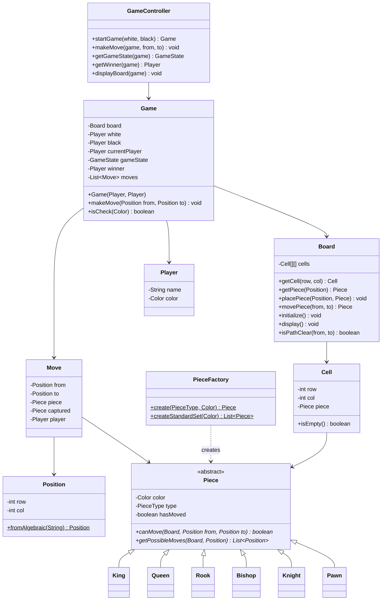
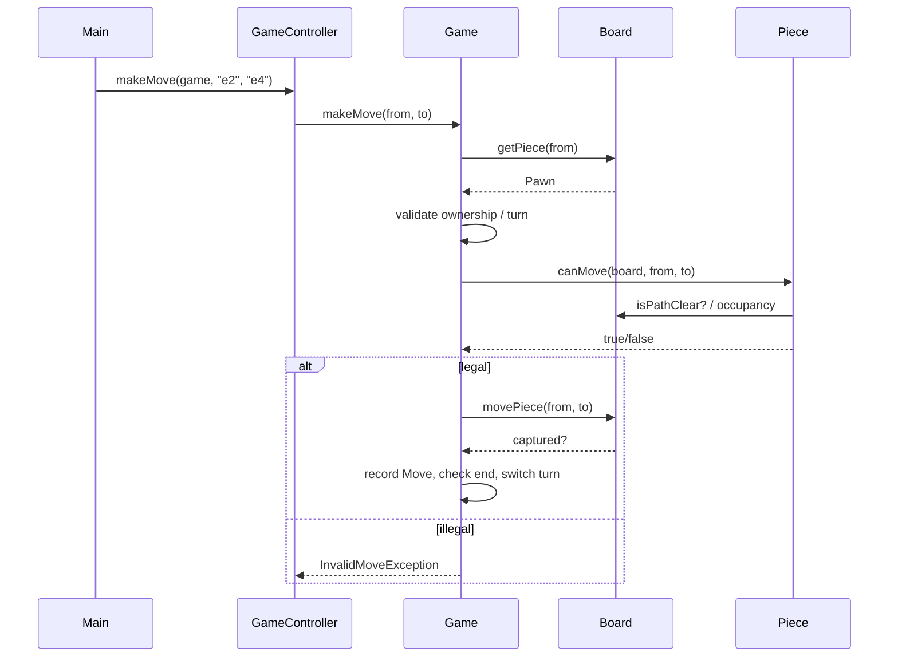

# Chess Game — Low Level Design (Interview Guide)

> **Goal:** Understand, explain, and code this in ~60 minutes during an LLD interview.

---

## Table of Contents

1. [Problem Statement](#1-problem-statement)
2. [Functional Requirements (8–10)](#2-functional-requirements-810)
3. [Out of Scope (say this upfront)](#3-out-of-scope-say-this-upfront)
4. [Package Structure](#4-package-structure)
5. [Class Diagram](#5-class-diagram)
6. [Schema Design](#6-schema-design)
7. [Design Patterns](#7-design-patterns)
8. [Core Classes — Responsibilities & Key Methods](#8-core-classes--responsibilities--key-methods)
9. [Game Flow & Sequence Diagrams](#9-game-flow--sequence-diagrams)
10. [Piece Movement Rules (cheat sheet)](#10-piece-movement-rules-cheat-sheet)
11. [Validation Rules](#11-validation-rules)
12. [60-Minute Coding Plan](#12-60-minute-coding-plan)
13. [How to Explain in Interview](#13-how-to-explain-in-interview)
14. [Sample Interview Q&A](#14-sample-interview-qa)
15. [Extension Hooks (bonus points)](#15-extension-hooks-bonus-points)
16. [Cross-Project Mapping](#16-cross-project-mapping)

---

## 1. Problem Statement

Design a **2-player Chess** game on an **8×8 board**. Each player owns 16 pieces (King, Queen, Rook, Bishop, Knight, Pawn ×8). Players alternate turns moving one piece per turn. A move may **capture** an opponent piece. The game ends on **checkmate** (or simplified: **King captured** / **resign** for interview MVP).

**Interview framing:** Chess is like TicTacToe (turn-based board game) + Snake & Ladder (richer move rules). The hard part is **piece polymorphism** and **move validation** — not UI or multiplayer.

---

## 2. Functional Requirements (8–10)

| # | Requirement | Interview one-liner |
|---|-------------|---------------------|
| **R1** | **Board setup** — 8×8 grid; standard starting positions. | "Board = `Cell[8][8]`; each cell may hold one `Piece`." |
| **R2** | **Two players** — White and Black; White moves first. | "Same turn index pattern as TicTacToe / Snake & Ladder." |
| **R3** | **Piece types** — King, Queen, Rook, Bishop, Knight, Pawn with distinct movement. | "Abstract `Piece` + subclasses; each overrides `canMove` / `getPossibleMoves`." |
| **R4** | **Turn-based play** — One legal move per turn; then switch color. | "`currentPlayer` toggles WHITE ↔ BLACK." |
| **R5** | **Move validation** — Destination in bounds; piece belongs to current player; path clear (for sliding pieces); cannot capture own piece. | "Validate before mutating board." |
| **R6** | **Capture** — Moving onto opponent piece removes it. | "Destination cell occupied by enemy → capture." |
| **R7** | **Pawn rules (simplified)** — Forward 1 (or 2 from start), capture diagonally. | "Pawn is special; mention en passant as out of scope." |
| **R8** | **Display board** — Print board after each move (ASCII / Unicode). | "Same as TicTacToe `displayBoard()`." |
| **R9** | **Win / end** — Checkmate *or* (MVP) King captured / no legal moves / resign. | "State preference upfront: full check vs simplified." |
| **R10** | **Move history** — Record moves (from, to, piece, captured). | "Like TicTacToe `List<Move>`; unlocks undo later." |

### Recommended MVP for 1 hour (pick with interviewer)

Agree on **3 working functionalities** to code:

1. **Initialize + display** standard board  
2. **Make a validated move** (at least Pawn + one sliding piece, e.g. Rook/Bishop; ideally all 6 types via polymorphism)  
3. **Capture + switch turns + detect game end** (simplified: King removed, or basic check)

Say explicitly: *full check/checkmate/castling/en passant/promotion are extensions unless time remains.*

---

## 3. Out of Scope (say this upfront)

Keep v1 small — interviewers respect scope control:

- Castling, en passant, pawn promotion (mention as hooks)
- Full check / checkmate / stalemate search (can stub or simplify)
- Timers / chess clocks
- Online multiplayer / WebSocket
- Database persistence (still discuss schema)
- UI / frontend / FEN / PGN parsers
- Chess engine / AI bot (mention Strategy like TicTacToe Bot)
- Three-fold repetition, 50-move rule

---

## 4. Package Structure

Mirror TicTacToe / Snake & Ladder layout:

```
chess/
├── ChessGameMain.java                   # entry point, game loop (CLI)
├── controller/
│   └── GameController.java              # stateless — forwards to Game
├── models/
│   ├── Game.java                        # orchestrator (setup + makeMove)
│   ├── Board.java                       # 8×8 cells, place/move/get
│   ├── Cell.java                        # row, col, Piece?
│   ├── Player.java                      # name, Color
│   ├── Move.java                        # from, to, piece, captured?
│   └── pieces/
│       ├── Piece.java                   # abstract
│       ├── King.java
│       ├── Queen.java
│       ├── Rook.java
│       ├── Bishop.java
│       ├── Knight.java
│       └── Pawn.java
├── enums/
│   ├── Color.java                       # WHITE, BLACK
│   ├── PieceType.java                   # KING, QUEEN, ...
│   ├── GameState.java                   # IN_PROGRESS, CHECK, CHECKMATE, DRAW, RESIGNED
│   └── CellState.java                   # EMPTY, OCCUPIED (optional)
├── exceptions/
│   ├── InvalidMoveException.java
│   ├── WrongTurnException.java
│   └── GameAlreadyEndedException.java
├── strategies/                          # optional if not using Piece subclasses alone
│   ├── MoveValidationStrategy.java      # interface (bonus)
│   └── ...
└── factories/
    └── PieceFactory.java                # create piece by type + color
```

**Design choice to state clearly:**

| Approach | Pros | Cons |
|----------|------|------|
| **A. Inheritance** — `Piece` subclasses implement `canMove(board, from, to)` | Natural OOP; classic interview answer | Adding weird variants needs new classes |
| **B. Strategy** — `Piece` holds `MoveStrategy` | Same as TicTacToe winning strategies | Slightly more boilerplate in 1 hr |

**Recommend Approach A for interview** (inheritance), mention Strategy as alternative if interviewer pushes Open/Closed for *new movement rules without new piece types*.

---

## 5. Class Diagram

### 5.1 Mermaid Class Diagram (draw this on whiteboard)



### 5.2 Relationships to explain verbally

| From | To | Relationship | Why |
|------|----|--------------|-----|
| `GameController` | `Game` | Dependency | Stateless entry; matches TicTacToe |
| `Game` | `Board`, `Player` | Composition | Game owns match lifecycle |
| `Board` | `Cell` | Composition | Fixed 8×8 grid |
| `Cell` | `Piece` | Aggregation | Piece can move between cells |
| `King`…`Pawn` | `Piece` | Inheritance | Polymorphic `canMove` |
| `PieceFactory` | `Piece` | Factory | Centralize setup / avoid switch soup in `Board.initialize` |

### 5.3 Simplified whiteboard version (if short on time)

```
GameController → Game → Board + White/Black Player + Move history
Board → Cell[8][8] → Piece?
Piece ← King, Queen, Rook, Bishop, Knight, Pawn
each Piece.canMove(board, from, to)
PieceFactory creates pieces for setup
```

---

## 6. Schema Design

Interviewers may ask for **in-memory structure** or **DB design**. Cover both briefly.

### 6.1 In-Memory Object Schema (primary for 1-hr coding)

```
Game
├── board: Board
├── white: Player
├── black: Player
├── currentPlayer: Player
├── gameState: GameState
├── winner: Player | null
└── moves: List<Move>

Board
└── cells: Cell[8][8]

Cell
├── row: int          // 0–7
├── col: int          // 0–7
└── piece: Piece | null

Position (value object)
├── row: int
└── col: int          // helpers: algebraic "e2" ↔ (row,col)

Player
├── name: String
└── color: Color      // WHITE | BLACK

Piece (abstract)
├── color: Color
├── type: PieceType
└── hasMoved: boolean // useful for pawn double-step / castling later

Move
├── from: Position
├── to: Position
├── piece: Piece
├── captured: Piece | null
└── player: Player
```

**Coordinate convention (pick one and stick to it):**

| Convention | Example | Tip |
|------------|---------|-----|
| **Algebraic** | `e2 → e4` | User-friendly CLI |
| **0-indexed row/col** | row 1,col 4 → row 3,col 4 | Internals |
| White at bottom | row 0 = Black's back rank *or* row 0 = White — **state assumption** | Say: "row 0 = White's back rank" OR "row 0 = top like printed boards" |

Recommended for interview:

- `row 0` = **White back rank** (rank 1), `row 7` = Black back rank (rank 8)  
- `col 0` = file **a**, `col 7` = file **h**  
- Algebraic: `"e2"` → row=1, col=4

### 6.2 Database Schema (if interviewer asks "production / persistence")

```text
┌─────────────────┐       ┌──────────────────┐
│     games       │       │     players      │
├─────────────────┤       ├──────────────────┤
│ id (PK)         │       │ id (PK)          │
│ state           │       │ name             │
│ current_color   │       └──────────────────┘
│ winner_id (FK)  │──┐              │
│ created_at      │  │    ┌─────────▼──────────┐
└─────────────────┘  │    │   game_players     │
         │           │    ├──────────────────────┤
         │           └───►│ game_id (FK)       │
         │                │ player_id (FK)     │
         │                │ color (WHITE/BLACK)│
         │                └──────────────────────┘
         │
         ▼
┌─────────────────┐       ┌──────────────────┐
│  board_pieces   │       │   game_moves     │
├─────────────────┤       ├──────────────────┤
│ id (PK)         │       │ id (PK)          │
│ game_id (FK)    │       │ game_id (FK)     │
│ piece_type      │       │ move_number      │
│ color           │       │ from_row/col     │
│ row, col        │       │ to_row/col       │
│ has_moved       │       │ piece_type       │
│ is_captured     │       │ captured_type?   │
└─────────────────┘       │ created_at       │
                          └──────────────────┘
```

**Note:** Live board can be reconstructed from `game_moves` (event sourcing) *or* stored as current `board_pieces` snapshot. Snapshot is simpler for LLD.

---

## 7. Design Patterns

| Pattern | Where | Why (interview answer) |
|---------|-------|------------------------|
| **Inheritance / Polymorphism** | `Piece` ← King…Pawn | Same `makeMove` path; each piece owns its rules |
| **Factory** | `PieceFactory` | Board setup without huge if-else; create by `PieceType` |
| **MVC-ish** | `GameController` + `Game` | Controller thin; model holds state (TicTacToe style) |
| **Strategy** *(optional)* | `MoveStrategy` per piece type | Prefer if interviewer wants Strategy explicitly |
| **Template Method** *(optional)* | `Piece.canMove` calls shared helpers | Bounds + own-piece check in base; subclass does geometry |

### Patterns to mention but NOT implement in 1 hour

| Pattern | When to mention |
|---------|-----------------|
| **Command** | Undo / redo moves (TicTacToe has undo) |
| **Observer** | Notify UI on move / check |
| **Memento** | Snapshot board for undo or AI search |
| **State** | Richer `GameState` transitions (CHECK → CHECKMATE) |

---

## 8. Core Classes — Responsibilities & Key Methods

> Pseudocode signatures — **no full implementation** (you will code this yourself).

### 8.1 `GameController` (stateless)

```
startGame(whiteName, blackName) → Game
makeMove(game, fromAlgebraic, toAlgebraic) → void
getGameState(game) → GameState
getWinner(game) → Player?
displayBoard(game) → void
```

### 8.2 `Game` (orchestrator)

```
Game(Player white, Player black):
  board = new Board()
  board.initialize()          // standard setup via PieceFactory
  currentPlayer = white
  gameState = IN_PROGRESS
  moves = []

makeMove(Position from, Position to):
  1. if gameState != IN_PROGRESS → throw
  2. piece = board.getPiece(from)
  3. if piece == null → InvalidMoveException
  4. if piece.color != currentPlayer.color → WrongTurnException
  5. if !piece.canMove(board, from, to) → InvalidMoveException
  6. // optional MVP+: if move leaves own king in check → invalid
  7. captured = board.movePiece(from, to)
  8. piece.hasMoved = true
  9. record Move
 10. // end detection (pick one):
       a) if captured is King → winner, COMPLETED
       b) if opponent in checkmate → CHECKMATE
 11. switch currentPlayer
```

### 8.3 `Board`

```
initialize():
  place back rank: Rook, Knight, Bishop, Queen, King, Bishop, Knight, Rook
  place pawn rank
  (mirror for Black)

movePiece(from, to) → captured Piece?:
  captured = cells[to].piece
  cells[to].piece = cells[from].piece
  cells[from].piece = null
  return captured

isPathClear(from, to):
  // used by Rook, Bishop, Queen
  // walk cells strictly between from and to; all must be empty

isInside(row, col) → boolean
```

### 8.4 `Piece` (abstract)

```
abstract canMove(Board board, Position from, Position to): boolean

// Shared helpers in base class:
protected boolean isDestinationValid(Board, from, to):
  if !board.isInside(to) → false
  dest = board.getPiece(to)
  if dest != null && dest.color == this.color → false  // can't capture own
  return true
```

### 8.5 Per-piece `canMove` (logic sketch)

```
King:   |dRow|<=1 && |dCol|<=1 && not same cell
Queen:  (rook-like OR bishop-like) && pathClear
Rook:   same row OR same col && pathClear
Bishop: |dRow|==|dCol| && pathClear
Knight: (2,1) or (1,2) L-shape — NO pathClear needed
Pawn:   direction = color==WHITE ? +1 : -1
        - forward 1 if empty
        - forward 2 from start rank if both empty
        - diagonal 1 if enemy present
```

### 8.6 `PieceFactory`

```
create(PieceType type, Color color) → Piece
  switch type → new King/Queen/...

placeStandardPieces(Board board):
  // loops ranks/files; uses create()
```

---

## 9. Game Flow & Sequence Diagrams

### 9.1 Main Game Loop

```
main():
  controller = new GameController()
  game = controller.startGame("Alice", "Bob")
  controller.displayBoard(game)

  while game.state == IN_PROGRESS:
    print currentPlayer
    read input: "e2 e4"   // or resign
    try:
      controller.makeMove(game, "e2", "e4")
      controller.displayBoard(game)
    catch InvalidMoveException:
      print "Illegal move, try again"

  print winner / draw
```

### 9.2 Single Move Sequence



### 9.3 Move Decision Tree

```text
Input from → to
    │
    ▼
Game in progress?
    │ no → reject
    ▼
Piece at from?
    │ no → reject
    ▼
Piece color == current player?
    │ no → reject
    ▼
piece.canMove(board, from, to)?
    │ no → reject
    ▼
(optional) Own king safe after move?
    │ no → reject
    ▼
Apply move / capture
    │
    ▼
Opponent checkmated / king gone?
    │ yes → end game
    │ no  → switch turn
```

---

## 10. Piece Movement Rules (cheat sheet)

Memorize this table for whiteboard / coding:

| Piece | Pattern | Path must be clear? |
|-------|---------|---------------------|
| **King** | Any adjacent square (8 dirs) | N/A (1 step) |
| **Queen** | Rook + Bishop | Yes |
| **Rook** | Horizontal / vertical | Yes |
| **Bishop** | Diagonal (`|Δr|==|Δc|`) | Yes |
| **Knight** | L: (2,1)/(1,2) | **No** (jumps) |
| **Pawn** | Forward empty; diag capture; optional double from start | Forward cells empty |

**Pawn start ranks (with recommended coords):** White double-step from `row=1`; Black from `row=6`.

---

## 11. Validation Rules

| Rule | Exception | Message idea |
|------|-----------|--------------|
| No piece at source | `InvalidMoveException` | "No piece at e2" |
| Not your piece / wrong turn | `WrongTurnException` | "It is White's turn" |
| Out of bounds | `InvalidMoveException` | "Destination off board" |
| Capturing own piece | `InvalidMoveException` | "Cannot capture own piece" |
| Illegal geometry / blocked path | `InvalidMoveException` | "Illegal move for Rook" |
| Game already finished | `GameAlreadyEndedException` | "Game over" |
| (Optional) Leaves king in check | `InvalidMoveException` | "Move leaves king in check" |

---

## 12. 60-Minute Coding Plan

| Time | Task | Deliverable |
|------|------|-------------|
| **0–5 min** | Clarify requirements & scope | Agree MVP: setup + move + capture + simple end |
| **5–12 min** | Draw class diagram + enums | Whiteboard buy-in |
| **12–20 min** | `Color`, `PieceType`, `GameState`, `Position`, `Cell`, `Player`, `Move` | Models compile |
| **20–30 min** | Abstract `Piece` + `Pawn` + `Rook` (or Knight) + `PieceFactory` | 2 piece types movable |
| **30–40 min** | Remaining pieces (`Bishop`, `Queen`, `King`, `Knight`) + `Board.initialize` / `display` | Full setup |
| **40–50 min** | `Game.makeMove` + validations + turn switch + capture | Core loop works |
| **50–55 min** | `GameController` + `ChessGameMain` CLI | Playable demo |
| **55–60 min** | Walk edge cases | Blocked path, wrong turn, knight jump, pawn capture |

### If running behind — minimum viable

1. Skip full checkmate — end when **King is captured**  
2. Implement **Pawn + Rook + Knight** only; stub other pieces with `return false` or copy Queen from Rook+Bishop  
3. Skip algebraic parsing — use `row,col` integers in CLI  
4. Skip `Move` history initially  
5. Skip DB schema until asked  

### 2–3 functionalities to demo (must work)

| # | Demo | How to show |
|---|------|-------------|
| 1 | Board initializes correctly | Print board at start |
| 2 | Legal move + illegal move rejected | `e2 e4` works; `e2 e5` fails; wrong turn fails |
| 3 | Capture works | Move onto enemy piece; piece removed; printed board updates |

Bonus if time: detect check (is square attacked) or undo last move.

---

## 13. How to Explain in Interview

### Opening (30–40 seconds)

> "I'll design a 2-player chess game on an 8×8 board. Core flow: initialize standard setup, alternate White/Black turns, validate moves via polymorphic Piece subclasses, support capture, and end the game on checkmate — or for MVP, when the King is captured. Structure mirrors TicTacToe: GameController + Game + Board + Move history. Piece movement uses inheritance (or MoveStrategy if we want Strategy pattern). Factory creates pieces for setup. Out of scope for v1: castling, en passant, promotion, clocks, and multiplayer."

### Class diagram walk (2 minutes)

1. **GameController** — thin API  
2. **Game** — turn, state, winner, `makeMove`  
3. **Board / Cell** — 8×8 occupancy  
4. **Piece hierarchy** — polymorphism for rules  
5. **PieceFactory** — standard setup  
6. **Move** — audit trail / undo hook  

### Schema walk (1 minute)

> "In memory: `Cell[8][8]` holding optional `Piece`, plus `List<Move>`. If we persist: `games`, `game_players`, `board_pieces` snapshot, and `game_moves` log."

### Trade-offs to mention

| Choice | Trade-off |
|--------|-----------|
| Inheritance vs Strategy for moves | Inheritance is faster to code; Strategy is more flexible |
| King-captured vs real checkmate | Captured is faster MVP; checkmate needs attack-map + legal-move generation |
| Store board snapshot vs replay moves | Snapshot is O(1) read; replay is smaller writes |
| Algebraic vs (r,c) input | Algebraic is nicer UX; (r,c) is faster to implement |

---

## 14. Sample Interview Q&A

**Q: How do you validate a Rook move?**  
A: Same row or same column; `board.isPathClear(from, to)`; destination empty or enemy.

**Q: Why doesn't Knight need path clear?**  
A: Knights jump; only check L-shape and destination not own piece.

**Q: How would you implement check?**  
A: Find King position for color; scan all opponent pieces — if any `canMove` to King's square, in check. A legal move must leave own king unchecked (simulate move → test → undo).

**Q: How is this different from TicTacToe?**  
A: TicTacToe validates empty cell + pluggable `WinningStrategy`. Chess validates **piece-specific geometry** + path + ownership. Both share Controller/Game/Board/Move/turn index ideas.

**Q: How is this different from Snake & Ladder?**  
A: Snake & Ladder movement is dice + jumper map. Chess movement is player-chosen coordinates with rich rules. Both use turn-based `Game` loop.

**Q: Thread safety?**  
A: Single-threaded CLI for LLD. For concurrent API, one lock per `gameId` on `makeMove`.

**Q: How do you support undo?**  
A: Pop last `Move`, restore piece to `from`, put `captured` back on `to`, restore `hasMoved` / turn (Command or careful reverse).

**Q: Pawn promotion?**  
A: When pawn reaches last rank, replace with Queen (default) or ask user — Factory creates new piece on that cell.

---

## 15. Extension Hooks (bonus points)

| Extension | Pattern / approach |
|-----------|-------------------|
| Castling | King+Rook `hasMoved==false`, path clear, not in check |
| En passant | Track last move was pawn double-step; special capture square |
| Promotion | On last rank → `PieceFactory.create(chosenType)` |
| Real checkmate | Generate all legal moves for side; none + in check → mate |
| Bot player | `Bot extends Player` + `BotMoveStrategy` (TicTacToe style) |
| Undo | Command / move stack |
| REST API | Controller → service; persist schema above |
| FEN export | Serialize board + turn + castling rights |

---

## 16. Cross-Project Mapping

| Concept | TicTacToe | Snake & Ladder | Chess |
|---------|-----------|----------------|-------|
| Entry | `GameController` | `GameController` | `GameController` |
| Orchestrator | `Game` | `Game` | `Game` |
| Grid | `Board` + `Cell` | linear cells + jumper map | `Board` + `Cell[8][8]` |
| Turn | `currentPlayerIndex` | same | White/Black toggle |
| Rules plug-in | `WinningStrategy` | `Jumper` / dice Strategy | `Piece.canMove` hierarchy |
| History | `List<Move>` | `List<Move>` | `List<Move>` |
| Creation | Builder on `Game` | `Game` ctor / factory | `PieceFactory` + `Game` ctor |
| End state | COMPLETED / DRAW | COMPLETED | CHECKMATE / DRAW / (King captured) |

---

## Quick Reference Card (print this)

```
REQUIREMENTS: 8×8 | 2 players | White first | piece rules |
              capture | turn switch | win (mate or king taken) |
              display | move history

CLASSES:      GameController → Game → Board, Players, Moves
              Cell → Piece?
              Piece ← K Q R B N P
              PieceFactory

PATTERNS:     Polymorphism | Factory | MVC | (Strategy optional)

CORE LOGIC:   get piece → validate turn → canMove → move/capture
              → check end → switch player

DATA:         Board.cells[8][8]
              Piece.color, Piece.type
              Move(from, to, piece, captured)

MVP DEMO:     1) init+print  2) legal/illegal move  3) capture+turns
```

### Suggested first moves to test manually

```
e2 e4      # white pawn
e7 e5      # black pawn
g1 f3      # white knight
b8 c6      # black knight
f1 c4      # white bishop
...
```

---

*Study this doc, then implement class-by-class following the 60-minute plan. Keep package naming and Controller/Game/Board patterns consistent with TicTacToe and Snake & Ladder so every board-game LLD feels familiar in interviews.*
