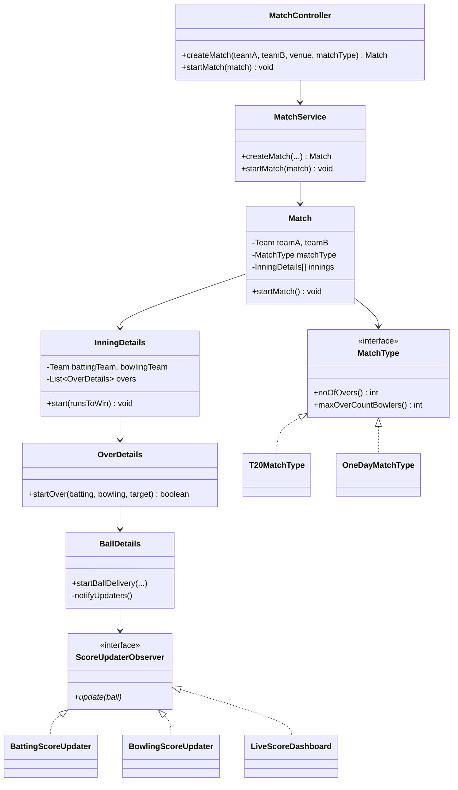
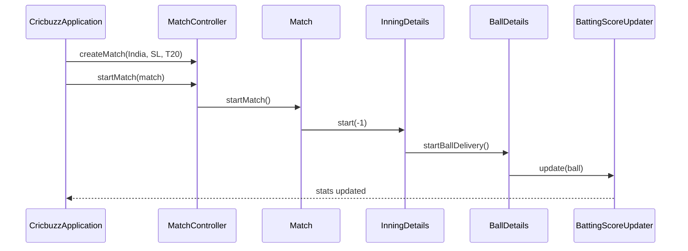

# CricBuzz — Low Level Design (Interview Guide)

> **Goal:** Understand, explain, and code this in ~60 minutes during an LLD interview.  
> **Signature patterns:** **Observer** (live score updates on each ball) + **Strategy** (T20 vs ODI match rules).  
> **Reference style:** Mirrors your [ATM Machine](../atm/LLD_ATM_MACHINE.md) / [Airline](../airline/docs/AIRLINE_MANAGEMENT_LLD.md) guides.

---

## Code map (implemented)

Study order: `CricbuzzApplication` (scripted demo) → `models/Match` → `models/inning/BallDetails` → `observers/*`.

| Feature | What | Where to read |
|---------|------|---------------|
| **1. Start match** | Two teams, 11 players, venue, format strategy (T20/ODI) | `MatchController.createMatch`, `TeamFactory`, `MatchService` |
| **2. Ball-by-ball scoring** | Random sim: runs, wicket, strike swap; Observer updates stats | `BallDetails.startBallDelivery`, `BattingScoreUpdater`, `BowlingScoreUpdater` |
| **3. Scorecard + result** | Per-innings batting/bowling cards; chase logic; winner | `Match.startMatch`, `InningDetails.start`, `OverDetails.startOver` |

**Run the scripted demo** (T20 India vs SriLanka — full match sim):

```bash
cd cricbuzz
.\mvnw.cmd -q -DskipTests compile exec:java
```

**Run single quick match:**

```bash
.\mvnw.cmd -q -DskipTests compile exec:java "-Dexec.mainClass=com.cricbuzz.cricbuzz.demo.CricbuzzDemo"
```

**Start Spring Boot web context** (optional — no REST endpoints yet):

```bash
.\mvnw.cmd spring-boot:run -Dspring-boot.run.arguments=server
```

---

## Table of Contents

1. [Problem Statement](#1-problem-statement)
2. [Functional Requirements (8–10)](#2-functional-requirements-810)
3. [Out of Scope](#3-out-of-scope)
4. [Clarify With Interviewer First](#4-clarify-with-interviewer-first)
5. [Package Structure (implemented)](#5-package-structure-implemented)
6. [Class Diagram](#6-class-diagram)
7. [Schema Design](#7-schema-design)
8. [Design Patterns — Observer + Strategy](#8-design-patterns--observer--strategy)
9. [Core Classes — Responsibilities](#9-core-classes--responsibilities)
10. [Flow & Sequence Diagrams](#10-flow--sequence-diagrams)
11. [Cricket Rules Engine](#11-cricket-rules-engine)
12. [60-Minute Coding Plan](#12-60-minute-coding-plan)
13. [How to Explain in Interview](#13-how-to-explain-in-interview)
14. [Sample Interview Q&A](#14-sample-interview-qa)
15. [Extension Hooks](#15-extension-hooks)
16. [Cross-Project Mapping](#16-cross-project-mapping)

---

## 1. Problem Statement

Design a **cricket live scoreboard** (like CricBuzz) that tracks a match **ball-by-ball**: team score, wickets, extras, individual batsman/bowler stats, strike rotation, and match result after two innings.

**Interview framing:** Domain-rich **event accumulation** — each ball appends state; **Observer** fans out updates to live dashboards; **Strategy** encapsulates T20 vs ODI limits.

---

## 2. Functional Requirements (8–10)

| # | Requirement | Implemented in |
|---|-------------|----------------|
| **R1** | Create match (two teams, venue, format) | `MatchService.createMatch` |
| **R2** | Toss + start innings with batting order | `Match.startMatch`, `PlayerBattingController` |
| **R3** | Record ball (runs / wicket / extras enum) | `BallDetails.startBallDelivery` |
| **R4** | Strike rotation on odd runs + end of over | `BallDetails`, `InningDetails.start` |
| **R5** | Extras (wide / no-ball) — enum ready | `BallType.WIDEBALL`, `BallType.NOBALL` |
| **R6** | Wicket → next batsman | `OverDetails.startOver`, `Team.chooseNextBatsMan` |
| **R7** | Innings scorecard print | `Team.printBattingScoreCard`, `printBowlingScoreCard` |
| **R8** | Second innings chase target | `InningDetails.start(runsToWin)` |
| **R9** | Match winner | `Match.startMatch`, `Team.isWinner` |
| **R10** | Live ticker on each ball | `LiveScoreDashboard` (Observer) |

### MVP for 1 hour

1. **Start match** — teams + T20 strategy  
2. **Ball-by-ball** — `BallDetails` + Observer score updaters  
3. **Print scorecard** — after each innings + winner  

---

## 3. Out of Scope

- Manual ball input CLI (current sim uses random outcomes — easy extension)
- DRS, rain/DLS, Test cricket, commentary text
- REST API / WebSocket (Spring Boot shell is ready)
- Persistence (schema below for discussion)

---

## 4. Clarify With Interviewer First

| Question | Default |
|----------|---------|
| Format? | **T20** — 20 overs, 5 overs max per bowler |
| Scoring input? | **Simulated** random; mention manual `recordBall` as extension |
| One or two innings? | **Two** (full match) — drop to one if short on time |
| Wide/no-ball in MVP? | Enums exist; sim uses `NORMAL` balls only for now |

---

## 5. Package Structure (implemented)

```
cricbuzz/
├── pom.xml
├── LLD_CRICBUZZ.md
└── src/main/java/com/cricbuzz/cricbuzz/
    ├── CricbuzzApplication.java          # @SpringBootApplication + study demo main
    ├── controller/
    │   └── MatchController.java          # thin API
    ├── demo/
    │   └── CricbuzzDemo.java             # single-match runner
    ├── services/
    │   └── MatchService.java             # create + start match
    ├── factories/
    │   └── TeamFactory.java              # seed 11-player squads
    ├── models/
    │   ├── Match.java
    │   ├── Team.java
    │   ├── Wicket.java
    │   ├── inning/
    │   │   ├── InningDetails.java
    │   │   ├── OverDetails.java
    │   │   └── BallDetails.java          # core ball logic + observer notify
    │   ├── player/
    │   │   ├── Person.java
    │   │   ├── PlayerDetails.java
    │   │   ├── PlayerBattingController.java
    │   │   └── PlayerBowlingController.java
    │   └── score/
    │       ├── BattingScoreCard.java
    │       └── BowlingScoreCard.java
    ├── strategies/
    │   ├── MatchType.java                # Strategy interface
    │   ├── T20MatchType.java
    │   └── OneDayMatchType.java
    ├── observers/
    │   ├── ScoreUpdaterObserver.java
    │   ├── BattingScoreUpdater.java
    │   ├── BowlingScoreUpdater.java
    │   └── LiveScoreDashboard.java
    └── enums/
        ├── BallType.java
        ├── RunType.java
        ├── WicketType.java
        ├── PlayerType.java
        └── MatchStatus.java
```

---

## 6. Class Diagram



### Relationships to explain

| From | To | Why |
|------|-----|-----|
| `MatchController` | `MatchService` | Thin layer — same as `AtmController` |
| `Match` | `InningDetails` | Composition — 2 innings per match |
| `BallDetails` | `ScoreUpdaterObserver` | **Observer** — stats + live ticker |
| `Match` | `MatchType` | **Strategy** — T20 vs ODI rules |
| `Team` | `PlayerBattingController` | Manages striker/non-striker queue |

---

## 7. Schema Design

### In-memory (current code)

```
Match
├── teamA, teamB: Team
├── matchType: MatchType (Strategy)
├── innings[2]: InningDetails
└── status: MatchStatus

Team
├── playing11: Queue<PlayerDetails>
├── battingController, bowlingController
└── isWinner: boolean

InningDetails
├── battingTeam, bowlingTeam
└── overs: List<OverDetails>

BallDetails
├── ballType, runType, wicket
├── playedBy, bowledBy
└── scoreUpdaterObserverList (Batting + Bowling + Live)

PlayerDetails
├── battingScoreCard, bowlingScoreCard
└── person, playerType
```

### DB schema (interview extension)

See ER diagram in prior revision — tables: `matches`, `innings`, `overs`, `balls`, `batsman_innings_stats`, `teams`, `players`.

---

## 8. Design Patterns — Observer + Strategy

### Observer (primary)

After each ball, `BallDetails.notifyUpdaters()` calls:

1. `BowlingScoreUpdater` — overs, runs conceded, wickets  
2. `BattingScoreUpdater` — runs, balls, 4s, 6s  
3. `LiveScoreDashboard` — one-line ticker  

**Say in interview:** *"Adding push notifications = new `ScoreUpdaterObserver` class, zero change to `BallDetails` core logic."*

### Strategy (match format)

| Class | Overs | Max overs/bowler |
|-------|-------|------------------|
| `T20MatchType` | 20 | 5 |
| `OneDayMatchType` | 50 | 10 |

`InningDetails` and `PlayerBowlingController` depend on `MatchType` interface — **Open/Closed**.

---

## 9. Core Classes — Responsibilities

### `MatchController`

```
createMatch(teamA, teamB, venue, matchType) → Match
startMatch(match) → void
```

### `BallDetails.startBallDelivery` (heart of LLD)

```
1. playedBy = striker; bowledBy = current bowler
2. If wicket → runType=ZERO, create Wicket, clear striker
3. Else → random runType; swap strike on 1 or 3
4. notifyUpdaters() → batting + bowling + live dashboard
```

### `OverDetails.startOver`

```
Loop 6 legal balls:
  BallDetails.startBallDelivery(...)
  On wicket → chooseNextBatsMan()
  If chase target met → battingTeam.isWinner=true, return
End of over → return false (InningDetails swaps strike)
```

### `Match.startMatch`

```
toss → inning 1 (runsToWin=-1) → print scorecards
     → inning 2 (runsToWin=innings[0].total) → print scorecards
     → print winner
```

---

## 10. Flow & Sequence Diagrams



---

## 11. Cricket Rules Engine

| Rule | Implementation |
|------|----------------|
| 6 legal balls = 1 over | `OverDetails` ballCount loop |
| Strike swap on 1, 3 | `BallDetails` after run |
| Strike swap end of over | `InningDetails.start` after each over |
| Wicket → new batsman | `OverDetails` + `PlayerBattingController` |
| Chase win | `battingTeam.getTotalRuns() >= runsToWin` |
| Bowler rotation | `PlayerBowlingController.getNextBowler(max)` |

---

## 12. 60-Minute Coding Plan

| Time | Task |
|------|------|
| 0–5 | Requirements + MVP 3 features |
| 5–15 | Draw Match → Inning → Over → Ball + Observer |
| 15–25 | `Team`, `PlayerDetails`, `MatchType` strategies |
| 25–45 | **`BallDetails` + updaters + `OverDetails`** |
| 45–55 | `Match.startMatch`, controller, demo |
| 55–60 | Mention REST API, manual input, DB |

---

## 13. How to Explain in Interview

**Opening (60s):**

> "CricBuzz is ball-by-ball event sourcing. Match contains innings; each over has balls. `BallDetails` applies cricket rules and notifies Observer subscribers for batting stats, bowling stats, and live ticker. T20 vs ODI is a Strategy on max overs."

**While coding:** Narrate one ball end-to-end — striker, run, observer update, strike swap.

**Closing:** Extensions — manual `recordBall` API, wide/no-ball branches, bowler economy, persistence.

---

## 14. Sample Interview Q&A

**Q: Observer vs State (ATM)?**  
A: ATM = illegal ops by session phase (State). CricBuzz = append ball events + fan-out to readers (Observer).

**Q: Why Strategy for match type?**  
A: `InningDetails` asks `matchType.noOfOvers()` — new format = new class, no if-else in inning loop.

**Q: Where is single source of truth?**  
A: `BallDetails` triggers updates; score lives on `BattingScoreCard` / `BowlingScoreCard` on each player.

---

## 15. Extension Hooks

| Extension | Hook |
|-----------|------|
| Manual ball input | `ScorecardService.recordBall(type, runs)` replacing random sim |
| Wide / no-ball | Branch in `BallDetails` — don't increment legal ball count |
| REST API | `@RestController` wrapping `MatchController` |
| Undo ball | Command stack + Memento |
| Test match | `TestMatchType` strategy |

---

## 16. Cross-Project Mapping

| Concept | ATM | CricBuzz |
|---------|-----|----------|
| Core pattern | State | **Observer** + Strategy |
| Controller | `AtmController` | `MatchController` |
| Orchestrator | `ATM` + states | `BallDetails` + `Match` |
| External notify | — | `LiveScoreDashboard` |
| Strategy | — | `MatchType` (T20/ODI) |
| Factory | `AccountFactory` | `TeamFactory` |

---

## Quick Revision Card

```
REQUIREMENTS: start match, ball-by-ball, scorecard, winner
MVP CODE:     TeamFactory → MatchController → BallDetails → Observers
PATTERNS:     Observer (ScoreUpdaterObserver), Strategy (MatchType)
HIERARCHY:    Match → InningDetails → OverDetails → BallDetails
STRIKE:       odd runs + end of over → swap striker/nonStriker
SKIP:         DLS, DRS, persistence, REST (unless time)
RUN:          .\mvnw.cmd -q -DskipTests compile exec:java
```

---

*Practice: trace one ball from `OverDetails.startOver` through both score updaters in 2 minutes — that is your interview story.*
