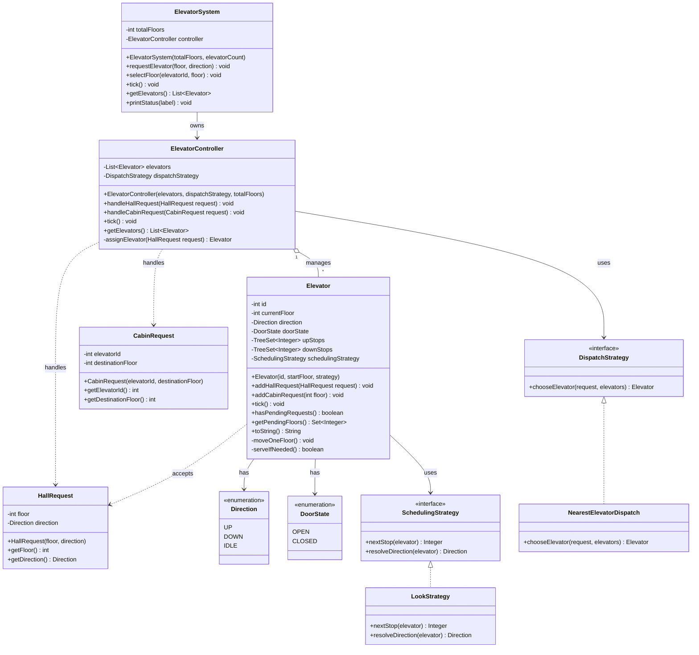
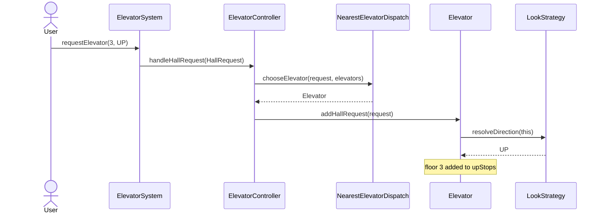
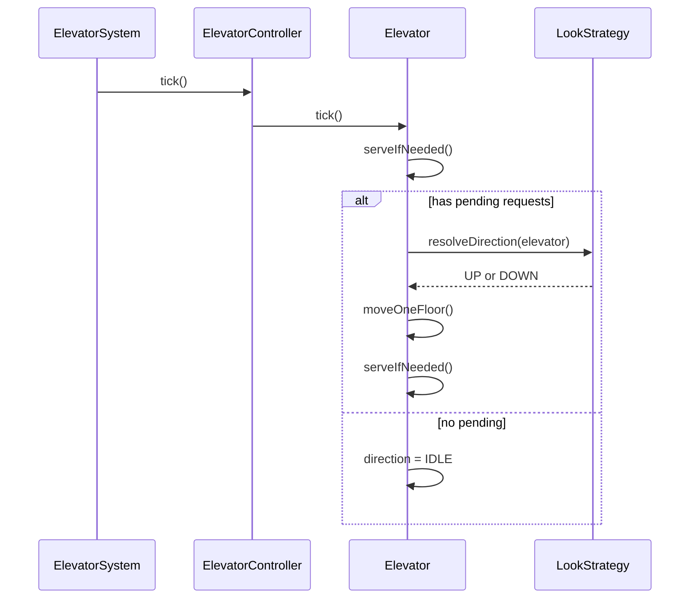
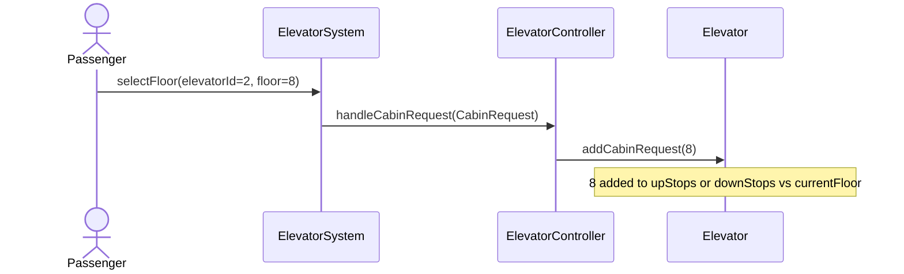
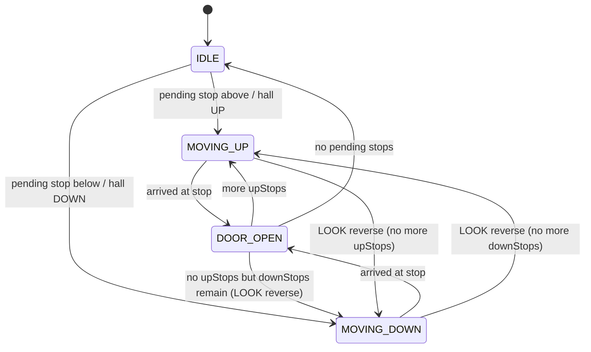

# Elevator System — LLD (1-Hour Scope)

Revision notes for designing and coding a multi-elevator system using the **LOOK** scheduling strategy.

---

## Code map (implemented)

Only **3 features** are coded (enough for a 1-hour interview):

| Feature | What | Where to read |
|---------|------|----------------|
| **1. Hall + Cabin + Nearest dispatch** | Outside/inside requests; assign closest car | `ElevatorController`, `NearestElevatorDispatch`, `Elevator.addHallRequest` / `addCabinRequest` |
| **2. LOOK scheduling** | Keep direction while stops remain; reverse; never go past last request | `LookStrategy`, `Elevator.upStops` / `downStops` |
| **3. Tick simulation** | One floor (or door open/close) per `tick()` | `Elevator.tick()` — step comments inside |

**Run the demo** (no Spring needed):

- IDE: run `com.elevatorsystem.elevator.demo.ElevatorDemo`
- CLI: `.\mvnw.cmd -q -DskipTests compile org.codehaus.mojo:exec-maven-plugin:3.5.0:java "-Dexec.mainClass=com.elevatorsystem.elevator.demo.ElevatorDemo"`

Study order: `ElevatorDemo` → `ElevatorSystem` → `ElevatorController` → `Elevator.tick()` → `LookStrategy`.

---

## 1. Goal

Design an elevator control system for **one building** with:

- `N` floors
- `M` elevators
- Hall calls (outside) + cabin calls (inside)
- **LOOK** strategy for each elevator’s stop order
- Discrete time simulation via `tick()` / `step()`

Target: finish design + core code walkthrough in **~1 hour**.

---

## 2. Functional Requirements (In Scope)

| ID | Requirement |
|----|-------------|
| FR1 | System supports configurable floors `[1..N]` and elevators `[1..M]`. |
| FR2 | User can make a **hall call**: request an elevator at floor `F` going `UP` or `DOWN`. |
| FR3 | Passenger inside elevator can make a **cabin call**: select destination floor `D`. |
| FR4 | Each elevator tracks: `id`, `currentFloor`, `direction`, `doorState`, pending stops. |
| FR5 | Elevator moves **one floor per tick** when in motion. |
| FR6 | When elevator reaches a floor with a stop, it **opens door**, serves request(s), then closes. |
| FR7 | Controller assigns a hall call to the **best elevator** (simple cost: nearest / least work). |
| FR8 | Once assigned, each elevator serves its stops using **LOOK**. |
| FR9 | System exposes status of all elevators (floor, direction, door, pending floors). |
| FR10 | Idle elevator with no pending requests stays at current floor (`IDLE`). |

### Request types

1. **HallRequest** — `(sourceFloor, direction)` — pressed on floor panel  
2. **CabinRequest** — `(elevatorId, destinationFloor)` — pressed inside cabin  

---

## 3. Non-Functional / Design Constraints

| ID | Constraint |
|----|------------|
| NFR1 | Single-threaded simulation (no locks / concurrency). |
| NFR2 | In-memory only (no DB / REST required for core LLD). |
| NFR3 | Strategy pattern for scheduling so LOOK can be swapped later. |
| NFR4 | Clear separation: Controller (assign) vs Elevator (serve) vs Strategy (order). |

---

## 4. Out of Scope (Explicitly Cut)

- Weight / capacity / overcrowding  
- Emergency, fire, maintenance modes  
- Peak-hour zoning, destination dispatch, VIP  
- Express elevators, multi-building  
- Real-time multithreading, persistence, UI  
- Door open duration as multi-tick delay (optional stretch)

---

## 5. Assumptions

1. Floors are integers from `1` to `N` (inclusive).  
2. Invalid floors / directions are rejected (or ignored with a log).  
3. Door open/close is **instant within one tick** when stopping (simplify).  
4. Hall call is assigned to **one** elevator; no reassignment mid-trip.  
5. Same floor requested twice is treated as one pending stop.  
6. Idle elevators do **not** auto-return to lobby.  
7. When both UP and DOWN hall buttons exist on a floor, they are separate requests.  
8. Cabin requests always join that elevator’s own stop set (no reassignment).

---

## 6. LOOK Strategy (Must Know for Revision)

### Idea

Like SCAN (elevator algorithm), but **does not go to the end of the shaft** if there are no more requests in that direction. It **looks ahead**, serves the last request in current direction, then **reverses**.

### Rules

1. Keep moving in `currentDirection` while there are pending stops **in that direction**.  
2. Serve stops in order along the way (nearest next stop in direction).  
3. When no more stops in current direction → reverse direction (or become `IDLE` if none left).  
4. If idle and a new request arrives → set direction toward that floor and start LOOK.

### LOOK vs SCAN (interview soundbite)

| | SCAN | LOOK |
|---|------|------|
| Travel | Always to top/bottom extreme | Only as far as last request |
| Efficiency | More wasted travel | Better for sparse requests |
| This design | Out of scope | **Chosen** |

### Mini example

Elevator at floor **5**, direction **UP**, pending: `{3, 7, 9}`

1. Serve **7**, then **9** (UP side)  
2. No more UP requests → reverse to **DOWN**  
3. Serve **3**  
4. No pending → **IDLE**

---

## 7. High-Level Components

```text
[Floor Panel] --hall call--> [ElevatorController] --assign--> [Elevator]
[Cabin Panel] --cabin call----------------------> [Elevator]
                                                      |
                                                      v
                                              [LookStrategy]
                                                      |
                                                      v
                                              next stop / direction
```

---

## 8. Class Diagram (Relationships + Methods)



> **No `ElevatorStatus` DTO:** `Elevator` is the single source of truth. Status printing uses `Elevator.toString()` / getters.
---

## 9. Relationship Schema (ER-style mental model)

Not a DB schema — a **domain relationship map** for revision.

```text
ElevatorSystem 1 ────── 1 ElevatorController
ElevatorController 1 ── * Elevator
ElevatorController * ── 1 DispatchStrategy
Elevator * ──────────── 1 SchedulingStrategy   (LookStrategy)
Elevator 1 ──────────── * pending stop floors  (upStops / downStops)
HallRequest ──────────> assigned to 1 Elevator
CabinRequest ─────────> belongs to 1 Elevator
Elevator 1 ──────────── 1 Direction
Elevator 1 ──────────── 1 DoorState
```

### Suggested package layout

```text
com.elevatorsystem.elevator
├── ElevatorApplication.java          // optional Spring boot entry
├── model
│   ├── Direction.java
│   ├── DoorState.java
│   ├── HallRequest.java
│   ├── CabinRequest.java
│   ├── Elevator.java
│   ├── HallRequest.java
│   └── CabinRequest.java
├── strategy
│   ├── SchedulingStrategy.java
│   ├── LookStrategy.java
│   ├── DispatchStrategy.java
│   └── NearestElevatorDispatch.java
└── control
    ├── ElevatorController.java
    └── ElevatorSystem.java
```

---

## 10. Class Responsibilities & Method Specs

### `ElevatorSystem` (facade / entry point)

| Method | Responsibility |
|--------|----------------|
| `ElevatorSystem(totalFloors, elevatorCount)` | Create `M` elevators + controller with LOOK + nearest dispatch. |
| `requestElevator(floor, direction)` | Create `HallRequest`, forward to controller. |
| `selectFloor(elevatorId, floor)` | Create `CabinRequest`, forward to controller. |
| `tick()` | Advance simulation one step for all elevators. |
| `getStatus()` | Snapshot of every elevator. |

---

### `ElevatorController`

| Method | Responsibility |
|--------|----------------|
| `handleHallRequest(request)` | Validate → `assignElevator` → `elevator.addHallRequest`. |
| `handleCabinRequest(request)` | Find elevator by id → `addCabinRequest`. |
| `assignElevator(request)` | Delegate to `DispatchStrategy.chooseElevator`. |
| `tick()` | Call `tick()` on every elevator. |
| `getElevators()` | Expose list for status / tests. |

**Dispatch cost (NearestElevatorDispatch — keep simple):**

```text
score = |elevator.currentFloor - request.floor|
prefer elevators already moving toward the request when scores tie
```

---

### `Elevator`

| Field | Meaning |
|-------|---------|
| `upStops` | Floors to serve while going UP (sorted ascending when reading next) |
| `downStops` | Floors to serve while going DOWN (sorted descending when reading next) |
| `direction` | `UP` / `DOWN` / `IDLE` |
| `doorState` | `OPEN` / `CLOSED` |

| Method | Responsibility |
|--------|----------------|
| `addHallRequest(request)` | Add `request.floor` into `upStops` or `downStops` based on hall direction; if IDLE, set initial direction via strategy. |
| `addCabinRequest(floor)` | If `floor > current` → `upStops`; if `<` → `downStops`; if equal → open door / ignore move. |
| `tick()` | Close door if open → if pending: move or serve → update direction. |
| `hasPendingRequests()` | `!upStops.isEmpty() \|\| !downStops.isEmpty()` |
| `getPendingFloors()` / `toString()` | Read status from Elevator directly (no Status DTO). |
| `moveOneFloor()` | `currentFloor++` or `--` based on direction. |
| `serveIfNeeded()` | If current floor in relevant stop set: open door, remove stop. |
| `updateDirection()` | Ask `LookStrategy.resolveDirection(this)`. |

**Suggested `tick()` order:**

```text
1. If door OPEN → CLOSE and return (or close then continue — pick one and stick to it)
2. serveIfNeeded()          // already at a stop floor?
3. If no pending → direction = IDLE; return
4. updateDirection()        // LOOK may reverse here
5. moveOneFloor()
6. serveIfNeeded()          // arrived at next floor
```

---

### `LookStrategy` implements `SchedulingStrategy`

| Method | Logic |
|--------|--------|
| `nextStop(elevator)` | If direction UP → min of `upStops`; if DOWN → max of `downStops`; if IDLE → nearest pending in either set. |
| `resolveDirection(elevator)` | If UP and `upStops` not empty → stay UP; else if DOWN and `downStops` not empty → stay DOWN; else if opposite set has stops → reverse; else IDLE. |

---

### `NearestElevatorDispatch` implements `DispatchStrategy`

| Method | Logic |
|--------|--------|
| `chooseElevator(request, elevators)` | Minimize distance; optional tie-break: elevator already heading toward `request.floor`. |

---

### Enums

**`Direction`:** `UP`, `DOWN`, `IDLE`  
**`DoorState`:** `OPEN`, `CLOSED`  
**`RequestType`:** `HALL`, `CABIN` (optional; useful if you unify request model later)

---

## 11. Sequence Diagrams

### 11.1 Hall call



### 11.2 One simulation tick (LOOK in motion)



### 11.3 Cabin call



---

## 12. State Machine (per Elevator)



In code you can keep a single `direction` enum + `doorState` instead of a separate state enum.

---

## 13. Walkthrough Scenario (memorize this)

**Setup:** 10 floors, 2 elevators.  
- E1 at floor 1, IDLE  
- E2 at floor 6, IDLE  

**Events:**

1. Hall: floor **4 UP** → assigned to E2 (closer: `|6-4|=2` vs `|1-4|=3`)  
2. `tick` until E2 reaches 4 → door opens, passenger enters  
3. Cabin on E2: select **9** → `upStops={9}`  
4. E2 goes 5→6→7→8→9 (LOOK keeps UP)  
5. Meanwhile hall: floor **2 DOWN** → likely E1  
6. After E2 finishes 9 with no more UP → IDLE (LOOK does **not** travel to floor 10)

---

## 14. Extension Ideas (Only If Time Left)

1. Door stays open for `K` ticks  
2. Swap LOOK → SCAN / FCFS via strategy  
3. Reassignment of pending hall calls  
4. Metrics: average wait time  
5. Thin REST API on top of `ElevatorSystem`

---

## 15. 1-Hour Checklist

- [ ] Write assumptions + out of scope (5 min)  
- [ ] Sketch classes + LOOK rules (10 min)  
- [ ] Implement enums + request models + strategy interfaces (10 min)  
- [ ] Implement `Elevator` + `LookStrategy` (15 min)  
- [ ] Implement controller + nearest dispatch + facade (10 min)  
- [ ] Run one scenario / explain trade-offs (10 min)

---

## 16. Interview Talking Points

1. **Why LOOK?** Less wasted travel than SCAN when requests are sparse.  
2. **Why split Dispatch vs Scheduling?** Assigning *which* elevator ≠ ordering *its* stops.  
3. **Why two stop sets (`upStops` / `downStops`)?** Makes LOOK reverse logic obvious and O(log n) with `TreeSet`.  
4. **What would change in production?** Concurrency, sensors, safety interlocks, persistence, load balancing, monitoring.

---

*Keep this README as the single revision sheet. Implement classes to match Section 8–10; don’t expand scope unless the checklist is done.*
