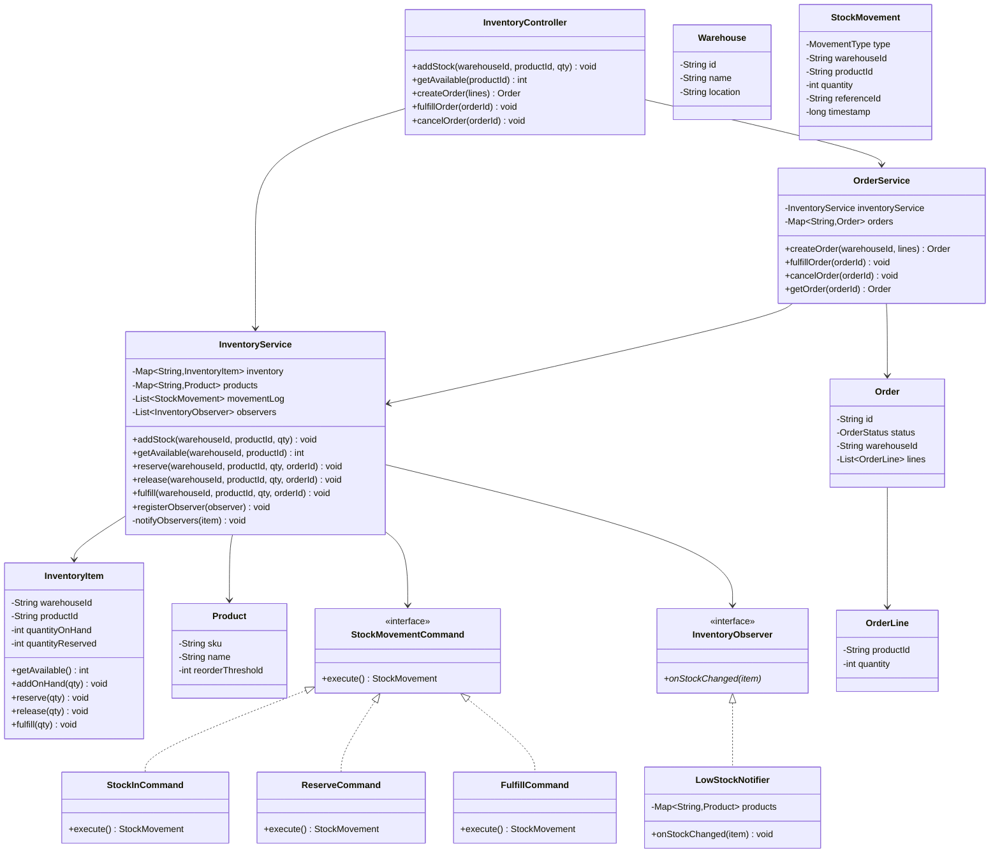
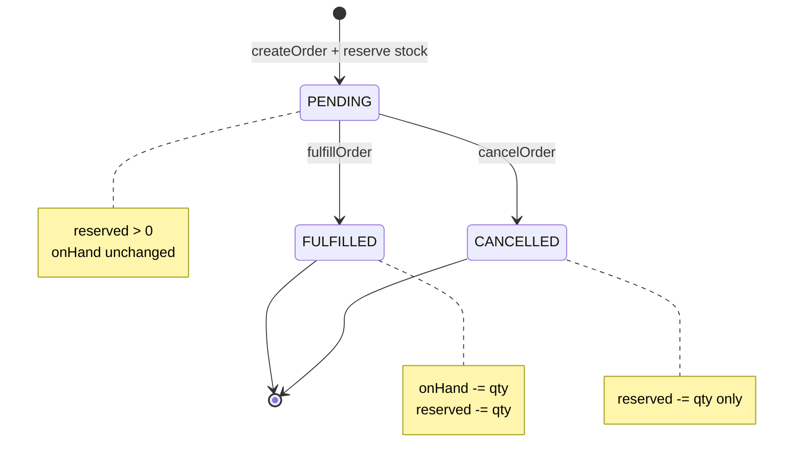
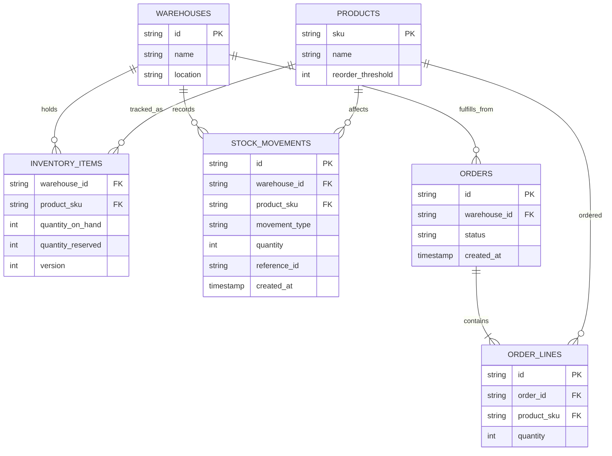
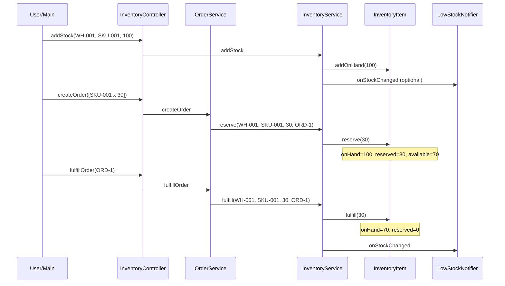

# Inventory Management System — Low Level Design (Interview Guide)

> **Goal:** Understand, explain, and code this in ~60 minutes during an LLD interview.  
> **Signature patterns:** **Command** (auditable stock movements) + **Observer** (low-stock alerts).  
> **Reference style:** Mirrors your [ATM Machine](../atm/LLD_ATM_MACHINE.md) / [Vending Machine](../vending/LLD_VENDING_MACHINE.md) / [CricBuzz](../cricbuzz/LLD_CRICBUZZ.md) guides — requirements → class/schema → patterns → 60-min coding plan.

---

## Code map (implemented)

Study order: `InventorymanagementApplication` (scripted demo) → `models/InventoryItem` → `services/InventoryService` → `commands/*` → `observers/*`.

| Feature | What | Where to read |
|---------|------|---------------|
| **1. Catalog + restock** | Create product SKU; add stock to warehouse | `CatalogFactory`, `InventoryService.addStock`, `StockInCommand` |
| **2. Check availability + reserve** | Order reserves qty; prevent oversell | `InventoryItem.reserve`, `OrderService.createOrder`, `ReserveCommand` |
| **3. Fulfill order** | Deduct on-hand; release reservation; audit log | `OrderService.fulfillOrder`, `FulfillCommand`, `movementLog` |

**Run the scripted demo** (walks all scenarios automatically):

```bash
cd inventorymanagement
.\mvnw.cmd -q -DskipTests compile exec:java
```

**Run interactive demo** (drive inventory yourself):

```bash
.\mvnw.cmd -q -DskipTests compile exec:java "-Dexec.mainClass=com.inventory.inventorymanagement.demo.InventoryDemo"
```

---

## Table of Contents

1. [Problem Statement](#1-problem-statement)
2. [Functional Requirements (8–10)](#2-functional-requirements-810)
3. [Out of Scope (say this upfront)](#3-out-of-scope-say-this-upfront)
4. [Clarify With Interviewer First](#4-clarify-with-interviewer-first)
5. [Package Structure](#5-package-structure)
6. [Class Diagram](#6-class-diagram)
7. [Schema Design](#7-schema-design)
8. [Design Patterns — Command + Observer (deep dive)](#8-design-patterns--command--observer-deep-dive)
9. [Core Classes — Responsibilities & Key Methods](#9-core-classes--responsibilities--key-methods)
10. [Flow & Sequence Diagrams](#10-flow--sequence-diagrams)
11. [Validation Rules](#11-validation-rules)
12. [60-Minute Coding Plan](#12-60-minute-coding-plan)
13. [How to Explain in Interview](#13-how-to-explain-in-interview)
14. [Sample Interview Q&A](#14-sample-interview-qa)
15. [Extension Hooks (bonus points)](#15-extension-hooks-bonus-points)
16. [Cross-Project Mapping](#16-cross-project-mapping)

---

## 1. Problem Statement

Design an **Inventory Management System** for a warehouse (or e-commerce backend) that tracks **products (SKUs)**, **stock levels per warehouse**, and **orders**. Staff can restock items; customers place orders that **reserve** stock; fulfillment **deducts** on-hand quantity. The system must **never oversell** — available stock = on-hand minus already-reserved.

**Interview framing:** This is **inventory accounting + concurrency safety**. The hard part is not CRUD — it is keeping **three numbers consistent** (`onHand`, `reserved`, `available`) and recording every change as an **auditable movement**. Compare to ATM: instead of account balance + ATM cash, you have **warehouse on-hand + order reservations**.

---

## 2. Functional Requirements (8–10)

| # | Requirement | Interview one-liner |
|---|-------------|---------------------|
| **R1** | **Product catalog** — Each product has SKU, name, description, reorder threshold. | "`Product` entity; SKU is unique key." |
| **R2** | **Warehouse** — One or more warehouses hold stock. | "`Warehouse` + `InventoryItem` per (warehouse, product)." |
| **R3** | **Restock (stock in)** — Add quantity when shipment arrives. | "`addStock(warehouseId, productId, qty)` → `StockMovement` IN." |
| **R4** | **View stock** — Query on-hand, reserved, available for a SKU. | "`available = onHand - reserved`." |
| **R5** | **Create order** — Customer order with line items (product + qty). | "`Order` + `OrderLine`; status PENDING." |
| **R6** | **Reserve stock** — On order creation, reserve qty if available. | "Increase `reserved`; fail if `available < qty`." |
| **R7** | **Fulfill order** — On shipment, deduct on-hand and release reservation. | "`onHand -= qty; reserved -= qty`; status → FULFILLED." |
| **R8** | **Cancel order** — Release reservation without touching on-hand. | "`reserved -= qty`; status → CANCELLED." |
| **R9** | **Low-stock alert** — Notify when on-hand ≤ reorder threshold. | **`Observer`** on `InventoryItem` after restock/fulfill." |
| **R10** | **Audit trail** — Every stock change is logged. | **`Command`** → `StockMovement` record." |

### Recommended MVP for 1 hour (pick with interviewer)

Agree on **3 working functionalities** to code:

1. **Add product + restock** — seed catalog; `addStock` increases on-hand  
2. **Create order + reserve stock** — validate availability; prevent oversell  
3. **Fulfill order** — deduct on-hand, clear reservation, log movement  

Say explicitly: *multi-warehouse transfer, batch/lot tracking, expiry, barcode scan, payment, shipping carrier integration, and DB persistence are extensions unless time remains.*

---

## 3. Out of Scope (say this upfront)

Keep v1 small — interviewers respect scope control:

- Payment / billing / invoicing
- Shipping label / carrier APIs
- Multi-step partial fulfillment (backorders)
- Lot/batch/serial-number tracking
- Expiry dates / FEFO / FIFO valuation
- Inter-warehouse transfer
- Purchase order workflow (PO → GRN)
- Barcode scanner hardware
- Full admin RBAC / audit UI
- Distributed inventory across regions (eventual consistency)
- Persistence / DB required for MVP (still discuss schema)
- Real-time analytics dashboard

---

## 4. Clarify With Interviewer First

Ask these in the first **2–3 minutes** (shows product thinking):

| Question | Good default for interview |
|----------|----------------------------|
| Single warehouse or many? | **One warehouse** for MVP; mention multi-warehouse map |
| Reserve on order or deduct immediately? | **Reserve on create**, deduct on **fulfill** (e-commerce standard) |
| Partial fulfillment? | **All-or-nothing** per line item for MVP |
| Negative stock allowed? | **No** — reject if insufficient available |
| Concurrency? | **Synchronized** per `InventoryItem` or `ReentrantLock`; mention DB row lock in prod |
| Product identity? | **SKU string** (unique) |
| Units? | **Integer quantity** (whole units) |
| Who triggers fulfill? | **Warehouse staff** via `fulfillOrder(orderId)` |

**Assumptions to state aloud:**

1. One warehouse (`WH-001`) unless interviewer wants multi-warehouse.  
2. Order moves: `PENDING → (FULFILLED | CANCELLED)`.  
3. Reserve is atomic: check `available >= qty` then increment `reserved` in same lock.  
4. Fulfill is atomic: decrement both `onHand` and `reserved`.  
5. Cancel only releases `reserved`; never changes `onHand`.

---

## 5. Package Structure

Mirror ATM / Vending / CricBuzz layout:

```
inventorymanagement/
├── InventorymanagementApplication.java   # Spring entry (optional)
├── demo/
│   └── InventoryDemo.java                  # CLI demo — primary for interview
├── controller/
│   └── InventoryController.java          # thin: restock, createOrder, fulfill, cancel
├── models/
│   ├── Product.java                      # sku, name, reorderThreshold
│   ├── Warehouse.java                    # id, name, location
│   ├── InventoryItem.java                # warehouseId, productId, onHand, reserved
│   ├── Order.java                        # id, status, lines, warehouseId
│   └── OrderLine.java                    # productId, quantity
├── services/
│   ├── InventoryService.java             # addStock, reserve, release, fulfill, getAvailable
│   └── OrderService.java                 # createOrder, fulfillOrder, cancelOrder
├── commands/
│   ├── StockMovementCommand.java         # interface execute() → StockMovement
│   ├── StockInCommand.java
│   ├── ReserveCommand.java
│   └── FulfillCommand.java
├── observers/
│   ├── InventoryObserver.java            # interface onStockChanged(item)
│   └── LowStockNotifier.java             # prints alert if onHand <= threshold
├── enums/
│   ├── OrderStatus.java                  # PENDING, FULFILLED, CANCELLED
│   └── MovementType.java                 # STOCK_IN, RESERVE, RELEASE, FULFILL
├── exceptions/
│   ├── ProductNotFoundException.java
│   ├── InsufficientStockException.java
│   ├── OrderNotFoundException.java
│   └── InvalidOrderStateException.java
└── factories/
    └── CatalogFactory.java               # seed products + warehouse + initial stock
```

**Design choice to state clearly:**

| Approach | Pros | Cons |
|----------|------|------|
| **A. Service + Command + Observer** | Clean audit trail; easy to extend movements | More classes |
| **B. Fat `InventoryService` with if/else** | Faster to code in 30 min | Hard to extend; weak audit story |

**Recommend Approach A for interview.** If short on time, inline Command objects as private methods but **keep the movement log list** — still discuss Command as refactor target.

---

## 6. Class Diagram

### 6.1 Mermaid Class Diagram (draw this on whiteboard)



### 6.2 Relationships to explain verbally

| From | To | Relationship | Why |
|------|----|--------------|-----|
| `InventoryController` | Services | Dependency | Thin API for CLI / REST demo |
| `OrderService` | `InventoryService` | Dependency | Orders drive stock reservations |
| `InventoryService` | `InventoryItem` | Aggregation | Composite key `(warehouseId, productId)` |
| `InventoryItem` | `Product` | Association | Threshold for low-stock alerts |
| `StockInCommand` etc. | `StockMovementCommand` | Implementation | Auditable, extensible movements |
| `LowStockNotifier` | `InventoryObserver` | Implementation | Decouple alert from core service |

### 6.3 Simplified whiteboard version (if short on time)

```
InventoryController → InventoryService, OrderService

InventoryItem (per warehouse + product):
  onHand, reserved, available = onHand - reserved

Flow:
  addStock        → onHand += qty
  createOrder     → reserved += qty  (if available >= qty)
  cancelOrder     → reserved -= qty
  fulfillOrder    → onHand -= qty; reserved -= qty

Order: PENDING → FULFILLED | CANCELLED
Every change → StockMovement log entry
onHand change → notify LowStockNotifier
```

### 6.4 Order state diagram (draw this — interviewers love it)



**One-liner:** *"PENDING holds a promise on stock via `reserved`; fulfill converts promise into actual deduction."*

---

## 7. Schema Design

Interviewers may ask for **in-memory structure** or **DB design**. Cover both briefly.

### 7.1 In-Memory Object Schema (primary for 1-hr coding)

```
InventoryService
├── products: Map<String, Product>              // key = sku
├── inventory: Map<String, InventoryItem>       // key = warehouseId + ":" + productId
├── movementLog: List<StockMovement>
└── observers: List<InventoryObserver>

InventoryItem
├── warehouseId: String
├── productId: String                           // sku
├── quantityOnHand: int
└── quantityReserved: int
    available = onHand - reserved

Product
├── sku: String
├── name: String
└── reorderThreshold: int                       // e.g. 10

OrderService
└── orders: Map<String, Order>                    // key = orderId

Order
├── id: String
├── warehouseId: String
├── status: OrderStatus                           // PENDING | FULFILLED | CANCELLED
└── lines: List<OrderLine>

OrderLine
├── productId: String
└── quantity: int

StockMovement
├── type: MovementType                          // STOCK_IN | RESERVE | RELEASE | FULFILL
├── warehouseId: String
├── productId: String
├── quantity: int
├── referenceId: String                         // orderId or shipmentId
└── timestamp: long
```

### 7.2 Database Schema (if interviewer asks "production / persistence")

```text
┌──────────────────┐       ┌──────────────────┐
│    products      │       │   warehouses     │
├──────────────────┤       ├──────────────────┤
│ sku (PK)         │       │ id (PK)          │
│ name             │       │ name             │
│ reorder_threshold│       │ location         │
└────────┬─────────┘       └────────┬─────────┘
         │                          │
         └──────────┬───────────────┘
                    ▼
         ┌──────────────────────┐
         │   inventory_items      │
         ├──────────────────────┤
         │ warehouse_id (FK)    │  composite PK (warehouse_id, product_sku)
         │ product_sku (FK)     │
         │ quantity_on_hand     │
         │ quantity_reserved    │
         │ version              │  ← optimistic locking
         └──────────┬───────────┘
                    │
         ┌──────────▼───────────┐
         │  stock_movements     │
         ├──────────────────────┤
         │ id (PK)              │
         │ warehouse_id (FK)    │
         │ product_sku (FK)     │
         │ movement_type        │
         │ quantity             │
         │ reference_id         │  order / shipment
         │ created_at           │
         └──────────────────────┘

┌──────────────────┐       ┌──────────────────┐
│     orders       │       │   order_lines    │
├──────────────────┤       ├──────────────────┤
│ id (PK)          │──1:N─►│ id (PK)          │
│ warehouse_id(FK) │       │ order_id (FK)    │
│ status           │       │ product_sku (FK) │
│ created_at       │       │ quantity         │
└──────────────────┘       └──────────────────┘
```

### 7.3 ER Diagram (Mermaid)



**Note:** `quantity_on_hand` and `quantity_reserved` should be updated in a **single transaction** with a movement row inserted — never update inventory without audit log in production.

---

## 8. Design Patterns — Command + Observer (deep dive)

### 8.1 Why Command for stock movements?

Without Command:

```
void fulfill(...) {
  item.onHand -= qty;
  item.reserved -= qty;
  // easy to forget log, or duplicate logic in cancel vs fulfill
}
```

With Command: each operation **encapsulates** validation + mutation + **returns a `StockMovement`** for the audit log. Same shape as ATM's atomic withdraw — but here the "transaction" is stock accounting.

| Movement | Effect on onHand | Effect on reserved |
|----------|------------------|-------------------|
| STOCK_IN | +qty | — |
| RESERVE | — | +qty |
| RELEASE (cancel) | — | −qty |
| FULFILL | −qty | −qty |

### 8.2 Why Observer for low stock?

After `addStock` or `fulfill`, check `onHand <= product.reorderThreshold` and notify procurement — **without** baking email/SMS into `InventoryService`.

**Compare to CricBuzz:** CricBuzz Observer updates scorecards on each ball; here Observer fires on **inventory level change**.

### 8.3 Pattern roles (say this)

| Role | In this design |
|------|----------------|
| **Command** | `StockInCommand`, `ReserveCommand`, `FulfillCommand` — one stock operation each |
| **Invoker** | `InventoryService` — runs command, appends to `movementLog` |
| **Observer subject** | `InventoryService.notifyObservers(item)` after mutation |
| **Concrete observer** | `LowStockNotifier` — prints "reorder SKU-123" |

### 8.4 Other patterns (mention, don't over-build)

| Pattern | Where | Why |
|---------|-------|-----|
| **Command** | Stock movements | Audit + extensibility |
| **Observer** | Low-stock alerts | Decouple notification channels |
| **Facade** | `InventoryService` | Single entry for warehouse ops |
| **Repository** | `Map` wrappers | Swap to JPA later |
| **Strategy** | Warehouse selection / FIFO allocation | Multi-warehouse extension |
| **State** | Order lifecycle | Optional; enum status is enough for 1 hr |

### Patterns to mention but NOT implement in 1 hour

| Pattern | When |
|---------|------|
| **Saga** | Distributed order + payment + inventory rollback |
| **Event Sourcing** | Rebuild inventory from movement stream |
| **Decorator** | Metrics wrapper on InventoryService |
| **Factory** | Seed demo catalog |

---

## 9. Core Classes — Responsibilities & Key Methods

> Pseudocode signatures — **no full implementation** (you will code this yourself).

### 9.1 `InventoryController` (stateless)

```
addStock(warehouseId, productId, qty) → void
getAvailable(productId) → int
createOrder(lines) → Order
fulfillOrder(orderId) → void
cancelOrder(orderId) → void
```

### 9.2 `InventoryItem` (core accounting)

```
getAvailable() → quantityOnHand - quantityReserved

addOnHand(qty):
  quantityOnHand += qty

reserve(qty):
  if getAvailable() < qty → throw InsufficientStockException
  quantityReserved += qty

release(qty):                    // cancel
  if quantityReserved < qty → throw IllegalStateException
  quantityReserved -= qty

fulfill(qty):
  if quantityReserved < qty → throw IllegalStateException
  quantityOnHand -= qty
  quantityReserved -= qty
```

**Interview tip:** Wrap `InventoryItem` methods in `synchronized` or hold a `ReentrantLock` per item for thread safety.

### 9.3 `InventoryService`

```
addStock(warehouseId, productId, qty):
  item = getOrCreateItem(warehouseId, productId)
  synchronized(item):
    cmd = new StockInCommand(item, qty, referenceId)
    movement = cmd.execute()
    movementLog.add(movement)
    notifyObservers(item)

reserve(warehouseId, productId, qty, orderId):
  item = getItem(...)
  synchronized(item):
    cmd = new ReserveCommand(item, qty, orderId)
    movement = cmd.execute()       // throws if insufficient
    movementLog.add(movement)

fulfill(warehouseId, productId, qty, orderId):
  item = getItem(...)
  synchronized(item):
    cmd = new FulfillCommand(item, qty, orderId)
    movement = cmd.execute()
    movementLog.add(movement)
    notifyObservers(item)

getAvailable(warehouseId, productId) → item.getAvailable()
```

### 9.4 `OrderService`

```
createOrder(warehouseId, lines):
  order = new Order(PENDING, warehouseId, lines)
  for each line:
    inventoryService.reserve(warehouseId, line.productId, line.quantity, order.id)
  orders.put(order.id, order)
  return order

fulfillOrder(orderId):
  order = getOrder(orderId)
  if order.status != PENDING → throw InvalidOrderStateException
  for each line:
    inventoryService.fulfill(order.warehouseId, line.productId, line.quantity, orderId)
  order.status = FULFILLED

cancelOrder(orderId):
  order = getOrder(orderId)
  if order.status != PENDING → throw InvalidOrderStateException
  for each line:
    inventoryService.release(order.warehouseId, line.productId, line.quantity, orderId)
  order.status = CANCELLED
```

### 9.5 `LowStockNotifier` (Observer)

```
onStockChanged(item):
  product = products.get(item.productId)
  if item.quantityOnHand <= product.reorderThreshold:
    print "LOW STOCK alert: " + product.sku + " at " + item.warehouseId
```

### 9.6 Minimal happy-path algorithm (say this in 30 seconds)

```
1. Seed Product "SKU-001" (threshold 10), Warehouse "WH-001"
2. addStock(WH-001, SKU-001, 100)  → onHand=100, reserved=0, available=100
3. createOrder([SKU-001 x 30])     → reserved=30, available=70, order PENDING
4. createOrder([SKU-001 x 80])     → FAIL — only 70 available
5. fulfillOrder(order1)            → onHand=70, reserved=0, order FULFILLED
6. fulfill more until onHand <= 10  → LowStockNotifier fires
```

---

## 10. Flow & Sequence Diagrams

### 10.1 CLI main loop (demo)

```
main():
  catalog = CatalogFactory.create()           // products + warehouse + stock
  inventoryService = catalog.inventoryService
  orderService = new OrderService(inventoryService)
  controller = new InventoryController(inventoryService, orderService)

  loop:
    print menu:
      1.Restock  2.Check stock  3.Create order  4.Fulfill  5.Cancel  6.Exit
    switch choice:
      1 → controller.addStock(...)
      2 → print controller.getAvailable(sku)
      3 → controller.createOrder(lines)
      4 → controller.fulfillOrder(orderId)
      5 → controller.cancelOrder(orderId)
```

### 10.2 Successful order + fulfill sequence



### 10.3 Oversell prevention sequence

```
onHand=100, reserved=30, available=70
createOrder([SKU-001 x 80])
  → reserve checks available (70 < 80)
  → InsufficientStockException
  → order NOT created (or rollback if multi-line — state clearly)
onHand still 100, reserved still 30
```

### 10.4 Cancel order sequence

```
PENDING order reserved 30
cancelOrder:
  release(30) → reserved=0, onHand unchanged
  status=CANCELLED
available back to 100
```

---

## 11. Validation Rules

| Rule | When | Behavior |
|------|------|----------|
| Unknown SKU | any | `ProductNotFoundException` |
| qty ≤ 0 | restock / order | Reject |
| available < requested | reserve | `InsufficientStockException`; no partial reserve in MVP |
| Fulfill non-PENDING order | fulfill | `InvalidOrderStateException` |
| Cancel non-PENDING | cancel | `InvalidOrderStateException` |
| reserved < qty | fulfill/release | `IllegalStateException` — data inconsistency |
| Double fulfill | fulfill | Block via order status |

**Invariant to state:** *`quantityOnHand >= quantityReserved` always.*  
**Second invariant:** *Never decrement `onHand` without a corresponding `reserved` (fulfill) or explicit stock-out adjustment.*

**Third invariant:** *Every mutation of onHand or reserved produces a `StockMovement` log entry.*

---

## 12. 60-Minute Coding Plan

| Time | What to do |
|------|------------|
| **0–5 min** | Requirements + out of scope + MVP 3 features + assumptions |
| **5–15 min** | Draw inventory accounting (onHand/reserved/available) + order states + class sketch |
| **15–25 min** | Code `Product`, `Warehouse`, `InventoryItem`, `CatalogFactory`, seed data |
| **25–35 min** | Code `InventoryService.addStock`, `reserve`, `fulfill`, `release` + movement log |
| **35–45 min** | Code `Order`, `OrderService`, `InventoryController`, CLI menu |
| **45–52 min** | Demo: restock → order → fulfill; try oversell; cancel path |
| **52–55 min** | Add `LowStockNotifier` Observer (5 lines) |
| **55–60 min** | Mention Command refactor, DB schema, multi-warehouse Strategy as extensions |

### Must-demo scripts (practice these)

```
# Happy path
Restock SKU-001 +100 → Available 100
Create order 30 units → Available 70, order PENDING
Fulfill order → onHand 70, reserved 0, FULFILLED

# Oversell blocked
Available 70 → Create order 80 units → ERROR, stock unchanged

# Cancel releases reservation
Create order 20 → Cancel → Available back to 100

# Low stock alert
Fulfill until onHand <= threshold → notifier prints alert
```

### If running behind (cut order)

1. Drop Command classes — inline logic in `InventoryService` but keep `movementLog`  
2. Drop Observer — mention verbally  
3. Single product + single warehouse only  
4. Skip cancel — only restock + create + fulfill  
5. Combine `OrderService` into controller (temporary)  

---

## 13. How to Explain in Interview

### Opening (60 seconds)

> "I'll design a warehouse inventory system with products, per-warehouse stock levels, and orders. The core invariant is **available = on-hand minus reserved**. Creating an order **reserves** stock; fulfillment **deducts** on-hand and clears the reservation. I'll use **Command** for auditable stock movements and **Observer** for low-stock alerts. Concurrency is handled by locking per inventory item."

### While drawing

1. Draw **InventoryItem box** with three numbers: onHand, reserved, available.  
2. Draw **order state**: PENDING → FULFILLED / CANCELLED.  
3. Then services: `InventoryService`, `OrderService`, controller.  
4. Highlight **oversell prevention** at reserve time.  
5. Only then method signatures.

### While coding

- Narrate accounting: *"Reserve doesn't touch onHand — it only blocks quantity."*  
- Show one rejection: *"Second order for 80 fails when available is 70."*  
- Show fulfill: *"Both onHand and reserved decrease together."*  
- Append to movement log on every change.

### Closing (30 seconds)

> "MVP covers restock, order reservation, fulfill with audit log, and low-stock Observer. Extensions: multi-warehouse Strategy, optimistic locking in DB, partial fulfillment, purchase orders, and event sourcing from movement stream."

---

## 14. Sample Interview Q&A

**Q: Why reserve instead of deducting immediately on order?**  
A: Orders can be cancelled or payment can fail. Reservation holds stock without changing physical on-hand until shipment.

**Q: How is this different from Vending Machine inventory?**  
A: Vending is single-machine qty decrement on dispense. Here we split **promise (reserved)** vs **physical (onHand)** — closer to real e-commerce WMS.

**Q: How do you prevent overselling under concurrency?**  
A: Lock per `InventoryItem` (or DB `SELECT FOR UPDATE` on inventory row). Check `available >= qty` and update `reserved` atomically inside the lock.

**Q: What if two orders race for last unit?**  
A: First reserve wins; second gets `InsufficientStockException`. No negative available.

**Q: Where would Command pattern help?**  
A: Each stock operation becomes testable, logged, and undoable (release command compensates reserve). Easy to add TRANSFER, ADJUSTMENT types.

**Q: Floats for quantity?**  
A: Integer units for MVP. Weighted items (kg) would use `BigDecimal` + unit of measure.

**Q: Single warehouse vs multi-warehouse?**  
A: MVP one warehouse. Multi-warehouse: `Map<(warehouseId, sku), InventoryItem>` + Strategy to pick warehouse nearest customer.

**Q: How does Observer differ from just an if-statement?**  
A: Multiple listeners (email, Slack, ERP) without modifying `InventoryService`. Open/Closed.

**Q: Database design for inventory?**  
A: `inventory_items` with version column for optimistic locking; `stock_movements` append-only audit; update both in one transaction.

**Q: Partial fulfillment?**  
A: Split order lines or backorder status — extension; MVP all-or-nothing per line.

---

## 15. Extension Hooks (bonus points)

| Extension | Hook in design |
|-----------|----------------|
| Multi-warehouse | Composite key inventory map + `WarehouseAllocationStrategy` |
| Inter-warehouse transfer | `TransferCommand` (OUT from A, IN to B) |
| Purchase order flow | `PurchaseOrder` → `StockInCommand` on GRN |
| Batch / expiry | `InventoryLot` sub-entity; FEFO Strategy |
| Optimistic locking | `version` on `InventoryItem` / DB row |
| Event sourcing | Movements are source of truth; rebuild onHand |
| REST API | `InventoryController` → Spring `@RestController` |
| Payment integration | Order stays PENDING until payment Observer confirms |
| Admin adjustment | `AdjustmentCommand` with reason code + approval |

---

## 16. Cross-Project Mapping

| Concept | Vending Machine | ATM | **Inventory** |
|---------|-----------------|-----|---------------|
| Physical qty | Product.quantity | CashDispenser.cash | InventoryItem.onHand |
| "Held" qty | User balance (pre-dispense) | — | quantityReserved |
| Illegal action | Withdraw before PIN | Dispense without money | Fulfill without reserve |
| Audit | Optional txn log | Transaction history | StockMovement log |
| Key pattern | State | State | **Command + Observer** |
| External svc | — | BankingService | — (OrderService orchestrates) |
| Concurrency | Single user | Single session | **Lock per SKU/warehouse** |

**Study tip:** Learn **Vending inventory decrement** first, then add **reserve/fulfill split** for Inventory — that one distinction is what interviewers probe most.

---

## Quick Revision Card (read night before)

```
REQUIREMENTS: catalog, restock, reserve on order, fulfill, cancel, low-stock alert
MVP CODE:     addStock + createOrder(reserve) + fulfillOrder
ACCOUNTING:   available = onHand - reserved
ORDER STATES: PENDING → FULFILLED | CANCELLED
RESERVE:      blocks stock, no onHand change
FULFILL:      onHand -= qty AND reserved -= qty
CANCEL:       reserved -= qty only
PATTERNS:     Command (movements), Observer (low stock)
INVARIANT:    onHand >= reserved; never negative available
SCHEMA:       products, warehouses, inventory_items, orders, order_lines, stock_movements
SKIP:         payment, shipping, lot/expiry, multi-warehouse (unless asked)
```

---

## Overall Interview Approach (1 hour timeline)

Use this as your **default runbook** in any LLD round:

| Phase | Minutes | What to say / do |
|-------|---------|------------------|
| **1. Requirements** | 0–8 | Restate problem; list 8–10 reqs; agree **3 MVP features**; state out-of-scope |
| **2. Clarifications** | 8–12 | Ask: one warehouse? reserve vs immediate deduct? concurrency? integer qty? |
| **3. Class diagram** | 12–22 | Draw InventoryItem accounting + Order states; then services + Command/Observer |
| **4. Schema** | 22–28 | In-memory maps first; ER diagram if they ask persistence |
| **5. Code MVP** | 28–52 | Models → InventoryService (lock per item) → OrderService → controller → demo |
| **6. Demo + extensions** | 52–60 | Run happy path + oversell failure; mention multi-warehouse, event sourcing |

**Phrases that score well:**

- *"Available is on-hand minus reserved — reserve is where we prevent overselling."*  
- *"Fulfill is the only operation that touches both onHand and reserved."*  
- *"Every stock mutation appends a movement row — audit trail by default."*  
- *"I lock at InventoryItem granularity so different SKUs don't block each other."*

---

*Practice: explain the onHand/reserved/available diagram in 2 minutes, then code `InventoryItem` + `addStock` + `createOrder` + `fulfillOrder` without looking. That alone covers a strong 1-hour inventory LLD interview.*
