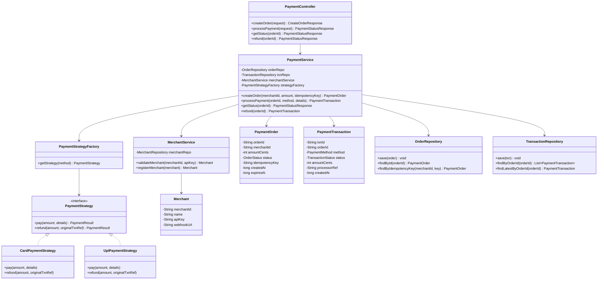
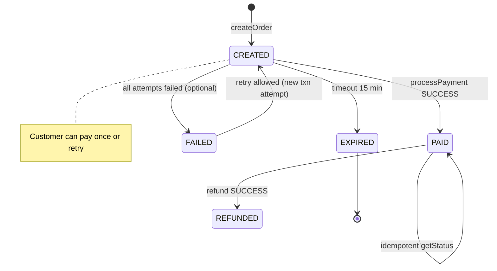
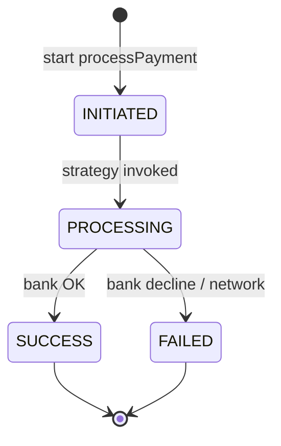
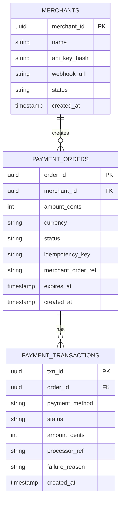
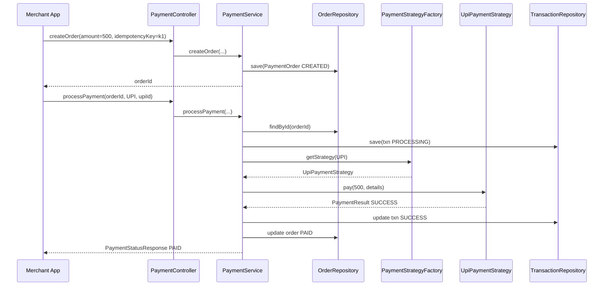

# Payment Gateway — Low Level Design (Interview Guide)

> **Goal:** Understand, explain, and code this in ~60 minutes during an LLD interview.  
> **Signature patterns:** **Strategy** (Card / UPI / Wallet / NetBanking) + **State** (transaction lifecycle) + **Factory** (payment method lookup).  
> **Reference style:** Mirrors your [ATM Machine](../atm/LLD_ATM_MACHINE.md) / [Airline](../airline/docs/AIRLINE_MANAGEMENT_LLD.md) / [CricBuzz](../cricbuzz/LLD_CRICBUZZ.md) guides — requirements → class/schema → patterns → 60-min coding plan.

---

## Code map (implemented)

Study order: `PaymentgatewayApplication` (scripted demo) → `services/PaymentService` → `strategies/*` → `factories/PaymentStrategyFactory`.

| Feature | What | Where to read |
|---------|------|---------------|
| **1. Create payment order** | Merchant creates order with amount + idempotency key | `PaymentController.createOrder`, `PaymentService.createOrder` (Step 8.1–8.4) |
| **2. Process payment** | Customer pays via Card/UPI; Strategy debits; status → SUCCESS/FAILED | `PaymentService.processPayment` (Step 8.5–8.11), `CardPaymentStrategy`, `UpiPaymentStrategy` |
| **3. Status + history** | Get order status; list transactions for merchant | `PaymentService.getStatus`, `TransactionRepository`, `PaymentStatusResponse` |

**Run the scripted demo** (walks all scenarios automatically):

```bash
cd paymentgateway
.\mvnw.cmd -q -DskipTests compile exec:java
```

**Run interactive demo** (drive the gateway yourself):

```bash
.\mvnw.cmd -q -DskipTests compile exec:java "-Dexec.mainClass=com.paymentgateway.paymentgateway.demo.PaymentGatewayDemo"
```

---

## Table of Contents

1. [Problem Statement](#1-problem-statement)
2. [Functional Requirements (8–10)](#2-functional-requirements-810)
3. [Out of Scope (say this upfront)](#3-out-of-scope-say-this-upfront)
4. [Clarify With Interviewer First](#4-clarify-with-interviewer-first)
5. [Package Structure](#5-package-structure)
6. [Class Diagram](#6-class-diagram)
7. [Schema Design](#7-schema-design)
8. [Design Patterns — Strategy + State (deep dive)](#8-design-patterns--strategy--state-deep-dive)
9. [Core Classes — Responsibilities & Key Methods](#9-core-classes--responsibilities--key-methods)
10. [Payment Flow & Sequence Diagrams](#10-payment-flow--sequence-diagrams)
11. [Validation Rules & Idempotency](#11-validation-rules--idempotency)
12. [60-Minute Coding Plan](#12-60-minute-coding-plan)
13. [How to Explain in Interview](#13-how-to-explain-in-interview)
14. [Sample Interview Q&A](#14-sample-interview-qa)
15. [Extension Hooks (bonus points)](#15-extension-hooks-bonus-points)
16. [Cross-Project Mapping](#16-cross-project-mapping)
17. [Alternate Framing: P2P Payment Gateway](#17-alternate-framing-p2p-payment-gateway)

---

## 1. Problem Statement

Design a **Payment Gateway** (like Razorpay / Stripe) that sits between **merchants** (e-commerce apps) and **customers**. A merchant creates a payment order; the customer pays using a supported method (Card, UPI, Wallet, Net Banking); the gateway processes the payment, updates transaction status, and notifies the merchant.

**Interview framing:** This is a **pluggable payment processor** with a **transaction state machine**. The hard parts are: (1) **Open/Closed** — new payment methods without changing core flow; (2) **idempotent** order creation and payment attempts; (3) **valid state transitions** — you cannot refund a FAILED payment.

```
Merchant App  ──create order──►  Payment Gateway  ──charge──►  Bank / UPI / Wallet (mock)
     ▲                                │
     └──────── webhook / poll status ─┘
```

**Two common interview variants** — clarify which one in minute 1:

| Variant | Who pays whom | Example companies |
|---------|---------------|-------------------|
| **A. Merchant Gateway** *(default below)* | Customer → Merchant via gateway | Razorpay, Stripe, PayPal |
| **B. P2P Gateway** | User → User with saved instruments | Paytm P2P, PhonePe send money |

Section [17](#17-alternate-framing-p2p-payment-gateway) covers variant B briefly. **Most interviews expect variant A.**

---

## 2. Functional Requirements (8–10)

| # | Requirement | Interview one-liner |
|---|-------------|---------------------|
| **R1** | **Register merchant** — API key, name, callback URL | "`MerchantService.registerMerchant` — seed 1–2 in demo" |
| **R2** | **Create payment order** — amount, currency, merchant ref, idempotency key | "Returns `orderId`; status = `CREATED`" |
| **R3** | **Process payment** — customer picks method + instrument details | "`PaymentService.processPayment(orderId, method, details)`" |
| **R4** | **Multiple payment methods** — Card, UPI, Wallet (at least 2 for MVP) | "**Strategy pattern** — one class per method" |
| **R5** | **Transaction lifecycle** — CREATED → PROCESSING → SUCCESS / FAILED | "**State** on `PaymentTransaction`; reject illegal transitions" |
| **R6** | **Get payment status** — merchant/customer polls by orderId | "Read-only; maps to latest transaction attempt" |
| **R7** | **Refund** — full refund on SUCCESS only | "New transaction type REFUND; Strategy.refund()" |
| **R8** | **Idempotency** — same key → same order, no double charge | "`Map<idempotencyKey, orderId>` per merchant" |
| **R9** | **Transaction history** — list orders/transactions for merchant | "`TransactionRepository.findByMerchantId`" |
| **R10** | **Webhook notify merchant** *(optional MVP)* | "`Observer` or simple callback on SUCCESS" |

### Recommended MVP for 1 hour (pick with interviewer)

Agree on **3 working functionalities** to code:

1. **Create payment order** (merchant + amount + idempotency)  
2. **Process payment** via **Card** and **UPI** strategies (mock bank success/fail)  
3. **Get payment status** + simple transaction history  

Say explicitly: *refund, partial refund, split payments, fraud scoring, PCI vault, multi-currency FX, settlement batching, and real bank APIs are extensions unless time remains.*

---

## 3. Out of Scope (say this upfront)

Keep v1 small — interviewers respect scope control:

- Real PCI-DSS card vault / tokenization (mock card numbers in memory)
- 3DS / OTP flows (mention as state sub-step)
- Settlement / T+1 merchant payout ledger
- Multi-currency conversion
- Partial refund / split payment across methods
- Chargeback dispute workflow
- Rate limiting / fraud ML
- Distributed transactions / saga across microservices (mention conceptually)
- Persistence required for MVP (still discuss schema)
- OAuth for merchant dashboard
- Recurring / subscription billing

---

## 4. Clarify With Interviewer First

Ask these in the first **2–3 minutes** (shows product thinking):

| Question | Good default for interview |
|----------|----------------------------|
| Merchant gateway or P2P? | **Merchant gateway** — customer pays merchant |
| Which payment methods in MVP? | **Card + UPI** (add Wallet if time) |
| Sync or async payment? | **Sync mock** — bank returns instantly; mention async webhook in prod |
| Idempotency on create or pay? | **Both** — idempotency key on create order; payment attempt id on pay |
| Refund in scope? | **Mention design**; code only if extra time |
| Money unit? | Integer **paise/cents** — no floats |
| Failed payment retry? | **New attempt** on same order until SUCCESS or order expires |
| Who are the actors? | **Merchant**, **Customer** (implicit), **Gateway**, **PaymentProcessor** (mock) |

**Assumptions to state aloud:**

1. Single gateway instance (in-memory repos).  
2. Merchant authenticated via `merchantId` + `apiKey` (skip crypto in demo).  
3. One active payment attempt per order at a time for MVP.  
4. Order expires after 15 minutes if unpaid (`CREATED` → `EXPIRED`).  
5. Mock processors always succeed unless test flag `simulateFailure=true`.

---

## 5. Package Structure

Mirror Airline / ATM layout:

```
paymentgateway/
├── PaymentgatewayApplication.java      # Spring entry (optional)
├── demo/
│   └── PaymentGatewayDemo.java         # CLI demo — primary for interview
├── controller/
│   └── PaymentController.java          # createOrder, processPayment, getStatus, refund
├── services/
│   ├── PaymentService.java             # orchestrates order + pay + status
│   └── MerchantService.java            # register merchant, validate apiKey
├── models/
│   ├── Merchant.java                   # id, name, apiKey, webhookUrl
│   ├── PaymentOrder.java               # orderId, merchantId, amount, status, idempotencyKey
│   ├── PaymentTransaction.java         # txnId, orderId, method, status, amount, timestamps
│   └── PaymentInstrumentDetails.java   # cardNumber/cvv OR upiId — per request DTO
├── strategies/
│   ├── PaymentStrategy.java            # pay(amount, details), refund(amount, txnRef)
│   ├── CardPaymentStrategy.java
│   ├── UpiPaymentStrategy.java
│   └── WalletPaymentStrategy.java      # extension
├── factories/
│   └── PaymentStrategyFactory.java     # getStrategy(PaymentMethod)
├── repositories/                       # in-memory Maps for interview
│   ├── OrderRepository.java
│   ├── TransactionRepository.java
│   └── MerchantRepository.java
├── enums/
│   ├── PaymentMethod.java              # CARD, UPI, WALLET, NET_BANKING
│   ├── OrderStatus.java                # CREATED, PAID, FAILED, EXPIRED
│   └── TransactionStatus.java          # INITIATED, PROCESSING, SUCCESS, FAILED
├── dto/
│   ├── CreateOrderRequest.java
│   ├── CreateOrderResponse.java
│   ├── ProcessPaymentRequest.java
│   └── PaymentStatusResponse.java
├── exceptions/
│   ├── OrderNotFoundException.java
│   ├── InvalidOrderStateException.java
│   ├── DuplicateOrderException.java
│   ├── PaymentFailedException.java
│   └── InvalidMerchantException.java
└── factories/
    └── DemoDataFactory.java            # seed merchants + sample orders
```

**Design choice to state clearly:**

| Approach | Pros | Cons |
|----------|------|------|
| **A. Strategy + Factory** — `PaymentStrategy` per method | Classic interview answer; same as Airline/Car Rental | One class per method |
| **B. Giant if-else in PaymentService** | Faster to code first 10 min | Fails OCP; interviewer will push back |

**Recommend Approach A.** Same pattern you already coded in Airline `PaymentStrategyFactory`.

---

## 6. Class Diagram

### 6.1 Mermaid Class Diagram (draw this on whiteboard)



### 6.2 Relationships to explain verbally

| From | To | Relationship | Why |
|------|----|--------------|-----|
| `PaymentController` | `PaymentService` | Dependency | Thin REST/CLI layer |
| `PaymentService` | `PaymentStrategyFactory` | Dependency | Lookup method implementation |
| `PaymentStrategy` | Card/UPI/… | Implementation | **Strategy** — pluggable processors |
| `PaymentService` | `PaymentOrder` | Creates/manages | Order is aggregate root for payment |
| `PaymentOrder` | `PaymentTransaction` | 1-to-many | Retries / refund = new txn rows |
| `MerchantService` | `Merchant` | Aggregation | Validates caller before createOrder |

### 6.3 Simplified whiteboard version (if short on time)

```
PaymentController → PaymentService
PaymentService → OrderRepository, TransactionRepository
                 → PaymentStrategyFactory → Card | UPI | Wallet
                 → MerchantService

Flow:
  createOrder → PaymentOrder(CREATED)
  processPayment → validate order → Strategy.pay → txn SUCCESS/FAILED → order PAID/FAILED
  getStatus → read order + latest txn
```

### 6.4 Order & transaction state diagrams (draw these)

**Order status:**



**Transaction status (per payment attempt):**



**One-liner:** *"Order tracks business outcome (PAID/EXPIRED); Transaction tracks each processor attempt — audit trail for retries and refunds."*

---

## 7. Schema Design

### 7.1 In-Memory Object Schema (primary for 1-hr coding)

```
MerchantRepository
└── merchants: Map<String, Merchant>           // key = merchantId

OrderRepository
├── orders: Map<String, PaymentOrder>          // key = orderId
└── idempotencyIndex: Map<String, String>        // key = merchantId:idempotencyKey → orderId

TransactionRepository
└── transactions: Map<String, List<PaymentTransaction>>  // key = orderId

PaymentOrder
├── orderId: String                              // UUID
├── merchantId: String
├── amountCents: int
├── currency: String                             // "INR"
├── status: OrderStatus
├── idempotencyKey: String
├── merchantOrderRef: String                     // merchant's own ref
├── createdAt: long
└── expiresAt: long

PaymentTransaction
├── txnId: String
├── orderId: String
├── method: PaymentMethod
├── status: TransactionStatus
├── amountCents: int
├── processorRef: String                         // mock bank ref
├── failureReason: String | null
└── createdAt: long

Merchant
├── merchantId: String
├── name: String
├── apiKey: String
└── webhookUrl: String
```

### 7.2 Database Schema (if interviewer asks "production / persistence")

```text
┌──────────────────┐       ┌──────────────────────┐
│    merchants     │       │    payment_orders    │
├──────────────────┤       ├──────────────────────┤
│ merchant_id (PK) │◄──────│ order_id (PK)        │
│ name             │       │ merchant_id (FK)     │
│ api_key_hash     │       │ amount_cents         │
│ webhook_url      │       │ currency             │
│ status           │       │ status               │
│ created_at       │       │ idempotency_key      │
└──────────────────┘       │ merchant_order_ref   │
                           │ expires_at           │
                           │ created_at           │
                           └──────────┬───────────┘
                                      │
                           ┌──────────▼───────────┐
                           │ payment_transactions │
                           ├──────────────────────┤
                           │ txn_id (PK)          │
                           │ order_id (FK)        │
                           │ payment_method       │
                           │ status               │
                           │ amount_cents         │
                           │ processor_ref        │
                           │ failure_reason       │
                           │ created_at           │
                           └──────────────────────┘

Unique: (merchant_id, idempotency_key) on payment_orders
Index: order_id on payment_transactions
Index: merchant_id + created_at on payment_orders (history)
```

### 7.3 ER Diagram (Mermaid)



**Note:** Never store raw CVV in DB. Production stores **tokenized** card references only. Demo: pass card details in request object, discard after mock charge.

---

## 8. Design Patterns — Strategy + State (deep dive)

### 8.1 Why Strategy here?

Without Strategy:

```java
void processPayment(method, details) {
  if (method == CARD) { /* 20 lines */ }
  else if (method == UPI) { /* 20 lines */ }
  else if (method == WALLET) { /* ... */ }
}
```

Adding Net Banking modifies a growing god method → violates **Open/Closed**.

With Strategy: `PaymentService` calls `strategyFactory.getStrategy(method).pay(amount, details)` — **same as Airline booking payment**.

**Compare to Airline:**

| Airline Booking | Payment Gateway |
|-----------------|-----------------|
| `PaymentStrategy.pay(fare)` | `PaymentStrategy.pay(orderAmount, instrumentDetails)` |
| Used once at booking confirm | Used per order payment attempt |
| Refund on cancel | Refund on merchant request |

### 8.2 Pattern roles (say this)

| Role | In this design |
|------|----------------|
| **Context** | `PaymentService` — orchestrates order lifecycle |
| **Strategy interface** | `PaymentStrategy` — `pay`, `refund` |
| **Concrete strategies** | `CardPaymentStrategy`, `UpiPaymentStrategy`, … |
| **Factory** | `PaymentStrategyFactory` — maps `PaymentMethod` enum → instance |

### 8.3 State — order vs transaction

| Entity | States | Who transitions |
|--------|--------|-----------------|
| `PaymentOrder` | CREATED, PAID, FAILED, EXPIRED, REFUNDED | `PaymentService` after txn result |
| `PaymentTransaction` | INITIATED, PROCESSING, SUCCESS, FAILED | `PaymentService` during `processPayment` |

**Illegal transitions to reject in code:**

| Action | Invalid when | Exception |
|--------|--------------|-----------|
| `processPayment` | order.status == PAID | `InvalidOrderStateException` |
| `processPayment` | order.status == EXPIRED | `InvalidOrderStateException` |
| `refund` | order.status != PAID | `InvalidOrderStateException` |
| `refund` | order.status == REFUNDED | idempotent return or reject |

You can implement State pattern with classes (`CreatedOrderState`, …) but for 1 hour **enum + validation in PaymentService** is enough — say *"I'd extract to State classes if rules grow like ATM."*

### 8.4 Other patterns (mention, don't over-build)

| Pattern | Where | Why |
|---------|-------|-----|
| **Strategy** | Payment methods | Core of this problem |
| **Factory** | `PaymentStrategyFactory` | Central registry — same as Airline |
| **Repository** | Order/Transaction repos | Swap in-memory → DB |
| **Observer** | Webhook on SUCCESS | Decouple merchant notification |
| **Template Method** | `AbstractPaymentStrategy.pay()` skeleton | validate → call processor → map result |
| **Facade** | `PaymentService` | Single entry for merchants |

### Patterns to mention but NOT implement in 1 hour

| Pattern | When |
|---------|------|
| **Chain of Responsibility** | Fraud checks before charge |
| **Command** | Queued async payment jobs |
| **Saga** | Compensating refund if merchant callback fails |
| **Decorator** | Retry wrapper around Strategy |

---

## 9. Core Classes — Responsibilities & Key Methods

> Pseudocode signatures — **no full implementation** (you will code this yourself).

### 9.1 `PaymentController` (stateless)

```
createOrder(request: CreateOrderRequest) → CreateOrderResponse
processPayment(request: ProcessPaymentRequest) → PaymentStatusResponse
getStatus(orderId) → PaymentStatusResponse
refund(orderId) → PaymentStatusResponse          // if time permits
```

### 9.2 `PaymentService` (orchestrator)

```
createOrder(merchantId, apiKey, amountCents, idempotencyKey, merchantOrderRef):
  merchant = merchantService.validateMerchant(merchantId, apiKey)
  existing = orderRepo.findByIdempotencyKey(merchantId, idempotencyKey)
  if existing != null → return existing                         // idempotent

  order = new PaymentOrder(
    status = CREATED,
    expiresAt = now + 15 minutes
  )
  orderRepo.save(order)
  return order

processPayment(orderId, method, instrumentDetails):
  order = orderRepo.findById(orderId) ?? throw OrderNotFoundException
  if order.status == PAID → throw InvalidOrderStateException
  if order.status == EXPIRED → throw InvalidOrderStateException
  if now > order.expiresAt → order.status = EXPIRED; throw ...

  txn = new PaymentTransaction(orderId, method, INITIATED, order.amountCents)
  txn.status = PROCESSING
  strategy = strategyFactory.getStrategy(method)
  result = strategy.pay(order.amountCents, instrumentDetails)

  if result.success:
    txn.status = SUCCESS
    txn.processorRef = result.ref
    order.status = PAID
  else:
    txn.status = FAILED
    txn.failureReason = result.message
    // order stays CREATED for retry

  txnRepo.save(txn)
  orderRepo.save(order)
  // optional: webhookNotifier.notify(order.merchantId, order)
  return buildStatusResponse(order, txn)

getStatus(orderId):
  order = orderRepo.findById(orderId)
  latestTxn = txnRepo.findLatestByOrderId(orderId)
  return buildStatusResponse(order, latestTxn)

refund(orderId):
  order = orderRepo.findById(orderId)
  if order.status != PAID → throw InvalidOrderStateException
  latestTxn = txnRepo.findLatestSuccessful(orderId)
  strategy = strategyFactory.getStrategy(latestTxn.method)
  result = strategy.refund(order.amountCents, latestTxn.processorRef)
  if result.success → order.status = REFUNDED
  return ...
```

### 9.3 `PaymentStrategy` interface

```
pay(amountCents, details: PaymentInstrumentDetails) → PaymentResult
refund(amountCents, originalProcessorRef) → PaymentResult
```

### 9.4 `CardPaymentStrategy`

```
pay(amount, details):
  if details.cardNumber blank or cvv blank → return PaymentResult.failed("Invalid card")
  if details.simulateFailure → return PaymentResult.failed("Bank declined")
  // mock: call external CardProcessor
  ref = "CARD-" + UUID
  print "Charged " + amount + " on card ending " + last4(details.cardNumber)
  return PaymentResult.success(ref)

refund(amount, originalRef):
  print "Refunded " + amount + " to " + originalRef
  return PaymentResult.success("REF-" + UUID)
```

### 9.5 `UpiPaymentStrategy`

```
pay(amount, details):
  if details.upiId blank → return failed("Invalid UPI")
  if !details.upiId.contains("@") → return failed("Invalid UPI format")
  ref = "UPI-" + UUID
  print "UPI collect " + amount + " from " + details.upiId
  return PaymentResult.success(ref)

refund(amount, originalRef):
  return PaymentResult.success("UPI-REF-" + UUID)
```

### 9.6 `PaymentStrategyFactory`

```
getStrategy(method):
  switch method:
    CARD → return cardStrategy
    UPI  → return upiStrategy
    WALLET → return walletStrategy
    default → throw UnsupportedPaymentMethodException
```

*(In Spring: inject all strategies as `Map<PaymentMethod, PaymentStrategy>` — even cleaner.)*

### 9.7 Minimal happy-path algorithm (say this in 30 seconds)

```
1. Merchant createOrder(₹500, idempotencyKey=abc) → orderId, CREATED
2. Customer processPayment(orderId, CARD, cardDetails) → PROCESSING → SUCCESS
3. Order → PAID; merchant polls getStatus → PAID + txn ref
4. (Extension) refund(orderId) → REFUNDED
```

---

## 10. Payment Flow & Sequence Diagrams

### 10.1 CLI demo main loop

```
main():
  factory = DemoDataFactory.seed()           // 1 merchant, apiKey
  service = new PaymentService(...)

  order = service.createOrder(MERCHANT_1, API_KEY, 50000, "idem-001", "ORD-99")
  print order.orderId, order.status          // CREATED

  txn = service.processPayment(order.orderId, UPI, upi("user@paytm"))
  print txn.status                           // SUCCESS

  status = service.getStatus(order.orderId)
  print status                               // PAID

  // Failure path
  order2 = service.createOrder(..., 10000, "idem-002", ...)
  failDetails.simulateFailure = true
  service.processPayment(order2.orderId, CARD, failDetails)  // FAILED, order still CREATED
```

### 10.2 Successful payment sequence



### 10.3 Idempotent createOrder sequence

```
createOrder(idempotencyKey=k1) → orderId=O1, CREATED
createOrder(idempotencyKey=k1) → orderId=O1 (same), no duplicate row
```

### 10.4 Failed payment + retry sequence

```
createOrder → CREATED
processPayment(CARD, bad card) → txn FAILED, order stays CREATED
processPayment(UPI, valid upi) → txn SUCCESS, order PAID
```

---

## 11. Validation Rules & Idempotency

| Rule | When | Behavior |
|------|------|----------|
| Invalid merchant / apiKey | createOrder | `InvalidMerchantException` |
| amountCents ≤ 0 | createOrder | Reject |
| Duplicate idempotencyKey | createOrder | Return **existing** order (201 vs 200 — mention HTTP semantics) |
| Order not found | processPayment / getStatus | `OrderNotFoundException` |
| Order already PAID | processPayment | `InvalidOrderStateException` |
| Order expired | processPayment | Mark EXPIRED; reject |
| Unsupported method | processPayment | `UnsupportedPaymentMethodException` |
| Strategy returns failure | processPayment | txn FAILED; order stays CREATED for retry |
| Refund on non-PAID | refund | `InvalidOrderStateException` |

**Idempotency (important talking point):**

| Operation | Key | Behavior |
|-----------|-----|----------|
| Create order | `merchantId + idempotencyKey` | Same key → same `orderId`, no second order |
| Process payment | Optional `paymentAttemptId` | Same attempt id → return cached txn result (extension) |
| Refund | `orderId` | Second refund → reject or no-op idempotent |

**Invariant:** *Never mark order PAID unless Strategy returns success.*

**Second invariant:** *Amount charged always equals `order.amountCents` — no partial pay in MVP.*

---

## 12. 60-Minute Coding Plan

| Time | What to do |
|------|------------|
| **0–5 min** | Requirements + actors + MVP 3 features + out of scope |
| **5–12 min** | Draw class diagram: PaymentService, Strategy, Factory, Order, Transaction |
| **12–18 min** | Draw order state diagram + ER schema |
| **18–28 min** | Code enums, models, repos, `DemoDataFactory`, `MerchantService` |
| **28–40 min** | Code `PaymentStrategy` + Card + UPI + Factory |
| **40–50 min** | Code `PaymentService.createOrder` + `processPayment` + `getStatus` |
| **50–55 min** | Wire controller + CLI demo: happy path + failed card + idempotent create |
| **55–60 min** | Mention refund, webhook Observer, async queue, PCI tokenization |

### Must-demo scripts (practice these)

```
# Happy path — UPI
createOrder(merchant1, ₹500, idem-1) → orderId
processPayment(orderId, UPI, user@paytm) → SUCCESS, PAID
getStatus(orderId) → PAID

# Happy path — Card
createOrder(merchant1, ₹1200, idem-2) → orderId
processPayment(orderId, CARD, 4111..., cvv) → SUCCESS

# Idempotent create
createOrder(..., idem-1) → same orderId as first call

# Failed then retry
createOrder(..., idem-3)
processPayment(CARD, simulateFailure=true) → FAILED, order CREATED
processPayment(UPI, valid) → SUCCESS, PAID

# Invalid transitions
processPayment(already PAID order) → error
getStatus(unknown orderId) → not found
```

### If running behind (cut order)

1. Drop `refund` entirely  
2. Drop `MerchantService` validation — hardcode one merchant  
3. Implement **UPI only** first, add Card if time  
4. Skip separate `TransactionRepository` — embed latest txn on `PaymentOrder`  
5. Keep Factory + one Strategy — still proves OCP story  

---

## 13. How to Explain in Interview

### Opening (60 seconds)

> "I'll design a merchant payment gateway. Core entities: Merchant, PaymentOrder, PaymentTransaction. Merchants create orders with an idempotency key; customers pay via a pluggable method using the **Strategy pattern** — same approach as my Airline booking payment. Order status tracks CREATED → PAID/EXPIRED; each payment attempt is a separate transaction row for audit and retries. I'll mock external banks in strategy classes."

### While drawing

1. Draw **actors**: Merchant → Gateway → PaymentProcessor (external).  
2. Draw **Order state** circle (CREATED → PAID).  
3. Then boxes: PaymentService, PaymentStrategyFactory, strategies.  
4. Show **idempotency index** on createOrder.  
5. Only then method signatures.

### While coding

- Narrate: *"createOrder checks idempotency map first."*  
- Show Strategy: *"Adding Wallet = new class + factory line — PaymentService unchanged."*  
- Show rejection: *"Cannot pay an already PAID order."*  
- Use integer cents for money.

### Closing (30 seconds)

> "MVP covers order creation with idempotency, Card/UPI payment via Strategy, and status polling. Extensions: refund, webhook Observer, order expiry job, Template Method in abstract strategy, PCI token vault, and async processing queue."

---

## 14. Sample Interview Q&A

**Q: Strategy vs State — which is primary here?**  
A: **Strategy** for payment methods (Card vs UPI). **State** for order/transaction lifecycle — can stay as enum checks in MVP; extract to State classes if rules explode (like ATM).

**Q: Why separate Order and Transaction?**  
A: Order = merchant-facing payment intent (one per checkout). Transaction = each processor attempt (retries, refunds). Clean audit trail.

**Q: How is this different from Airline payment?**  
A: Airline embeds payment inside booking confirm. Gateway **is** the payment product — orders are first-class, idempotency is critical, multiple merchants, transaction history per merchant.

**Q: Idempotency — where stored?**  
A: Unique index on `(merchant_id, idempotency_key)` → returns existing order. For pay, optional `paymentAttemptId` maps to cached txn.

**Q: Floats for money?**  
A: No — **integer paise/cents** (`amountCents`).

**Q: Thread safety / concurrent pay on same order?**  
A: MVP: synchronize on `orderId` or reject if txn PROCESSING. Production: distributed lock + DB row version.

**Q: What if bank succeeds but DB update fails?**  
A: Reconciliation job matches processor ref; mention **at-least-once** webhook + idempotent status update.

**Q: Open/Closed?**  
A: New `NetBankingPaymentStrategy` + register in factory — zero change to `PaymentService`.

**Q: PCI compliance?**  
A: Never persist CVV; tokenize card at edge; strategies receive tokens not raw PAN in production.

**Q: Sync vs async payment?**  
A: Demo sync. Production: return 202 PROCESSING, customer polls or merchant gets webhook.

---

## 15. Extension Hooks (bonus points)

| Extension | Hook in design |
|-----------|----------------|
| Refund | `PaymentStrategy.refund` + order → REFUNDED |
| Partial refund | `refund(orderId, partialAmountCents)` |
| Webhook | `WebhookNotifier.onPaymentSuccess(order)` Observer |
| Order expiry cron | Scan CREATED where `expiresAt < now` → EXPIRED |
| Wallet / NetBanking | New strategy + factory entry |
| Fraud check | Chain of Responsibility before `strategy.pay` |
| 3DS / OTP | Sub-state PROCESSING → AWAITING_OTP → SUCCESS |
| Multi-merchant settlement | `settlements` table batching PAID orders |
| Async queue | `processPayment` enqueues job; worker calls strategy |
| Payment links | `createPaymentLink(orderId)` returns URL |

---

## 16. Cross-Project Mapping

| Concept | ATM | Airline | **Payment Gateway** |
|---------|-----|---------|------------------------|
| Core pattern | State | Strategy (pay + fare) | **Strategy** (pay methods) + State (order) |
| Controller | `AtmController` | `BookingController` | `PaymentController` |
| Orchestrator | `ATM` + states | `BookingService` | `PaymentService` |
| External system | `BankingService` | Flight inventory | **PaymentProcessor** (mock in Strategy) |
| Idempotency | — | Seat lock key | **Order idempotency key** |
| Lifecycle enum | Session states | BookingStatus | OrderStatus + TransactionStatus |
| Factory | `AccountFactory` | `PaymentStrategyFactory` | `PaymentStrategyFactory` |
| Illegal action | Wrong ATM state | Book cancelled seat | Pay PAID order |

**Study tip:** If you know Airline payment Strategy, Payment Gateway is **extracting payment into its own bounded context** with orders, idempotency, and merchant API. ATM teaches State when interviewer pushes on transaction rules.

---

## 17. Alternate Framing: P2P Payment Gateway

Some interviewers (or Concept & Coding style) ask for **user-to-user** transfers:

| Concept | Merchant Gateway | P2P Gateway |
|---------|------------------|-------------|
| Payer | Customer (anonymous) | Registered User |
| Payee | Merchant | Another User |
| Instrument | Ephemeral card/UPI per checkout | Saved Card / Bank account |
| Core API | `createOrder` + `processPayment` | `addInstrument` + `makePayment(sender, receiver)` |
| Pattern emphasis | Strategy | Strategy + Factory per **instrument type** |

**P2P package sketch:**

```
UserService.addUser
InstrumentController.addInstrument(CARD | BANK)  → InstrumentServiceFactory
TransactionService.makePayment(senderInstrument, receiverInstrument, amount)
Processor.processPayment(debit instrument, credit instrument)
```

If interviewer switches to P2P mid-round: *"Same Strategy for instrument processors; TransactionService replaces PaymentOrder as orchestrator; history keyed by userId."*

Reference implementation concepts: `lld-lowleveldesign/.../paymentgateway/` in your workspace.

---

## Quick Revision Card (read night before)

```
ACTORS:     Merchant → Payment Gateway → Bank/UPI (mock)
REQUIREMENTS: create order, process pay (Card+UPI), get status
MVP CODE:   DemoDataFactory → PaymentService → Strategy+Factory → CLI demo
PATTERN:    Strategy (PaymentStrategy), Factory (lookup by PaymentMethod)
STATE:      Order CREATED→PAID|EXPIRED|REFUNDED; Txn INITIATED→PROCESSING→SUCCESS|FAILED
DATA:       OrderRepository + idempotencyIndex + TransactionRepository
INVARIANT:  order PAID iff strategy returns success; integer amountCents
IDEMPOTENCY: (merchantId, idempotencyKey) → same orderId
SKIP:       PCI vault, settlement, fraud ML, async queue (mention only)
COMPARE:    Same Strategy as Airline; more focus on order lifecycle + idempotency
```

---

## Overall Interview Approach (1 hour timeline)

Use this as your **default runbook** in any LLD round:

| Phase | Minutes | What to say / do |
|-------|---------|------------------|
| **1. Requirements** | 0–8 | Restate problem; confirm merchant vs P2P; list 8–10 reqs; agree **3 MVP features** |
| **2. Clarifications** | 8–12 | Payment methods, idempotency, sync mock, integer money, refund scope |
| **3. Class diagram** | 12–22 | Draw PaymentService, Strategy, Factory, Order, Transaction, repos |
| **4. Schema** | 22–28 | In-memory maps + idempotency index; ER if persistence asked |
| **5. State diagram** | 28–32 | Order CREATED → PAID; txn attempt lifecycle |
| **6. Code MVP** | 32–52 | Models → repos → 2 strategies → factory → PaymentService → demo |
| **7. Demo + extensions** | 52–60 | Happy UPI + failed Card retry + idempotent create; mention refund/webhook |

**Phrases that score well:**

- *"PaymentService depends on PaymentStrategy interface — new method = new class, not new if-else."*  
- *"Order is the business aggregate; transactions are the audit log for retries and refunds."*  
- *"Idempotency key on create prevents duplicate charges when merchant retries HTTP."*  
- *"Same Strategy pattern I used in Airline — gateway generalizes it for multiple merchants."*

---

*Practice: explain the createOrder → processPayment → getStatus sequence with Strategy in 2 minutes, then code PaymentService + Card + UPI strategies without looking. That alone covers a strong 1-hour payment gateway interview.*
