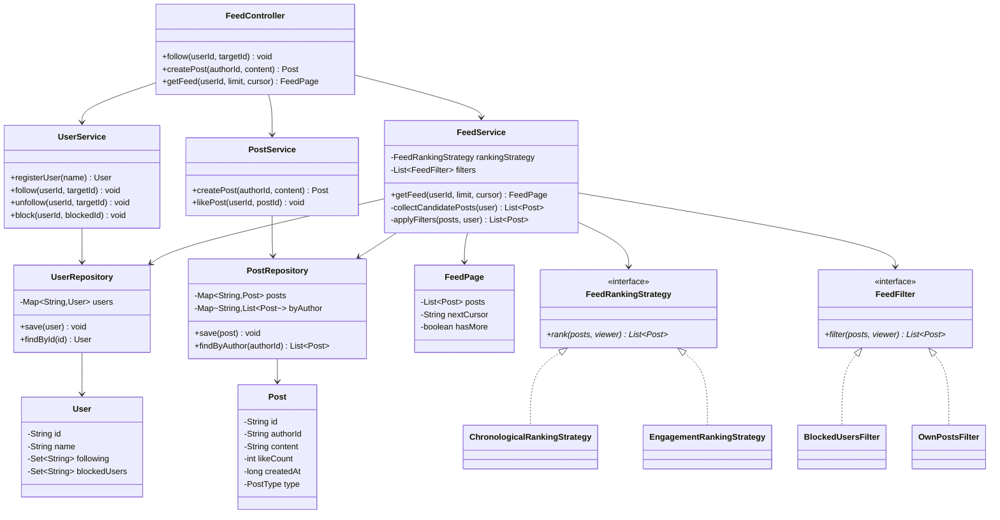
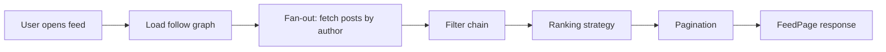
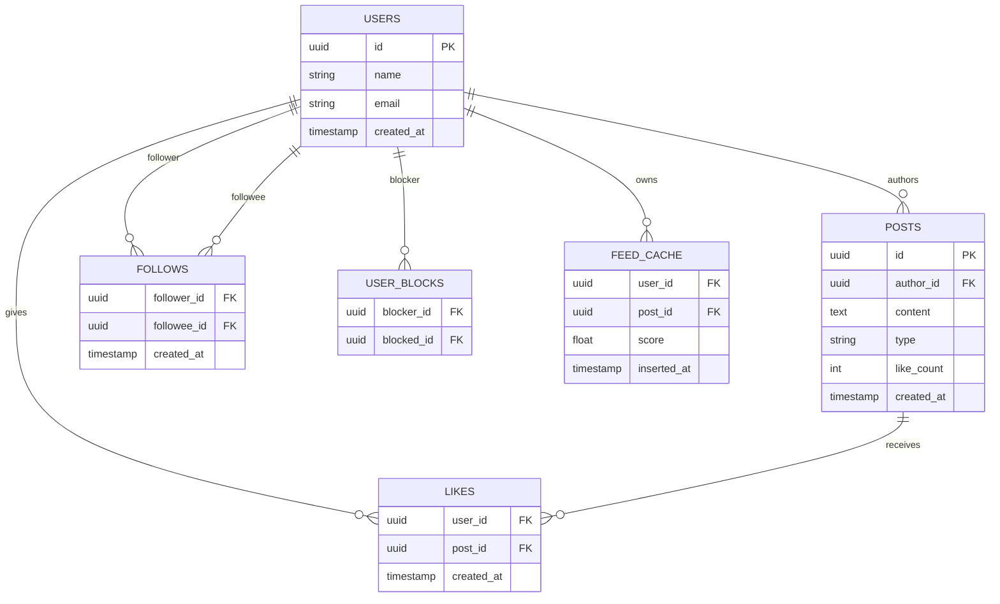
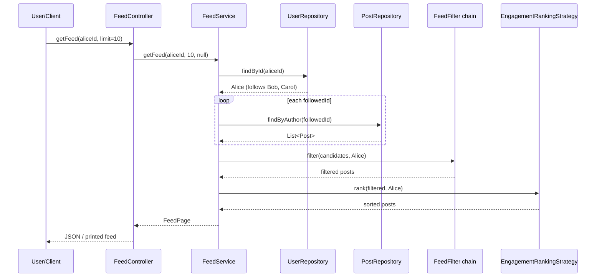

# Personalized News Feed — Low Level Design (Interview Guide)

> **Goal:** Understand, explain, and code this in ~60 minutes during an LLD interview.  
> **Signature patterns:** **Strategy** (feed ranking) + **Chain of Responsibility** (feed filters).  
> **Reference style:** Mirrors your [ATM Machine](../atm/LLD_ATM_MACHINE.md) / [CricBuzz](../cricbuzz/LLD_CRICBUZZ.md) guides — requirements → class/schema → patterns → 60-min coding plan.

---

## Code map (implemented)

Study order: `PersonalisednewsfeedApplication` (scripted demo) → `models/User, Post` → `services/FeedService` → `strategies/*` → `filters/*`.

| Feature | What | Where to read |
|---------|------|---------------|
| **1. Follow / unfollow** | User follows another user; graph stored in memory | `UserService.follow`, `UserService.unfollow` |
| **2. Create post** | Author publishes text post; stored globally | `PostService.createPost` |
| **3. Get personalized feed** | Pull posts from followed users → filter → rank → paginate | `FeedService.getFeed` + `EngagementRankingStrategy` |
| **Bonus. Like post** | Increments likeCount → affects ranking | `PostService.likePost` |

**Run the scripted demo**:

```bash
cd personalisednewsfeed
.\mvnw.cmd -q -DskipTests compile exec:java
```

**Run interactive demo** (drive the feed yourself):

```bash
.\mvnw.cmd -q -DskipTests compile exec:java "-Dexec.mainClass=com.newsfeed.personalisednewsfeed.demo.NewsFeedDemo"
```

**Run Spring Boot web context** (optional — REST endpoints as extension):

```bash
.\mvnw.cmd spring-boot:run
```

---

## Table of Contents

1. [Problem Statement](#1-problem-statement)
2. [Functional Requirements (8–10)](#2-functional-requirements-810)
3. [Out of Scope](#3-out-of-scope)
4. [Clarify With Interviewer First](#4-clarify-with-interviewer-first)
5. [Package Structure (planned)](#5-package-structure-planned)
6. [Class Diagram](#6-class-diagram)
7. [Schema Design](#7-schema-design)
8. [Design Patterns — Strategy + Chain of Responsibility](#8-design-patterns--strategy--chain-of-responsibility)
9. [Core Classes — Responsibilities](#9-core-classes--responsibilities)
10. [Flow & Sequence Diagrams](#10-flow--sequence-diagrams)
11. [Feed Generation — Fan-out on Read vs Write](#11-feed-generation--fan-out-on-read-vs-write)
12. [60-Minute Coding Plan](#12-60-minute-coding-plan)
13. [How to Explain in Interview](#13-how-to-explain-in-interview)
14. [Sample Interview Q&A](#14-sample-interview-qa)
15. [Extension Hooks](#15-extension-hooks)
16. [Cross-Project Mapping](#16-cross-project-mapping)

---

## 1. Problem Statement

Design a **personalized news feed** (like Facebook / Twitter / LinkedIn home feed) where:

- Users **follow** other users (and optionally topics/pages).
- Users **create posts** (text, image link, etc.).
- When a user opens the app, they see a **ranked list of posts** from people they follow — not a raw chronological dump, but **personalized** by engagement, recency, and preferences.

**Interview framing:** This is a **read-heavy aggregation + ranking** problem. The hard parts are:

1. **Collecting** candidate posts from a follow graph (fan-out).
2. **Filtering** noise (blocked users, already seen, spam).
3. **Ranking** by a pluggable algorithm (Strategy).
4. **Paginating** efficiently (cursor-based).

Say aloud: *"I'll start with fan-out-on-read in memory — same logic as production, minus Kafka and Redis — then discuss push/hybrid at scale."*

---

## 2. Functional Requirements (8–10)

| # | Requirement | Interview one-liner |
|---|-------------|---------------------|
| **R1** | **User registration** — Create user with id, name | "`UserService.registerUser` → `User` in repository" |
| **R2** | **Follow user** — A follows B; idempotent | "`User.following` set; reject self-follow" |
| **R3** | **Unfollow user** — Remove from following set | "`UserService.unfollow`" |
| **R4** | **Create post** — Author publishes content | "`PostService.createPost` → global post store" |
| **R5** | **Get feed** — Top N posts for user from followed authors | "`FeedService.getFeed(userId, pageSize, cursor)`" |
| **R6** | **Personalized ranking** — Not pure chronological | "`FeedRankingStrategy` — recency + engagement score" |
| **R7** | **Like post** *(optional MVP)* — Increment like count | "`PostService.likePost`; affects ranking" |
| **R8** | **Block user** *(optional)* — Hide blocked user's posts | "`BlockedUsersFilter` in filter chain |
| **R9** | **Pagination** — Cursor / offset for infinite scroll | "Return `nextCursor` with each page" |
| **R10** | **Feed filters** — Remove own reposts, blocked, expired | "`FeedFilter` chain before ranking" |

### Recommended MVP for 1 hour (pick with interviewer)

Agree on **3 working functionalities** to code:

1. **Follow / unfollow user** — build the social graph  
2. **Create post** — author publishes content  
3. **Get personalized feed** — aggregate from followed users → rank → return top K  

Say explicitly: *comments, shares, media upload, notifications, ML ranking, and persistence are extensions unless time remains.*

---

## 3. Out of Scope

Keep v1 small — interviewers respect scope control:

- Real-time push notifications (WebSocket / FCM)
- Comment threads, share/repost, @mentions
- Image/video upload & CDN (store URL string only)
- ML-based ranking model (use simple weighted score)
- Spam detection, moderation queue
- Full-text search / hashtags trending
- Multi-device sync, read receipts
- Distributed cache (Redis), message queue (Kafka)
- Persistence / DB required for MVP (still discuss schema)
- Celebrity fan-out optimization (discuss verbally)

---

## 4. Clarify With Interviewer First

Ask these in the first **2–3 minutes** (shows product thinking):

| Question | Good default for interview |
|----------|----------------------------|
| Follow users only, or pages/topics too? | **Users only** for MVP; mention `Topic` as extension |
| Feed ranking — chronological or scored? | **Scored** — recency + likes; Strategy pattern |
| Fan-out on read or write? | **Read (pull)** for MVP; discuss push/hybrid for scale |
| Pagination style? | **Offset/limit** in code; mention cursor in production |
| Can user see own posts in feed? | **No** — filter out own posts (or yes — clarify) |
| Post types? | **Text only**; enum ready for IMAGE/VIDEO |
| Duplicate posts in feed? | **No** — dedupe by post id |
| How many follows per user? | **Hundreds** — pull model fine; millions → hybrid |

**Assumptions to state aloud:**

1. Single process, in-memory repositories (Maps).  
2. Post ids and user ids are UUID strings.  
3. Feed is **eventually consistent** — new post visible on next refresh.  
4. Ranking is **deterministic** for same inputs (no random tie-break unless stated).  
5. Block list is per-user; blocked user's posts never appear.

---

## 5. Package Structure (implemented)

```
personalisednewsfeed/
├── pom.xml
├── LLD_PERSONALISED_NEWS_FEED.md
└── src/main/java/com/newsfeed/personalisednewsfeed/
    ├── PersonalisednewsfeedApplication.java   # @SpringBootApplication + study demo main
    ├── controller/
    │   └── FeedController.java                # thin: follow, createPost, getFeed
    ├── demo/
    │   └── NewsFeedDemo.java                  # CLI demo — primary for interview
    ├── services/
    │   ├── UserService.java                   # register, follow, unfollow, block
    │   ├── PostService.java                   # createPost, likePost
    │   └── FeedService.java                   # getFeed orchestration
    ├── models/
    │   ├── BaseModel.java                     # id, createdAt (optional)
    │   ├── User.java                          # following, followers, blockedUsers
    │   ├── Post.java                          # authorId, content, likeCount, createdAt
    │   └── FeedPage.java                      # posts, nextCursor, hasMore
    ├── repositories/
    │   ├── UserRepository.java                # Map<String, User>
    │   └── PostRepository.java                # Map<String, Post> + byAuthor index
    ├── strategies/
    │   ├── FeedRankingStrategy.java           # interface
    │   ├── ChronologicalRankingStrategy.java
    │   └── EngagementRankingStrategy.java     # score = likes + recency decay
    ├── filters/
    │   ├── FeedFilter.java                    # Chain of Responsibility
    │   ├── BlockedUsersFilter.java
    │   └── OwnPostsFilter.java
    ├── factories/
    │   └── UserFactory.java                   # seed demo users for demo
    └── enums/
        ├── PostType.java                      # TEXT, IMAGE, VIDEO
        └── FeedSortOrder.java                 # optional
```

**Design choice to state clearly:**

| Approach | Pros | Cons |
|----------|------|------|
| **A. Strategy + Filter chain** | Classic interview answer; OCP for new rankers/filters | More classes |
| **B. One big `getFeed()` with if-else** | Faster to code | Hard to extend; fails OCP |

**Recommend Approach A for interview.** If short on time, inline ranking first, then say *"I'd extract `FeedRankingStrategy` — same as my Airline fare strategies."*

---

## 6. Class Diagram

### 6.1 Mermaid Class Diagram (draw this on whiteboard)



### 6.2 Relationships to explain verbally

| From | To | Relationship | Why |
|------|----|--------------|-----|
| `FeedController` | `FeedService` | Dependency | Thin API for CLI / REST demo |
| `FeedService` | `UserRepository` | Dependency | Load viewer + follow graph |
| `FeedService` | `PostRepository` | Dependency | Pull posts by followed author ids |
| `FeedService` | `FeedRankingStrategy` | Strategy | Pluggable ranking (chrono vs engagement) |
| `FeedService` | `FeedFilter` | Chain | Remove blocked / own posts before rank |
| `User` | `User` (following) | Association | Social graph — many-to-many via ids |
| `Post` | `User` | Association | `authorId` FK — post belongs to one author |

### 6.3 Simplified whiteboard version (if short on time)

```
FeedController → UserService, PostService, FeedService

FeedService.getFeed(userId):
  1. user = UserRepository.findById
  2. candidates = for each followedId → PostRepository.findByAuthor
  3. candidates = FeedFilter chain (blocked, own posts)
  4. ranked = FeedRankingStrategy.rank(candidates, user)
  5. page = slice(ranked, cursor, limit) → FeedPage

Strategy: ChronologicalRanking | EngagementRanking
Filters:  BlockedUsersFilter → OwnPostsFilter
```

### 6.4 Feed pipeline diagram (draw this — interviewers love it)



**One-liner:** *"Feed generation is a pipeline — collect, filter, rank, paginate. Each stage is swappable without touching the others."*

---

## 7. Schema Design

Interviewers may ask for **in-memory structure** or **DB design**. Cover both briefly.

### 7.1 In-Memory Object Schema (primary for 1-hr coding)

```
UserRepository
└── users: Map<String, User>              // key = userId

User
├── id: String
├── name: String
├── following: Set<String>                // userIds this user follows
├── followers: Set<String>                // optional reverse index
└── blockedUsers: Set<String>

PostRepository
├── posts: Map<String, Post>              // key = postId
└── postsByAuthor: Map<String, List<Post>> // key = authorId — speeds fan-out

Post
├── id: String
├── authorId: String
├── content: String
├── type: PostType                        // TEXT for MVP
├── likeCount: int
└── createdAt: long                       // epoch millis — for ranking

FeedPage
├── posts: List<Post>
├── nextCursor: String | null             // last post id or offset
└── hasMore: boolean
```

### 7.2 Database Schema (if interviewer asks "production / persistence")

```text
┌──────────────────┐       ┌──────────────────┐
│      users       │       │      posts       │
├──────────────────┤       ├──────────────────┤
│ id (PK)          │       │ id (PK)          │
│ name             │       │ author_id (FK)   │
│ email            │       │ content          │
│ created_at       │       │ type             │
└────────┬─────────┘       │ like_count       │
         │                 │ created_at       │
         │                 └────────┬─────────┘
         │                          │
         ▼                          ▼
┌──────────────────┐       ┌──────────────────┐
│    follows       │       │      likes       │
├──────────────────┤       ├──────────────────┤
│ follower_id (FK) │       │ user_id (FK)     │
│ followee_id (FK) │       │ post_id (FK)     │
│ created_at       │       │ created_at       │
│ PK(follower,     │       │ PK(user, post)   │
│     followee)    │       └──────────────────┘
└──────────────────┘

┌──────────────────┐       ┌──────────────────┐
│  user_blocks     │       │  feed_cache      │  ← fan-out-on-write
├──────────────────┤       ├──────────────────┤
│ blocker_id (FK)  │       │ user_id (FK)     │
│ blocked_id (FK)  │       │ post_id (FK)     │
│ PK(blocker,      │       │ score            │
│     blocked)     │       │ inserted_at      │
└──────────────────┘       └──────────────────┘
```

### 7.3 ER Diagram (Mermaid)



**Note:** `feed_cache` is the **fan-out-on-write** table — precomputed rows per follower when a post is created. MVP uses pull (no `feed_cache` table in code).

### 7.4 Indexing to mention (production)

| Query | Index |
|-------|-------|
| Posts by author | `(author_id, created_at DESC)` |
| Follow graph | `(follower_id)`, `(followee_id)` |
| Feed cache | `(user_id, score DESC)` |
| Likes dedupe | `(user_id, post_id)` UNIQUE |

---

## 8. Design Patterns — Strategy + Chain of Responsibility

### 8.1 Strategy (feed ranking) — primary pattern

Different users or A/B tests may want different ranking:

| Implementation | Logic | When to use |
|----------------|-------|-------------|
| `ChronologicalRankingStrategy` | `sort by createdAt DESC` | "Latest first" mode |
| `EngagementRankingStrategy` | `score = likeCount * 10 + recencyBoost(createdAt)` | Default personalized feed |

```java
// Pseudocode — EngagementRankingStrategy
rank(posts, viewer):
  return posts.stream()
    .sorted(comparing(this::score).reversed())
    .toList()

score(post):
  hoursOld = (now - post.createdAt) / 3600_000
  recencyBoost = max(0, 100 - hoursOld)      // decay over ~4 days
  return post.likeCount * 10 + recencyBoost
```

**Say in interview:** *"Adding ML ranker = new `FeedRankingStrategy` class; `FeedService` unchanged — Open/Closed."*

### 8.2 Chain of Responsibility (feed filters)

Run filters **before** ranking:

```
FeedService.applyFilters(candidates, viewer):
  result = candidates
  for filter in filters:                    // order matters
    result = filter.filter(result, viewer)
  return result
```

| Filter | Rule |
|--------|------|
| `BlockedUsersFilter` | Remove posts where `authorId ∈ viewer.blockedUsers` |
| `OwnPostsFilter` | Remove posts where `authorId == viewer.id` |

**Extension:** `MutedKeywordsFilter`, `AlreadySeenFilter`, `NSFWFilter`.

### 8.3 Other patterns (mention, don't over-build)

| Pattern | Where | Why |
|---------|-------|-----|
| **Strategy** | `FeedRankingStrategy` | Core of personalization |
| **Chain of Responsibility** | `FeedFilter` | Composable feed hygiene |
| **Observer** | New post → notify followers | Push notification extension |
| **Factory** | `PostFactory` for TEXT/IMAGE/VIDEO | Polymorphic post creation |
| **Repository** | `UserRepository`, `PostRepository` | Swap in-memory → DB |
| **Facade** | `FeedService` | Hides fan-out + filter + rank pipeline |

### Patterns to mention but NOT implement in 1 hour

| Pattern | When |
|---------|------|
| **Command** | Undo like, scheduled post publish |
| **Decorator** | Caching wrapper on `PostRepository` |
| **Pub/Sub** | Fan-out-on-write via Kafka |
| **Singleton** | Ranking service — usually avoid |

---

## 9. Core Classes — Responsibilities

> Pseudocode signatures — **no full implementation** (you will code this yourself).

### 9.1 `FeedController` (stateless)

```
follow(userId, targetId) → void
unfollow(userId, targetId) → void
createPost(authorId, content) → Post
getFeed(userId, limit, cursor) → FeedPage
```

### 9.2 `UserService`

```
registerUser(name) → User
follow(userId, targetId):
  if userId == targetId → throw InvalidOperationException
  user = userRepo.findById(userId)
  target = userRepo.findById(targetId)
  user.following.add(targetId)
  // optional: target.followers.add(userId)

unfollow(userId, targetId):
  user.following.remove(targetId)

block(userId, blockedId):
  user.blockedUsers.add(blockedId)
  unfollow(userId, blockedId)              // often block also unfollows
```

### 9.3 `PostService`

```
createPost(authorId, content):
  post = new Post(authorId, content, TEXT, now)
  postRepo.save(post)                      // updates posts + postsByAuthor index
  return post

likePost(userId, postId):
  post = postRepo.findById(postId)
  post.likeCount++
  // optional: persist Like row for dedupe
```

### 9.4 `FeedService.getFeed` (heart of LLD)

```
getFeed(userId, limit, cursor):
  viewer = userRepo.findById(userId)

  // 1. Fan-out on read
  candidates = []
  for followedId in viewer.following:
    candidates.addAll(postRepo.findByAuthor(followedId))

  // 2. Filter chain
  filtered = applyFilters(candidates, viewer)

  // 3. Rank
  ranked = rankingStrategy.rank(filtered, viewer)

  // 4. Paginate (offset cursor for MVP)
  start = cursor == null ? 0 : Integer.parseInt(cursor)
  page = ranked.subList(start, min(start + limit, ranked.size()))
  nextCursor = start + limit < ranked.size() ? String.valueOf(start + limit) : null

  return new FeedPage(page, nextCursor, nextCursor != null)
```

### 9.5 `EngagementRankingStrategy`

```
rank(posts, viewer):
  return posts.stream()
    .sorted(comparing(this::score).reversed())
    .toList()

score(post):
  ageHours = (System.currentTimeMillis() - post.createdAt) / 3_600_000L
  return post.likeCount * 10 + Math.max(0, 100 - ageHours)
```

### 9.6 Minimal happy-path algorithm (say this in 30 seconds)

```
1. Alice, Bob, Carol registered
2. Alice follows Bob and Carol
3. Bob creates post "Hello world"
4. Carol creates post "Good morning" (gets 5 likes)
5. Alice calls getFeed(limit=10)
   → candidates: Bob's post + Carol's post
   → filters: none blocked
   → rank: Carol's post first (higher engagement)
   → return FeedPage with 2 posts
```

---

## 10. Flow & Sequence Diagrams

### 10.1 Get feed sequence



### 10.2 Create post + fan-out-on-read vs write

```mermaid
sequenceDiagram
    participant B as Bob
    participant PS as PostService
    participant PR as PostRepository
    participant A as Alice (follower)

    B->>PS: createPost(bobId, "Hello")
    PS->>PR: save(post)
    Note over PR: Post stored; no fan-out yet (pull model)

    A->>PS: getFeed(aliceId)
    Note over PS: At read time: fetch Bob's posts<br/>because Alice follows Bob
```

---

## 11. Feed Generation — Fan-out on Read vs Write

**This is the #1 system-design talking point inside an LLD news feed interview.**

### 11.1 Fan-out on read (pull) — MVP choice

```
getFeed(user):
  for each followedUser in user.following:
    posts += fetchPosts(followedUser)
  return rank(posts)
```

| Pros | Cons |
|------|------|
| Simple; write path is O(1) | Read path is O(follows × posts) |
| Celebrities don't explode writes | Slow for users following thousands |
| Always fresh | Hard to cache per-user feed |

**Use when:** Prototype, low follow count, interview MVP.

### 11.2 Fan-out on write (push)

```
createPost(author, post):
  for each follower in author.followers:
    feedCache[follower].insert(post, score)
```

| Pros | Cons |
|------|------|
| Read is O(1) — just read cache | Write is O(followers) |
| Great for read-heavy feeds | Celebrity post = millions of writes |
| Easy pagination from sorted set | Stale cache invalidation complexity |

**Use when:** Normal users with < 10K followers.

### 11.3 Hybrid (production answer)

```
createPost(author, post):
  if author.followerCount < THRESHOLD:          // e.g. 10_000
    push to each follower's feed_cache
  else:
    store in celebrity_posts table only         // pull at read time for celebs

getFeed(user):
  posts = feed_cache.get(user)                  // pushed posts
  for celeb in user.followedCelebrities:
    posts += pullRecent(celeb)
  return merge + rank(posts)
```

**One-liner for interview:** *"Pull for MVP; hybrid push+pull for production — push for regular users, pull for celebrities."*

---

## 12. 60-Minute Coding Plan

| Time | Task | Output |
|------|------|--------|
| **0–5 min** | Clarify requirements; agree MVP: follow, post, getFeed | Verbal scope lock |
| **5–12 min** | Draw class diagram: User, Post, FeedService, Strategy | Whiteboard |
| **12–18 min** | `User`, `Post`, repositories (Maps + byAuthor index) | Compiling models |
| **18–28 min** | `UserService.follow/unfollow`, `PostService.createPost` | 2 features done |
| **28–40 min** | **`FeedService.getFeed`** + `EngagementRankingStrategy` | Core feed works |
| **40–48 min** | `BlockedUsersFilter`, `FeedController`, demo main | End-to-end demo |
| **48–55 min** | `likePost` + verify ranking changes | Bonus if time |
| **55–60 min** | Mention fan-out hybrid, DB schema, REST API | Strong close |

### Priority if running late

| Drop first | Keep at all costs |
|------------|-------------------|
| Filter chain (inline one if-block) | `FeedService.getFeed` pipeline |
| `likePost` | Follow graph + create post |
| Pagination cursor | Simple `limit` without cursor |
| Multiple ranking strategies | One ranking (engagement or chrono) |

### Demo script (pre-write this on paper)

```
1. Register Alice, Bob, Carol
2. Alice follows Bob, Carol
3. Bob posts "Launch day!"
4. Carol posts "Morning coffee" → like 3 times
5. Alice getFeed → Carol's post should rank above Bob's (engagement)
6. Alice unfollows Carol → getFeed → only Bob's post
```

---

## 13. How to Explain in Interview

### Opening (60 seconds)

> "A news feed is a read-heavy pipeline: given a user's follow graph, I fan-out to collect candidate posts, run them through filters — blocked users, own posts — then rank with a Strategy — engagement plus recency decay — and paginate. For MVP I use fan-out-on-read in memory; at scale I'd hybrid push for normal users and pull for celebrities."

### While coding

Narrate **`getFeed` end-to-end** — follow graph → fetch by author → filter → rank → slice. That single method is your story.

### Closing (30 seconds)

> "Extensions: fan-out-on-write with Redis sorted sets, like dedupe table, comment threads, Observer for push notifications, and pluggable ML ranker behind the same Strategy interface."

---

## 14. Sample Interview Q&A

**Q: Why Strategy for ranking?**  
A: Product toggles "Latest" vs "Top" vs A/B test weights without changing `FeedService`. New algorithm = new class.

**Q: Fan-out on read vs write?**  
A: Read = simple writes, expensive reads. Write = fast reads, expensive celebrity posts. Production uses hybrid with a follower threshold.

**Q: How do you handle a user following 10,000 people?**  
A: Cap candidates (top 500 recent per author), parallel fetch, precomputed feed cache, or background feed builder job.

**Q: How does a like affect the feed?**  
A: Increments `likeCount` on `Post`; next `getFeed` recomputes rank. At scale, update score in `feed_cache` asynchronously.

**Q: Duplicate posts in feed?**  
A: Dedupe by `post.id` after fan-out (user may follow overlapping repost paths in full system).

**Q: Observer pattern anywhere?**  
A: When author creates post, notify `FeedUpdateObserver` subscribers (push notification service) — don't block write path.

**Q: Strategy vs Chain — why both?**  
A: Filters **remove** invalid candidates (boolean decision per post). Strategy **orders** what remains. Different concerns, different patterns.

**Q: Thread safety?**  
A: MVP single-threaded. Production: optimistic locking on `likeCount`, or event sourcing for engagement.

---

## 15. Extension Hooks

| Extension | Hook |
|-----------|------|
| REST API | `@RestController` wrapping `FeedController` |
| Fan-out on write | `PostCreatedEvent` → `FeedFanOutService.pushToFollowers` |
| Topics/pages | `User.followedTopics` + `Post.topicIds` |
| Comments | `CommentService` + `Post.commentCount` in ranking |
| Seen posts | `FeedFilter` checking `User.seenPostIds` |
| ML ranking | `MachineLearningRankingStrategy implements FeedRankingStrategy` |
| Redis cache | `CachedPostRepository` decorator |
| Scheduled posts | `Post.scheduledAt` + job publisher |

---

## 16. Cross-Project Mapping

| Concept | ATM | CricBuzz | News Feed |
|---------|-----|----------|-----------|
| Core pattern | **State** | **Observer** + Strategy | **Strategy** + Chain |
| Controller | `AtmController` | `MatchController` | `FeedController` |
| Orchestrator | `ATM` + states | `BallDetails` + `Match` | `FeedService` pipeline |
| External service | `BankingService` | — | Repositories (mock DB) |
| Strategy | — | `MatchType` (T20/ODI) | `FeedRankingStrategy` |
| Event fan-out | — | Observer on ball | Fan-out read/write on post |
| Factory | `AccountFactory` | `TeamFactory` | `UserFactory` |

---

## Quick Revision Card

```
REQUIREMENTS: follow, create post, personalized feed (+ like optional)
MVP CODE:     UserFactory → FeedController → FeedService.getFeed → Strategy
PATTERNS:     Strategy (ranking), Chain of Responsibility (filters)
PIPELINE:     collect → filter → rank → paginate
FAN-OUT:      pull for MVP; hybrid push+pull for scale
RANK FORMULA: score = likeCount*10 + max(0, 100 - hoursOld)
SKIP:         comments, ML, Kafka, Redis (unless time)
RUN:          .\mvnw.cmd -q -DskipTests compile exec:java
```

---

## Appendix: Sample API shapes (for REST extension)

```
POST   /users                    { "name": "Alice" }
POST   /users/{id}/follow/{targetId}
DELETE /users/{id}/follow/{targetId}
POST   /posts                    { "authorId": "...", "content": "..." }
POST   /posts/{id}/like          { "userId": "..." }
GET    /feed/{userId}?limit=10&cursor=0
```

Response `FeedPage`:

```json
{
  "posts": [
    { "id": "p1", "authorId": "bob", "content": "Hello", "likeCount": 2, "createdAt": 1690000000000 }
  ],
  "nextCursor": "10",
  "hasMore": false
}
```

---

*Practice: trace `getFeed` from follow graph through ranking in 2 minutes — that is your interview story.*
