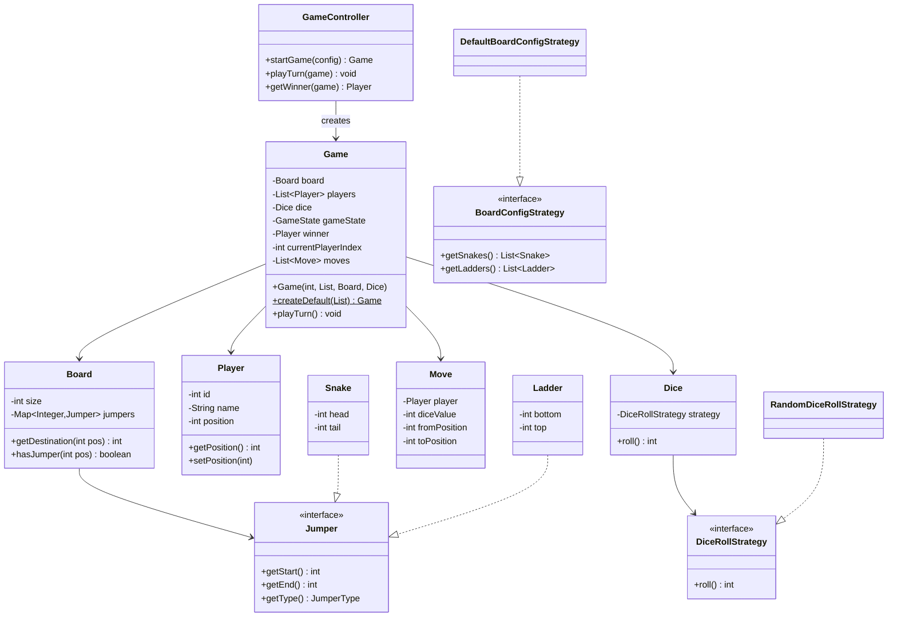
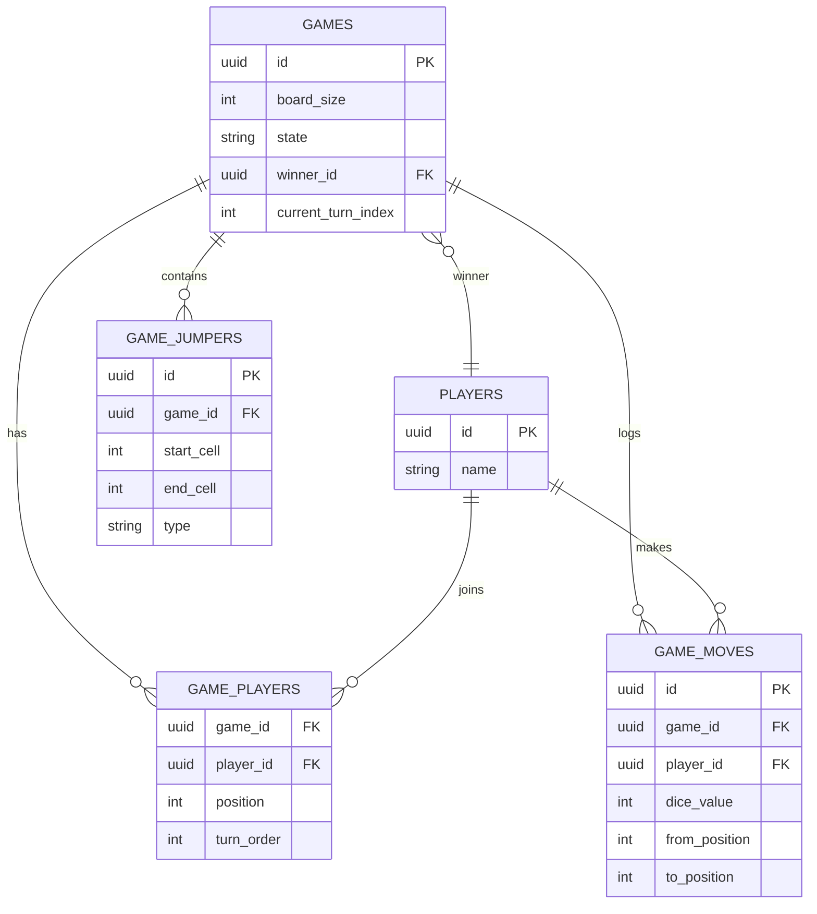
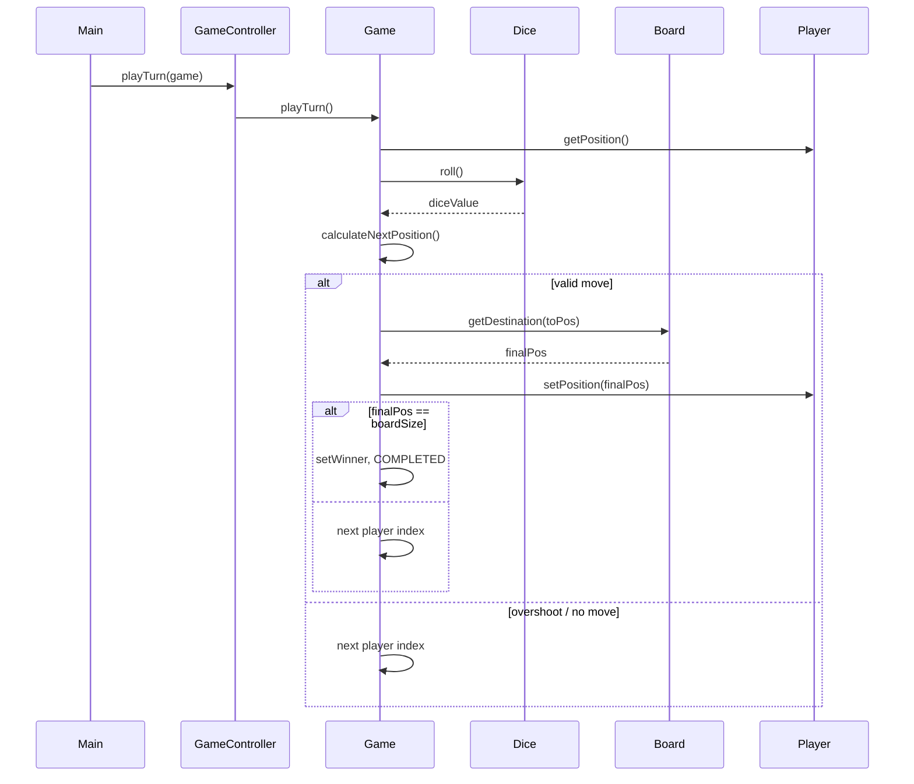

# Snake & Ladder — Low Level Design (Interview Guide)

> **Goal:** Understand, explain, and code this in ~60 minutes during an LLD interview.  
> **Reference style:** Mirrors your [TicTacToe](../TicTacToeGame-main/TicTacToeGame-main/) project — `models`, `controller`, `enums`, `exceptions`, `strategies`, `factories`.

---

## Table of Contents

1. [Problem Statement](#1-problem-statement)
2. [Functional Requirements (8–10)](#2-functional-requirements-810)
3. [Out of Scope (say this upfront)](#3-out-of-scope-say-this-upfront)
4. [Package Structure](#4-package-structure)
5. [Class Diagram](#5-class-diagram)
6. [Schema Design](#6-schema-design)
7. [Design Patterns](#7-design-patterns)
8. [Core Classes — Responsibilities & Key Methods](#8-core-classes--responsibilities--key-methods)
9. [Game Flow & Sequence Diagrams](#9-game-flow--sequence-diagrams)
10. [Validation Rules](#10-validation-rules)
11. [60-Minute Coding Plan](#11-60-minute-coding-plan)
12. [How to Explain in Interview](#12-how-to-explain-in-interview)
13. [Sample Interview Q&A](#13-sample-interview-qa)
14. [Extension Hooks (bonus points)](#14-extension-hooks-bonus-points)

---

## 1. Problem Statement

Design a **Snake & Ladder** board game for **2 to N players**. Players take turns rolling a dice, move their token on a board (default 100 cells), encounter snakes and ladders, and the first player to reach the **last cell exactly** wins.

---

## 2. Functional Requirements (8–10)

| # | Requirement | Interview one-liner |
|---|-------------|---------------------|
| **R1** | **Board setup** — Board has cells `1` to `N` (default `N = 100`). | "Board is a linear sequence of cells; position is an integer." |
| **R2** | **Player registration** — Support 2 to `MAX_PLAYERS` (e.g. 4) human players with unique names. | "Players start at position 0 (off-board) or 1 — pick one and stay consistent." |
| **R3** | **Turn-based play** — Players play in round-robin order. | "Same as TicTacToe: `currentPlayerIndex` cycles through the list." |
| **R4** | **Dice roll** — On a turn, roll a standard dice (1–6). | "Dice is pluggable via Strategy — random for real game, fixed for tests." |
| **R5** | **Movement** — Move token forward by dice value. | "New position = current + dice; apply board boundary rules next." |
| **R6** | **Exact finish rule** — If `current + dice > N`, player **stays** at current position (no move). | "Classic rule — prevents overshooting the win cell." |
| **R7** | **Snakes** — Landing on a snake **head** moves player to snake **tail**. | "Snake = downward jump; only head cell triggers it." |
| **R8** | **Ladders** — Landing on a ladder **bottom** moves player to ladder **top**. | "Ladder = upward jump; only bottom cell triggers it." |
| **R9** | **Win detection** — First player to land **exactly** on cell `N` wins; game ends. | "Check after full move resolution (including snake/ladder)." |
| **R10** | **Board configuration** — Snakes and ladders are configurable at game start (predefined default set or custom list). | "Passed into Game constructor; validated so no overlap/conflict." |

### Recommended default for R2

Use **position = 0** meaning "not yet on board." First roll that lands on 1–6 puts them on the board. This matches common implementations and makes "exact finish" cleaner.

---

## 3. Out of Scope (say this upfront)

Keep the first version small — interviewers respect scope control:

- Online multiplayer / WebSocket
- Database persistence (schema is still discussed for design maturity)
- UI / frontend
- Bot player (mention as extension)
- Multiple boards / tournaments
- Concurrent games

---

## 4. Package Structure

Mirror TicTacToe layout:

```
snakeandladder/
├── SnakeAndLadderGameMain.java          # entry point, game loop
├── controller/
│   └── GameController.java              # stateless — forwards to Game
├── models/
│   ├── Game.java                        # core orchestrator (constructor + validation)
│   ├── Board.java                       # cells + jumper lookup
│   ├── Cell.java                        # cell number (optional; can use int map)
│   ├── Player.java                      # id, name, position
│   ├── Dice.java                        # wraps DiceRollStrategy
│   ├── Move.java                        # player, diceValue, fromPos, toPos
│   ├── Snake.java                       # implements Jumper
│   └── Ladder.java                      # implements Jumper
├── enums/
│   ├── GameState.java                   # IN_PROGRESS, COMPLETED
│   └── PlayerType.java                  # HUMAN (BOT later)
├── exceptions/
│   ├── InvalidBoardException.java
│   ├── InvalidPlayerCountException.java
│   └── InvalidJumperException.java
├── strategies/
│   ├── DiceRollStrategy.java            # interface
│   ├── RandomDiceRollStrategy.java
│   └── FixedDiceRollStrategy.java       # for testing
├── boardConfig/
│   ├── BoardConfigStrategy.java         # interface — provides snakes & ladders
│   └── DefaultBoardConfigStrategy.java  # classic 100-cell layout
└── factories/
    └── DiceStrategyFactory.java
```

---

## 5. Class Diagram

### 5.1 Mermaid Class Diagram (draw this on whiteboard)



### 5.2 Relationships to explain verbally

| From | To | Relationship | Why |
|------|----|--------------|-----|
| `GameController` | `Game` | Dependency | Controller is stateless; doesn't own game state |
| `Game` | `Board`, `Player`, `Dice` | Composition | Game owns the match lifecycle |
| `Board` | `Jumper` | Aggregation | Jumpers configured per board, looked up by cell |
| `Snake`, `Ladder` | `Jumper` | Implementation | Polymorphism — same resolution logic |
| `Dice` | `DiceRollStrategy` | Strategy | Swap random vs fixed dice |
| `Game` | constructor / `createDefault()` | Factory method | Object creation + validation at init time |

### 5.3 Simplified whiteboard version (if short on time)

```
GameController → Game → Board + Players + Dice
Board → Map<cell, Jumper>
Snake/Ladder implement Jumper
Dice → DiceRollStrategy
```

---

## 6. Schema Design

Interviewers often ask "schema" for either **in-memory structure** or **DB design**. Cover both briefly.

### 6.1 In-Memory Object Schema (primary for 1-hr coding)

```
Game
├── gameId: String (optional UUID)
├── board: Board
├── players: List<Player>
├── dice: Dice
├── gameState: GameState
├── winner: Player | null
├── currentPlayerIndex: int
└── moves: List<Move>

Board
├── size: int                    // e.g. 100
└── jumpers: Map<int, Jumper>    // key = start cell (snake head / ladder bottom)

Player
├── id: int
├── name: String
├── position: int                // 0 = off-board
└── playerType: PlayerType

Move
├── player: Player
├── diceValue: int
├── fromPosition: int
└── toPosition: int              // after snake/ladder resolution

Jumper (interface)
├── start: int
├── end: int
└── type: SNAKE | LADDER

Snake  → start=head, end=tail   (start > end)
Ladder → start=bottom, end=top  (start < end)
```

**Why `Map<int, Jumper>` on Board?**  
O(1) lookup when player lands on a cell. Only the **start** cell is stored as key.

### 6.2 Database Schema (if interviewer asks "production / persistence")

```text
┌─────────────────┐       ┌──────────────────┐
│     games       │       │     players      │
├─────────────────┤       ├──────────────────┤
│ id (PK)         │       │ id (PK)          │
│ board_size      │       │ name             │
│ state           │       │ created_at       │
│ winner_id (FK)  │──┐    └──────────────────┘
│ current_turn    │  │              │
│ created_at      │  │    ┌─────────▼──────────┐
└─────────────────┘  │    │   game_players     │
         │           │    ├──────────────────────┤
         │           └───►│ game_id (FK)       │
         │                │ player_id (FK)     │
         │                │ position           │
         │                │ turn_order         │
         │                └──────────────────────┘
         │
         ▼
┌─────────────────┐       ┌──────────────────┐
│  game_jumpers   │       │   game_moves     │
├─────────────────┤       ├──────────────────┤
│ id (PK)         │       │ id (PK)          │
│ game_id (FK)    │       │ game_id (FK)     │
│ start_cell      │       │ player_id (FK)   │
│ end_cell        │       │ dice_value       │
│ type (SNAKE/    │       │ from_position    │
│        LADDER)  │       │ to_position      │
└─────────────────┘       │ created_at       │
                          └──────────────────┘
```

**Normalization note:** `game_jumpers` allows per-game custom boards. For a static default board, a `board_templates` table could be shared across games.

### 6.3 ER Diagram (Mermaid)



---

## 7. Design Patterns

| Pattern | Where | Why (interview answer) |
|---------|-------|------------------------|
| **Strategy** | `DiceRollStrategy` | Decouple *how* we roll from *game logic*; easy to test with fixed rolls |
| **Strategy** | `BoardConfigStrategy` | Decouple board layout (default 100, small 30, custom) from `Game` |
| **Factory** | `DiceStrategyFactory`, `Game.createDefault()` | Central place to create dice strategies; static factory for a ready-to-play game |
| **Polymorphism** | `Jumper` ← `Snake`, `Ladder` | Single resolution path in `Board.getDestination()` regardless of type |
| **MVC-ish** | `GameController` + `Game` | Controller forwards; model holds state (matches TicTacToe) |

### Patterns to mention but NOT implement in 1 hour

| Pattern | When to mention |
|---------|-----------------|
| **Observer** | UI/API subscribers on turn complete |
| **Command** | Undo last move (TicTacToe has this) |
| **Singleton** | `DiceStrategyFactory` — only if interviewer asks; otherwise static factory method is enough |

---

## 8. Core Classes — Responsibilities & Key Methods

> Pseudocode signatures only — **no full implementation** (you will code this yourself).

### 8.1 `GameController` (stateless)

```
startGame(boardSize, players, boardConfigStrategy, dice) → Game
playTurn(game) → void          // delegates to game.playTurn()
getGameState(game) → GameState
getWinner(game) → Player?
```

### 8.2 `Game` (orchestrator)

```
Game(int boardSize, List<Player> players, Board board, Dice dice):
  validate in constructor
  initialize gameState = IN_PROGRESS, currentPlayerIndex = 0

Game.createDefault(List<Player> players):   // optional static factory
  config = new DefaultBoardConfigStrategy()
  board = new Board(100, config.getJumpers())
  dice = new Dice(new RandomDiceRollStrategy())
  return new Game(100, players, board, dice)

playTurn():
  1. if gameState != IN_PROGRESS → return
  2. currentPlayer = players[currentPlayerIndex]
  3. diceValue = dice.roll()
  4. fromPos = currentPlayer.position
  5. toPos = calculateNextPosition(fromPos, diceValue)
  6. if toPos == fromPos → log "no move" (overshoot or still at 0)
  7. else:
       toPos = board.getDestination(toPos)   // snake/ladder
       currentPlayer.setPosition(toPos)
       record Move
  8. if toPos == board.size → winner = currentPlayer, state = COMPLETED
  9. else → currentPlayerIndex = (index + 1) % players.size()

calculateNextPosition(pos, dice):
  if pos == 0:
    return dice <= board.size ? dice : 0   // enter board on first valid roll
  if pos + dice > board.size:
    return pos                             // exact finish rule
  return pos + dice
```

### 8.3 `Board`

```
Board(size, List<Jumper> jumpers):
  validate jumpers
  build map: startCell → jumper

getDestination(position):
  if map.contains(position):
    return map.get(position).getEnd()
  return position
```

### 8.4 `Jumper` interface

```
getStart(): int
getEnd(): int
getType(): JumperType   // SNAKE | LADDER
```

### 8.5 `Dice`

```
roll() → strategy.roll()
```

### 8.6 `Game` constructor validations (critical for interview)

Called from `Game(int boardSize, List<Player> players, Board board, Dice dice)` or `Game.createDefault(players)`:

```
validatePlayerCount(): 2 <= players.size() <= MAX
validateJumpers():
  - start and end in [1, size]
  - snake: start > end
  - ladder: start < end
  - no two jumpers share same start cell
  - no chain conflicts (optional): ladder top shouldn't be another snake head
validateBoardSize(): size >= 10 (or any sensible min)
```

---

## 9. Game Flow & Sequence Diagrams

### 9.1 Main Game Loop

```
main():
  controller = new GameController()
  players = [Alice, Bob]
  config = new DefaultBoardConfigStrategy()
  dice = new Dice(new RandomDiceRollStrategy())
  game = controller.startGame(100, players, config, dice)

  while game.state == IN_PROGRESS:
    controller.playTurn(game)
    print positions

  print winner
```

### 9.2 Single Turn Sequence



### 9.3 Move Resolution Flow (decision tree)

```text
Roll dice
    │
    ▼
position == 0? ──yes──► dice assigns entry cell (or stay at 0)
    │
    no
    ▼
pos + dice > N? ──yes──► stay at pos (skip move, next turn)
    │
    no
    ▼
newPos = pos + dice
    │
    ▼
jumper at newPos? ──yes──► newPos = jumper.end
    │
    no
    ▼
newPos == N? ──yes──► WIN
    │
    no
    ▼
next player's turn
```

---

## 10. Validation Rules

| Rule | Exception | Message idea |
|------|-----------|--------------|
| Players < 2 or > MAX | `InvalidPlayerCountException` | "Need 2–4 players" |
| Board size < min | `InvalidBoardException` | "Board too small" |
| Snake head ≤ tail | `InvalidJumperException` | "Snake head must be above tail" |
| Ladder bottom ≥ top | `InvalidJumperException` | "Ladder bottom must be below top" |
| Duplicate start cells | `InvalidJumperException` | "Two jumpers on same cell" |
| Start/end out of range | `InvalidJumperException` | "Cell out of board bounds" |

---

## 11. 60-Minute Coding Plan

| Time | Task | Deliverable |
|------|------|-------------|
| **0–5 min** | Clarify requirements & scope with interviewer | Agree on R1–R10, position 0, exact finish |
| **5–10 min** | Draw class diagram + enums | Whiteboard buy-in |
| **10–15 min** | `Jumper`, `Snake`, `Ladder`, `Player`, `Move`, enums | Models compile |
| **15–25 min** | `Board`, `DiceRollStrategy`, `Dice`, exceptions | Board lookup works |
| **25–40 min** | `Game` constructor + `playTurn()` | Core logic done |
| **40–45 min** | `GameController`, `DefaultBoardConfigStrategy` | Wiring complete |
| **45–55 min** | `SnakeAndLadderGameMain` + manual test | Playable loop |
| **55–60 min** | Walk through edge cases | Overshoot, snake, ladder, win |

### Minimum viable class list (if running behind)

Skip `Cell` as a separate class — use `int position` on `Player` and `Map` on `Board`.  
Skip DB schema discussion until asked.  
Skip `Move` history initially; add if time permits.

### Default snakes & ladders (hardcode in `DefaultBoardConfigStrategy`)

Classic pairs for 100-cell board (memorize 3–4, rest can be "configured"):

| Snakes (head → tail) | Ladders (bottom → top) |
|----------------------|------------------------|
| 16 → 6 | 1 → 38 |
| 47 → 26 | 4 → 14 |
| 49 → 11 | 9 → 31 |
| 56 → 53 | 21 → 42 |
| 62 → 19 | 28 → 84 |
| 64 → 60 | 36 → 44 |
| 87 → 24 | 51 → 67 |
| 93 → 73 | 71 → 91 |
| 95 → 75 | 80 → 100 |
| 98 → 78 | |

---

## 12. How to Explain in Interview

### Opening (30 seconds)

> "I'll design a turn-based Snake & Ladder for 2–N players on an N-cell board. Each turn: roll dice, move forward with exact-finish rule, resolve snake or ladder if landed on start cell, check win. I'll use a constructor (or static factory) for Game creation, Strategy for dice and board config, and a Jumper interface for snakes and ladders — similar to how WinningStrategy is pluggable in TicTacToe."

### Class diagram walk (2 minutes)

1. **GameController** — thin, stateless entry point  
2. **Game** — state machine: players, turn index, winner  
3. **Board** — size + jumper map for O(1) lookup  
4. **Jumper hierarchy** — Snake/Ladder polymorphism  
5. **Dice + Strategy** — testable rolls  

### Schema walk (1 minute)

> "In memory, the critical structure is `Map<startCell, Jumper>` on Board and `position` on Player. If we persist, I'd add `games`, `game_players`, `game_jumpers`, and `game_moves` tables."

### Trade-offs to mention

| Choice | Trade-off |
|--------|-----------|
| `Map` vs `Cell[]` array | Map is simpler for sparse jumpers; array is O(1) with index = cell-1 |
| Position 0 vs 1 start | 0 makes "not on board" explicit |
| Single `playTurn()` vs split services | Single method is faster to code in 1 hour |
| Validate in constructor vs at runtime | Constructor — fail fast before game starts |

---

## 13. Sample Interview Q&A

**Q: What if a ladder top lands on a snake head?**  
A: Resolve one jumper only per turn (standard rule). After moving to ladder top, we do **not** chain unless interviewer explicitly wants multi-hop — state that assumption.

**Q: Can two players be on the same cell?**  
A: Yes, unless collision rule is specified. Default: multiple tokens allowed.

**Q: Extra turn on rolling 6?**  
A: Not in base requirements. Mention as extension.

**Q: Thread safety?**  
A: Single-threaded game loop for LLD. For concurrent access, synchronize `playTurn()` or use actor model per game.

**Q: How is this different from TicTacToe design?**  
A: TicTacToe uses `WinningStrategy` list checked after each move. Snake & Ladder uses `Jumper` map on board and movement arithmetic. Both use `Game` + stateless `Controller`; game setup can be a constructor or factory method.

---

## 14. Extension Hooks (bonus points)

| Extension | Pattern |
|-----------|---------|
| Bot player | `Bot extends Player` + `BotMoveStrategy` (like TicTacToe) |
| Undo move | `Command` pattern on `Move` stack (copy TicTacToe `performUndo`) |
| Custom board sizes | New `BoardConfigStrategy` implementations |
| Event notifications | `Observer` / `GameEventListener` on turn complete |
| REST API | `GameController` becomes service layer; `Game` serialized to DB schema |

---

## Quick Reference Card (print this)

```
REQUIREMENTS: Board 1–N | 2+ players | dice 1–6 | exact finish |
              snakes ↓ | ladders ↑ | first to N wins | configurable jumpers

CLASSES:      GameController → Game → Board, Player, Dice
              Snake/Ladder → Jumper
              Dice → DiceRollStrategy
              DefaultBoardConfig → snakes & ladders list

PATTERNS:     Strategy | Factory | Polymorphism | MVC

CORE LOGIC:    roll → move → resolve jumper → check win → next player

DATA:         Board.jumpers: Map<start, Jumper>
              Player.position: int
```

---

*Study this doc, then implement class-by-class following the 60-minute plan. Match package naming and patterns from your TicTacToe project so the design feels consistent across LLD problems.*
