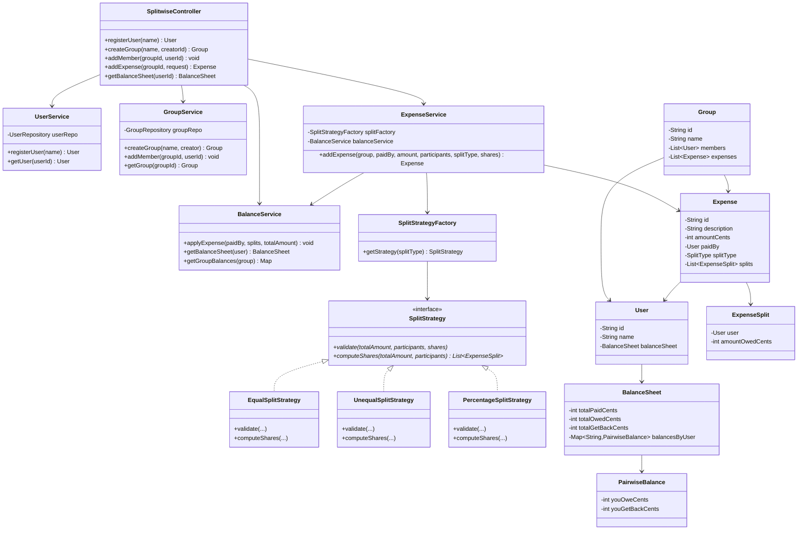
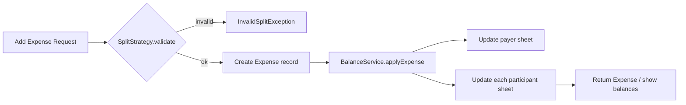
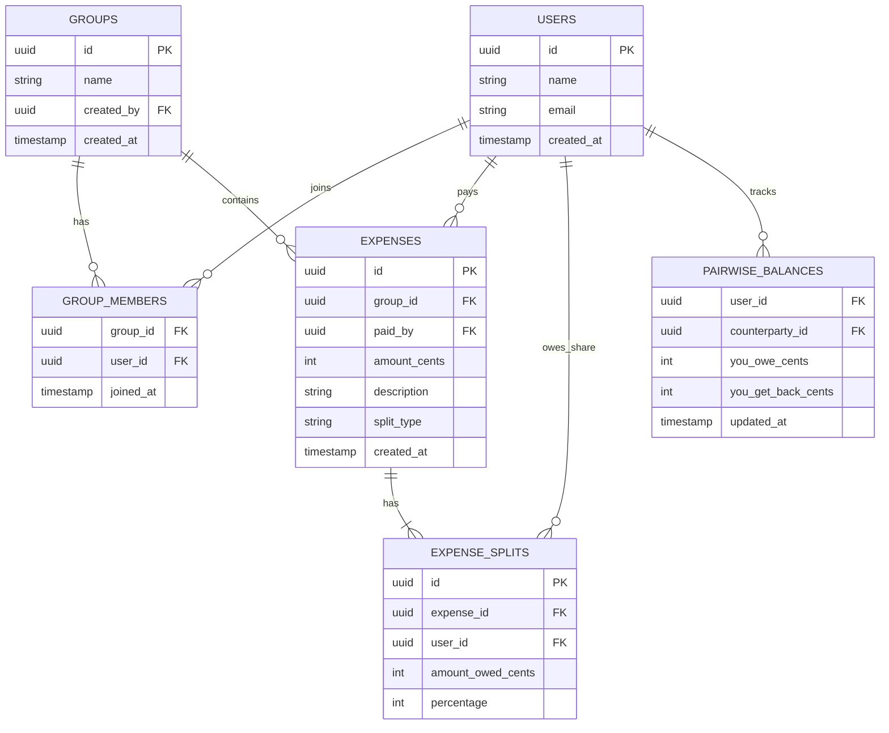
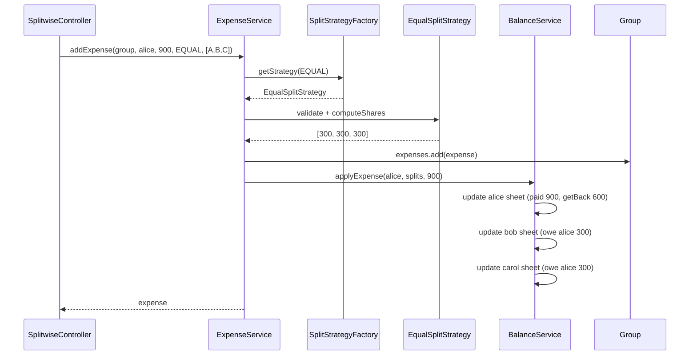

# Splitwise — Low Level Design (Interview Guide)

> **Goal:** Understand, explain, and code this in ~60 minutes during an LLD interview.  
> **Signature patterns:** **Strategy** (Equal / Unequal / Percentage splits) + **Factory** (split type lookup) + **Facade** (`ExpenseService` orchestrates validation → expense → balance update).  
> **Reference style:** Mirrors your [ATM Machine](../atm/LLD_ATM_MACHINE.md) / [Payment Gateway](../paymentgateway/LLD_PAYMENT_GATEWAY.md) / [Inventory Management](../inventorymanagement/LLD_INVENTORY_MANAGEMENT.md) guides — requirements → class/schema → patterns → 60-min coding plan.

---

## Code map (implemented)

Study order: `SplitwiseApplication` (scripted demo) → `services/ExpenseService` → `services/BalanceService` → `strategies/*`.

| Step | File | What |
|------|------|------|
| 1 | `enums/SplitType.java` | EQUAL, UNEQUAL, PERCENTAGE |
| 2 | `models/*` | User, Group, Expense, BalanceSheet, PairwiseBalance |
| 3 | `repositories/*` | In-memory User + Group stores |
| 4 | `strategies/*` | **Strategy pattern** — validate + computeShares |
| 5 | `factories/SplitStrategyFactory.java` | Enum → Strategy lookup |
| 6 | `services/UserService`, `GroupService` | Users + groups |
| 7 | `services/BalanceService.java` | **Ledger heart** — applyExpense, print balances |
| 8 | `services/ExpenseService.java` | **Orchestrator** — validate → expense → balances |
| 9 | `controller/SplitwiseController.java` | Thin API |
| 10 | `factories/DemoDataFactory.java` | Wire + seed Alice/Bob/Carol |

| Feature | What | Where to read |
|---------|------|---------------|
| **1. Users + groups** | Register users; create group; add members | `UserService`, `GroupService`, `DemoDataFactory.seedUsersAndGroup` |
| **2. Add expense (split)** | EQUAL / UNEQUAL / PERCENTAGE via Strategy | `ExpenseService`, `EqualSplitStrategy`, `UnequalSplitStrategy` |
| **3. Show balances** | Per-user balance sheet — who owes whom | `BalanceService.printBalanceSheet` |

**Run the scripted demo** (walks all scenarios automatically):

```bash
cd splitwise
.\mvnw.cmd -q -DskipTests compile exec:java
```

**Run interactive demo** (drive Splitwise yourself):

```bash
.\mvnw.cmd -q -DskipTests compile exec:java "-Dexec.mainClass=com.splitwise.splitwise.demo.SplitwiseDemo"
```

---

## Table of Contents

1. [Problem Statement](#1-problem-statement)
2. [Functional Requirements (8–10)](#2-functional-requirements-810)
3. [Out of Scope (say this upfront)](#3-out-of-scope-say-this-upfront)
4. [Clarify With Interviewer First](#4-clarify-with-interviewer-first)
5. [Package Structure](#5-package-structure)
6. [Class Diagram](#6-class-diagram)
7. [Schema Design](#7-schema-design)
8. [Design Patterns — Strategy + Factory (deep dive)](#8-design-patterns--strategy--factory-deep-dive)
9. [Core Classes — Responsibilities & Key Methods](#9-core-classes--responsibilities--key-methods)
10. [Expense Flow & Sequence Diagrams](#10-expense-flow--sequence-diagrams)
11. [Validation Rules & Balance Logic](#11-validation-rules--balance-logic)
12. [60-Minute Coding Plan](#12-60-minute-coding-plan)
13. [How to Explain in Interview](#13-how-to-explain-in-interview)
14. [Sample Interview Q&A](#14-sample-interview-qa)
15. [Extension Hooks (bonus points)](#15-extension-hooks-bonus-points)
16. [Cross-Project Mapping](#16-cross-project-mapping)

---

## 1. Problem Statement

Design **Splitwise** — an expense-sharing app where friends track shared bills. Users form **groups** (e.g. "Goa Trip"), add **expenses** (who paid, how much, how to split among participants), and view **balances** showing who owes whom. Optionally, users **settle** debts via recorded payments.

**Interview framing:** This is a **ledger + pluggable split calculator**. The hard parts are:

1. **Open/Closed** — new split types (Equal, Exact amounts, Percentage) without changing core expense flow  
2. **Correct balance math** — when A pays ₹900 split equally among A, B, C, update pairwise debts consistently  
3. **Validation** — split amounts must sum to total expense; payer must be in split list  

```
User A pays ₹900 dinner
Split EQUAL among A, B, C  →  each owes ₹300
Result: B owes A ₹300, C owes A ₹300  (A's share nets to zero with self)
```

**One-liner for the interviewer:**

> "Each expense creates a set of pairwise debts. I maintain a per-user balance sheet keyed by counterparty userId. Split type is a Strategy; balance update is centralized in one service."

---

## 2. Functional Requirements (8–10)

| # | Requirement | Interview one-liner |
|---|-------------|---------------------|
| **R1** | **Register user** — id, name, email | "`UserService.registerUser` — in-memory map" |
| **R2** | **Create group** — name, creator becomes member | "`GroupService.createGroup(creatorId, name)`" |
| **R3** | **Add/remove group member** | "`group.addMember(user)` — validate user exists" |
| **R4** | **Add expense** — amount, description, paidBy, participants, split type | "`ExpenseService.addExpense(...)`" |
| **R5** | **Split types** — EQUAL, UNEQUAL (exact), PERCENTAGE | "**Strategy pattern** — one class per type" |
| **R6** | **Validate splits** — sum of shares = total; payer in participants | "`SplitStrategy.validate(...)` before persist" |
| **R7** | **Show user balance sheet** — total paid, total owe, total get back, per-user breakdown | "`BalanceService.getBalanceSheet(userId)`" |
| **R8** | **Show group balances** — aggregate balances for group members only | "Filter pairwise map to group member ids" |
| **R9** | **Settle up** — record payment from debtor to creditor | "Reverse/adjust pairwise balance; optional MVP" |
| **R10** | **Expense history** — list expenses in a group | "`Group.expenses` list or repo query" |

### Recommended MVP for 1 hour (pick with interviewer)

Agree on **3 working functionalities** to code:

1. **Register users + create group + add members**  
2. **Add expense** with **EQUAL** split (add **UNEQUAL** if fast)  
3. **Show balance sheet** for each user (who owes whom)  

Say explicitly: *PERCENTAGE split, settle-up, debt simplification (min cash flow), non-group expenses, notifications, auth, and DB persistence are extensions unless time remains.*

---

## 3. Out of Scope (say this upfront)

Keep v1 small — interviewers respect scope control:

- User authentication / OAuth / JWT
- Real payment integration (UPI, bank transfer)
- Debt simplification algorithm (minimize transactions) — **mention** as extension
- Multi-currency / FX rates
- Recurring expenses / subscriptions
- Expense edit / delete with balance rollback (mention compensating update)
- Attachments (receipt photos)
- Push/email notifications
- Concurrent expense creation / distributed locks (mention conceptually)
- Persistence required for MVP (still discuss schema)
- Tax / tip calculation rules
- Split by shares (e.g. 2 shares vs 1 share) — can map to PERCENTAGE

---

## 4. Clarify With Interviewer First

Ask these in the first **2–3 minutes** (shows product thinking):

| Question | Good default for interview |
|----------|----------------------------|
| Group-only or also 1:1 expenses? | **Group expenses** for MVP; 1:1 = group of 2 |
| Which split types in MVP? | **EQUAL + UNEQUAL**; PERCENTAGE if time |
| Money unit? | Integer **paise/cents** — **no floats** |
| Can payer be excluded from split? | **No** — payer must be in participants list |
| Settle-up in scope? | **Show balances only**; settle as extension |
| Edit/delete expense? | **Out of scope** — mention reverse ledger entry |
| Show net balance or all pairwise? | **Pairwise** (A→B, A→C); net per friend is derived |
| Who creates expenses? | Any group member |

**Assumptions to state aloud:**

1. Single JVM, in-memory repositories.  
2. User ids and group ids are strings (UUID or `U001`).  
3. One payer per expense.  
4. All amounts in smallest currency unit (int).  
5. Balance sheet is **derived incrementally** on each expense (not recomputed from scratch every time — but mention recompute-from-history as alternative).

---

## 5. Package Structure

Mirror your other LLD projects:

```
splitwise/
├── SplitwiseApplication.java           # Spring entry (optional)
├── demo/
│   └── SplitwiseDemo.java              # CLI demo — primary for interview
├── controller/
│   └── SplitwiseController.java        # thin: addUser, createGroup, addExpense, getBalance
├── models/
│   ├── User.java
│   ├── Group.java
│   ├── Expense.java
│   ├── ExpenseSplit.java               # one participant's share (userId + amountOwed)
│   └── BalanceSheet.java               # totals + Map<userId, PairwiseBalance>
├── enums/
│   └── SplitType.java                    # EQUAL, UNEQUAL, PERCENTAGE
├── strategies/
│   ├── SplitStrategy.java              # interface: validate + computeShares
│   ├── EqualSplitStrategy.java
│   ├── UnequalSplitStrategy.java
│   └── PercentageSplitStrategy.java    # extension
├── services/
│   ├── UserService.java
│   ├── GroupService.java
│   ├── ExpenseService.java             # orchestrates validate → expense → balance update
│   └── BalanceService.java             # update balances + query
├── factories/
│   ├── SplitStrategyFactory.java
│   └── DemoDataFactory.java            # seed users for demo
├── repositories/
│   ├── UserRepository.java
│   ├── GroupRepository.java
│   └── ExpenseRepository.java          # optional; can live on Group
└── exceptions/
    ├── UserNotFoundException.java
    ├── GroupNotFoundException.java
    ├── InvalidSplitException.java
    └── MemberNotInGroupException.java
```

**Design choice to state clearly:**

| Approach | Pros | Cons |
|----------|------|------|
| **A. Strategy + Factory** — split type → `SplitStrategy` | Classic interview answer; OCP for new split types | More classes |
| **B. switch in ExpenseService** | Faster to code | Violates OCP; messy validation |

**Recommend Approach A for interview.** If short on time, implement EQUAL inline first, then extract Strategy.

**Second design choice — where balances live:**

| Approach | Pros | Cons |
|----------|------|------|
| **A. Balance on User** — `User.balanceSheet` updated on each expense | Fast lookup; matches reference code | User entity heavier |
| **B. Separate BalanceService + global ledger** | Cleaner domain model | More indirection |

**Recommend A for 1-hour MVP** (matches reference `UserExpenseBalanceSheet`).

---

## 6. Class Diagram

### 6.1 Mermaid Class Diagram (draw this on whiteboard)



### 6.2 Relationships to explain verbally

| From | To | Relationship | Why |
|------|----|--------------|-----|
| `SplitwiseController` | Services | Dependency | Thin API for demo / REST |
| `ExpenseService` | `SplitStrategy` | Dependency | Pluggable split algorithms |
| `SplitStrategyFactory` | `SplitStrategy` | Creates | Lookup by `SplitType` enum |
| `ExpenseService` | `BalanceService` | Dependency | Single place for ledger math |
| `User` | `BalanceSheet` | Composition | Fast per-user balance queries |
| `Group` | `Expense` | Aggregation | Group owns expense history |
| `Expense` | `ExpenseSplit` | Composition | Immutable record of who owed what |

### 6.3 Simplified whiteboard version (if short on time)

```
SplitwiseController
  → UserService (users)
  → GroupService (groups, members)
  → ExpenseService
        → SplitStrategyFactory → Equal | Unequal | Percentage
        → BalanceService.applyExpense(...)
  → BalanceService.getBalanceSheet(user)

Expense flow:
  validate split → build Expense → update pairwise balances on payer + each participant
```

### 6.4 Expense lifecycle (flow diagram)



---

## 7. Schema Design

Interviewers may ask for **in-memory structure** or **DB design**. Cover both briefly.

### 7.1 In-Memory Object Schema (primary for 1-hr coding)

```
UserRepository
└── users: Map<String, User>              // key = userId

GroupRepository
└── groups: Map<String, Group>            // key = groupId

User
├── id: String
├── name: String
└── balanceSheet: BalanceSheet

Group
├── id: String
├── name: String
├── members: List<User>
└── expenses: List<Expense>

Expense
├── id: String
├── groupId: String
├── description: String
├── amountCents: int
├── paidBy: User
├── splitType: SplitType
├── splits: List<ExpenseSplit>
└── createdAt: long                     // optional

ExpenseSplit
├── user: User
└── amountOwedCents: int                // this user's share of the bill

BalanceSheet
├── totalPaidCents: int                 // sum of all expenses user paid
├── totalOwedCents: int                 // sum of user's own shares
├── totalGetBackCents: int              // what others owe this user (gross)
└── balancesByUser: Map<String, PairwiseBalance>
    // key = other user's id

PairwiseBalance
├── youOweCents: int                    // this user owes other user
└── youGetBackCents: int                // other user owes this user
```

**Net between A and B (explain verbally):**

```
net(A owes B) = A.balancesByUser[B].youOwe - A.balancesByUser[B].youGetBack
If net > 0 → A should pay B that amount
```

### 7.2 Database Schema (if interviewer asks "production / persistence")

```text
┌──────────────────┐       ┌──────────────────┐
│      users       │       │      groups      │
├──────────────────┤       ├──────────────────┤
│ id (PK)          │       │ id (PK)          │
│ name             │       │ name             │
│ email            │       │ created_by (FK)  │
│ created_at       │       │ created_at       │
└────────┬─────────┘       └────────┬─────────┘
         │                          │
         │    ┌─────────────────────┴──────────────┐
         │    │         group_members              │
         │    ├────────────────────────────────────┤
         └────► user_id (FK)                        │
              │ group_id (FK)                        │
              │ joined_at                            │
              └──────────────────────────────────────┘

┌──────────────────┐       ┌──────────────────┐
│    expenses      │       │  expense_splits  │
├──────────────────┤       ├──────────────────┤
│ id (PK)          │       │ id (PK)          │
│ group_id (FK)    │──1:N─►│ expense_id (FK)  │
│ paid_by (FK)     │       │ user_id (FK)     │
│ amount_cents     │       │ amount_owed_cents│
│ description      │       │ percentage       │  // nullable, for PERCENTAGE type
│ split_type       │       └──────────────────┘
│ created_at       │
└──────────────────┘

┌──────────────────┐       ┌──────────────────┐
│ pairwise_balances│       │   settlements    │  // extension
├──────────────────┤       ├──────────────────┤
│ user_id (FK)     │       │ id (PK)          │
│ counterparty (FK)│       │ from_user (FK)   │
│ you_owe_cents    │       │ to_user (FK)     │
│ you_get_back     │       │ amount_cents     │
│ updated_at       │       │ group_id (FK)    │
└──────────────────┘       │ created_at       │
                           └──────────────────┘
```

**Production note:** You can either **materialize** `pairwise_balances` (fast reads, update on each expense) or **derive** from `expenses` + `expense_splits` (source of truth, slower reads). Say you'd use materialized balances with expense history as audit trail.

### 7.3 ER Diagram (Mermaid)



---

## 8. Design Patterns — Strategy + Factory (deep dive)

### 8.1 Why Strategy here?

Without Strategy:

```
void addExpense(..., SplitType type) {
  if (type == EQUAL) { ... validate equal ... }
  else if (type == UNEQUAL) { ... sum check ... }
  else if (type == PERCENTAGE) { ... 100% check ... }
}
```

Every new split type modifies `ExpenseService` → violates **Open/Closed**.

With Strategy: `SplitStrategy.validate()` + `computeShares()` — `ExpenseService` stays stable.

**Compare to Payment Gateway:**

| Payment Gateway | Splitwise |
|-----------------|-----------|
| `PaymentStrategy.charge()` | `SplitStrategy.computeShares()` |
| Card / UPI / Wallet | Equal / Unequal / Percentage |
| `PaymentStrategyFactory` | `SplitStrategyFactory` |

Same skeleton, different domain.

### 8.2 Pattern roles (say this)

| Role | In this design |
|------|----------------|
| **Strategy interface** | `SplitStrategy` — validate + compute shares |
| **Concrete strategies** | `EqualSplitStrategy`, `UnequalSplitStrategy`, `PercentageSplitStrategy` |
| **Factory** | `SplitStrategyFactory.getStrategy(SplitType)` |
| **Context / orchestrator** | `ExpenseService` — uses strategy, then updates balances |
| **Facade** | `BalanceService` — hides pairwise ledger complexity |

### 8.3 Split type behavior matrix (memorize)

| Split Type | Input from caller | Validation | Share computation |
|------------|-------------------|------------|-------------------|
| **EQUAL** | List of participants | Count ≥ 1; payer in list | `total / n` each; distribute remainder paise to first k users |
| **UNEQUAL** | participants + exact amounts | `sum(shares) == total` | Use given amounts as-is |
| **PERCENTAGE** | participants + percentages | `sum(%) == 100` | `total * pct / 100`; fix rounding on last user |

### 8.4 Other patterns (mention, don't over-build)

| Pattern | Where | Why |
|---------|-------|-----|
| **Strategy** | Split types | Core extensibility story |
| **Factory** | Strategy lookup | Clean creation by enum |
| **Facade** | `BalanceService` | Single entry for ledger updates |
| **Repository** | User/Group/Expense storage | Swappable in-memory → DB |
| **Observer** | Notify when balance changes | Extension |
| **Command** | Undo expense / settlement | Extension |

### Patterns to mention but NOT implement in 1 hour

| Pattern | When |
|---------|------|
| **Observer** | Push notification "X added expense" |
| **Command** | Undo delete expense with balance rollback |
| **Graph algorithm** | Debt simplification (min transactions) |

---

## 9. Core Classes — Responsibilities & Key Methods

> Pseudocode signatures — **no full implementation** (you will code this yourself).

### 9.1 `SplitwiseController` (stateless)

```
registerUser(name) → User
createGroup(name, creatorId) → Group
addMember(groupId, userId) → void
addExpense(groupId, paidById, amountCents, description, splitType, participants, shares?) → Expense
getBalanceSheet(userId) → BalanceSheet
```

### 9.2 `EqualSplitStrategy`

```
computeShares(totalCents, participants) → List<ExpenseSplit>:
  base = totalCents / participants.size()
  remainder = totalCents % participants.size()
  for i, user in participants:
    share = base + (i < remainder ? 1 : 0)   // distribute extra paise
    splits.add(new ExpenseSplit(user, share))
  return splits

validate(totalCents, participants, shares):
  if participants.isEmpty() → throw InvalidSplitException
  // EQUAL can ignore pre-filled shares and compute itself
```

### 9.3 `UnequalSplitStrategy`

```
validate(totalCents, participants, shares):
  if sum(shares.amountOwed) != totalCents → throw InvalidSplitException
  if any share user not in participants → throw InvalidSplitException

computeShares(totalCents, participants, inputShares) → return inputShares
```

### 9.4 `ExpenseService`

```
addExpense(group, paidBy, amountCents, description, splitType, participants, inputShares):
  strategy = splitFactory.getStrategy(splitType)
  strategy.validate(amountCents, participants, inputShares)
  splits = strategy.computeShares(amountCents, participants, inputShares)
  expense = new Expense(id, description, amountCents, paidBy, splitType, splits)
  group.expenses.add(expense)
  balanceService.applyExpense(paidBy, splits, amountCents)
  return expense
```

### 9.5 `BalanceService.applyExpense` — **core algorithm**

```
applyExpense(paidBy, splits, totalCents):
  payerSheet = paidBy.balanceSheet
  payerSheet.totalPaidCents += totalCents

  for split in splits:
    participant = split.user
    oweAmount = split.amountOwedCents
    participantSheet = participant.balanceSheet
    participantSheet.totalOwedCents += oweAmount

    if participant.id == paidBy.id:
      // payer's own share — already counted in totalOwed
      continue

    // Others owe the payer
    payerSheet.totalGetBackCents += oweAmount
    incrementPairwise(payerSheet, participant.id, getBack = oweAmount)

    incrementPairwise(participantSheet, paidBy.id, owe = oweAmount)

incrementPairwise(sheet, counterpartyId, owe?, getBack?):
  balance = sheet.balancesByUser.computeIfAbsent(counterpartyId, PairwiseBalance::new)
  if owe > 0: balance.youOweCents += owe
  if getBack > 0: balance.youGetBackCents += getBack
```

### 9.6 `BalanceService.getBalanceSheet`

```
getBalanceSheet(user) → user.balanceSheet

printBalanceSheet(user):
  sheet = user.balanceSheet
  print totals: paid, owed, getBack
  for (counterpartyId, balance) in sheet.balancesByUser:
    net = balance.youGetBackCents - balance.youOweCents   // from THIS user's perspective
    if net > 0: print counterpartyId + " owes you " + net
    if net < 0: print "You owe " + counterpartyId + " " + (-net)
```

### 9.7 Minimal happy-path algorithm (say this in 30 seconds)

```
1. Register Alice, Bob, Carol
2. Alice creates group "Trip"; add Bob, Carol
3. Alice adds expense ₹900 EQUAL among Alice, Bob, Carol (Alice paid)
   → each owes ₹300; Bob owes Alice 300, Carol owes Alice 300
4. Bob adds expense ₹500 UNEQUAL: Alice ₹400, Bob ₹100 (Bob paid)
   → Alice owes Bob ₹400
5. Show balance sheets:
   Alice: Bob owes 300, Carol owes 300; Alice owes Bob 400
   Net: Alice gets 200 from Bob after offset (conceptually)
```

### 9.8 Worked example (use on whiteboard)

**Expense 1:** Alice pays **900**, EQUAL split [Alice, Bob, Carol]

| User | Share |
|------|-------|
| Alice | 300 |
| Bob | 300 |
| Carol | 300 |

Pairwise updates:
- Bob → Alice: owe 300
- Carol → Alice: owe 300

**Expense 2:** Bob pays **500**, UNEQUAL — Alice 400, Bob 100

Pairwise updates:
- Alice → Bob: owe 400

**Alice's view:**

| Counterparty | Get back | Owe | Net |
|--------------|----------|-----|-----|
| Bob | 0 | 400 | −400 (Alice owes Bob) |
| Carol | 300 | 0 | +300 |

**Bob's view:**

| Counterparty | Get back | Owe | Net |
|--------------|----------|-----|-----|
| Alice | 400 | 300 | +100 (Bob gets 100 net from Alice) |

---

## 10. Expense Flow & Sequence Diagrams

### 10.1 CLI demo main loop

```
main():
  userService = new UserService()
  groupService = new GroupService(userService)
  expenseService = new ExpenseService(...)
  controller = new SplitwiseController(...)

  alice = controller.registerUser("Alice")
  bob = controller.registerUser("Bob")
  carol = controller.registerUser("Carol")

  group = controller.createGroup("Goa Trip", alice.id)
  controller.addMember(group.id, bob.id)
  controller.addMember(group.id, carol.id)

  controller.addExpense(group.id, alice.id, 90000, "Breakfast",
      EQUAL, [alice, bob, carol])

  controller.addExpense(group.id, bob.id, 50000, "Lunch",
      UNEQUAL, [alice, bob], shares=[40000, 10000])

  for user in [alice, bob, carol]:
    controller.printBalanceSheet(user.id)
```

### 10.2 Add expense sequence



### 10.3 Invalid split sequence

```
addExpense UNEQUAL total=500 shares=[400, 50]
→ validate: 400+50 != 500
→ InvalidSplitException
→ no expense created, balances unchanged
```

---

## 11. Validation Rules & Balance Logic

| Rule | When | Behavior |
|------|------|----------|
| Unknown user | addMember / addExpense | `UserNotFoundException` |
| User not in group | addExpense | `MemberNotInGroupException` |
| amount ≤ 0 | addExpense | `InvalidSplitException` |
| Empty participants | addExpense | `InvalidSplitException` |
| Payer not in participants | addExpense | `InvalidSplitException` |
| UNEQUAL sum ≠ total | validate | `InvalidSplitException` |
| PERCENTAGE sum ≠ 100 | validate | `InvalidSplitException` |
| EQUAL remainder | compute | Distribute extra paise to first N users |

**Invariants to state:**

1. **Conservation:** Sum of all shares in an expense = `amountCents`.  
2. **Double-entry intuition:** For every rupee someone is owed, someone else owes a rupee (across the group).  
3. **No float money:** Use `int` paise; handle rounding explicitly in EQUAL/PERCENTAGE.  
4. **Idempotent demo ids:** Optional `expenseId` uniqueness check.

**Rounding strategy (EQUAL):**

```
900 paise / 3 = 300 each ✓
1000 paise / 3 = 333 + 333 + 334 (first two get 333, last gets 334)
State this aloud — interviewers notice float bugs.
```

---

## 12. 60-Minute Coding Plan

| Time | What to do |
|------|------------|
| **0–5 min** | Requirements + out of scope + MVP 3 features + assumptions |
| **5–15 min** | Draw class diagram: User, Group, Expense, SplitStrategy, BalanceService |
| **15–22 min** | Code `User`, `Group`, repos, `DemoDataFactory`, register + create group |
| **22–32 min** | Code `SplitStrategy` + `EqualSplitStrategy` + `SplitStrategyFactory` |
| **32–45 min** | Code `BalanceService.applyExpense` + `ExpenseService.addExpense` |
| **45–52 min** | Wire controller + demo: 2 expenses + print balances |
| **52–55 min** | Add `UnequalSplitStrategy` OR show invalid split rejection |
| **55–60 min** | Mention settle-up, debt simplification, DB schema, PERCENTAGE as extensions |

### Must-demo scripts (practice these)

```
# Happy path — equal split
Register A, B, C → Group "Trip" → A pays 900 EQUAL among A,B,C
→ B owes A 300, C owes A 300

# Unequal split
B pays 500 UNEQUAL: A=400, B=100
→ A owes B 400

# Show net balances
Print all three balance sheets — numbers match worked example in §9.8

# Invalid split
Add expense total 500, shares 400+50 → error, no balance change
```

### If running behind (cut order)

1. Drop `PercentageSplitStrategy` — mention only  
2. Drop separate repositories — use `HashMap` in services  
3. Drop `ExpenseRepository` — store expenses only on `Group`  
4. Skip group-level balance API — only per-user sheet  
5. Implement EQUAL only first — add UNEQUAL if 5 min left  
6. Skip Spring — plain `main()` + `SplitwiseDemo`  

---

## 13. How to Explain in Interview

### Opening (60 seconds)

> "I'll design Splitwise as an expense ledger with pluggable split strategies. Core entities: User, Group, Expense, and a BalanceSheet per user tracking pairwise debts. When someone adds an expense, we validate splits via Strategy, persist the expense, then update everyone's balance sheet. For a 1-hour MVP I'll code user/group setup, equal and unequal splits, and show who owes whom."

### While drawing

1. Draw **three boxes first:** User, Group, Expense.  
2. Add **SplitStrategy** interface with Equal / Unequal implementations + Factory.  
3. Show **BalanceService** as the only class that mutates balances (single responsibility).  
4. Walk through **one numeric example** (900 equal split) before coding.  
5. Mention **int paise** — never `double` for money.

### While coding

- Narrate: *"ExpenseService validates before mutating balances."*  
- Show one rejection: *"Unequal shares that don't sum to total throw InvalidSplitException."*  
- Print balance sheet after each expense so interviewer sees correctness.  
- Prefer clear method names over clever abstractions.

### Closing (30 seconds)

> "MVP covers users, groups, expenses with equal/unequal splits, and balance sheets. Extensions: percentage split, settle-up payments, debt simplification graph algorithm, expense edit with compensating ledger entries, and persistence with materialized pairwise balances."

---

## 14. Sample Interview Q&A

**Q: Why Strategy instead of switch on split type?**  
A: New split types (SHARES, BY_ITEMS) shouldn't touch `ExpenseService`. Strategy keeps validation and share computation colocated per type — same reason I used Strategy in Payment Gateway for Card/UPI.

**Q: Why store balances on User instead of recomputing from expenses?**  
A: **Materialized view** for O(1) reads. Expenses are the audit trail; balances are derived incrementally. Production could rebuild from history if corruption suspected.

**Q: How do you handle rounding in EQUAL split?**  
A: Integer division; distribute remainder paise one-by-one to first k participants so shares sum exactly to total.

**Q: Can Alice owe Bob and Bob owe Alice simultaneously?**  
A: Yes in **pairwise gross** view. Net settlement is `getBack - owe`. Optional simplification merges to single directed edge — extension.

**Q: How does settle-up work?**  
A: Record a payment expense or `Settlement` entity: decrement debtor's `youOwe` and creditor's `youGetBack`. Like a negative expense.

**Q: Debt simplification?**  
A: Model debts as directed graph; find minimum cash flow (LeetCode-style). **Out of MVP** — mention if asked.

**Q: Thread safety?**  
A: MVP single-threaded. Production: lock per group or optimistic locking on balance rows.

**Q: Floats for money?**  
A: **No** — int paise. Reference code uses `double` for brevity; say you'd fix in production.

**Q: Edit/delete expense?**  
A: Apply **reverse ledger entry** (negate shares) or recompute group balances from scratch. Mention Command pattern.

**Q: Expense outside a group?**  
A: Treat as group of 2 or use `groupId = null` with participant list — same balance logic.

---

## 15. Extension Hooks (bonus points)

| Extension | Hook in design |
|-----------|----------------|
| **PERCENTAGE split** | `PercentageSplitStrategy` + factory case |
| **Settle up** | `SettlementService.recordPayment(from, to, amount)` |
| **Debt simplification** | `BalanceOptimizer.minimizeTransactions(balances)` — graph |
| **Show group dues only** | Filter `balancesByUser` to group member ids |
| **Expense edit/delete** | `BalanceService.reverseExpense(expense)` |
| **Notifications** | `Observer` on `ExpenseService.addExpense` |
| **Non-group expense** | `ExpenseService.addDirectExpense(participants, ...)` |
| **Multi-currency** | Amount + currency on Expense; FX service |
| **Persistence** | Tables in §7; DAO repositories |
| **Activity feed** | `List<Activity>` per group |

### Debt simplification (30-second explanation)

```
Balances: B owes A 300, C owes A 300, A owes B 400
Net: B owes A net 100, C owes A 300
Minimum settlements: B→A 100, C→A 300 (2 transactions instead of 3 gross edges)
```

---

## 16. Cross-Project Mapping

| Concept | Payment Gateway | Inventory Mgmt | **Splitwise** |
|---------|-----------------|----------------|---------------|
| Orchestrator | `PaymentService` | `OrderService` | `ExpenseService` |
| Controller | `PaymentController` | `InventoryController` | `SplitwiseController` |
| Key pattern | **Strategy** (payment method) | **Command** (stock mvmt) | **Strategy** (split type) |
| Factory | `PaymentStrategyFactory` | `CatalogFactory` | `SplitStrategyFactory` |
| Ledger / state | Transaction status | Stock levels | **BalanceSheet** |
| Validation | Idempotency, amount | Insufficient stock | Split sums to total |
| Extension | Refund | Fulfill/release | Settle-up, simplify debts |

**Study tip:** Learn **Payment Gateway Strategy** first, then Splitwise is **Strategy on splits instead of payment methods**, plus **pairwise ledger updates** instead of transaction state. ATM/Vending teach State; Splitwise teaches **Strategy + ledger consistency**.

---

## Quick Revision Card (read night before)

```
REQUIREMENTS: users, groups, add expense (split), show balances
MVP CODE:     register + group + EQUAL expense + balance sheet (+ UNEQUAL if time)
PATTERN:      Strategy (Equal/Unequal/Percentage) + Factory + BalanceService Facade
DATA:         User.balanceSheet.balancesByUser[counterpartyId] = {owe, getBack}
FLOW:         validate split → create Expense → applyExpense updates all sheets
MONEY:        int paise — NO double; distribute remainder on EQUAL
INVARIANT:    sum(shares) == expense total; payer in participants
SCHEMA:       users, groups, group_members, expenses, expense_splits, pairwise_balances
SKIP:         auth, debt simplification, settle-up, notifications, DB (unless asked)
```

---

## Overall Interview Approach (1 hour timeline)

Use this as your **default runbook** in any LLD round:

| Phase | Minutes | What to say / do |
|-------|---------|------------------|
| **1. Requirements** | 0–8 | Restate problem; list 8–10 reqs; agree **3 MVP features**; state out-of-scope |
| **2. Clarifications** | 8–12 | Ask 4–5 questions (split types, int money, group-only, settle-up?) |
| **3. Class diagram** | 12–22 | Draw User/Group/Expense + Strategy + BalanceService; walk numeric example |
| **4. Schema** | 22–28 | In-memory BalanceSheet first; ER diagram if they ask persistence |
| **5. Code MVP** | 28–52 | Users/Group → EqualSplitStrategy → applyExpense → demo print balances |
| **6. Demo + extensions** | 52–60 | Run 2 expenses; mention settle-up, simplification, PERCENTAGE |

**Phrases that score well:**

- *"Split type is Strategy — same extensibility as payment methods in my Payment Gateway design."*  
- *"BalanceService is the only place that mutates pairwise debts — single source of truth for ledger rules."*  
- *"I'll use integer paise and distribute remainder on equal splits so totals always match."*  
- *"Expenses are immutable audit records; balances are materialized for fast reads."*

---

*Practice: explain the 900/equal-split example on a whiteboard in 2 minutes, then code User + Group + EqualSplit + applyExpense + print balances without looking. That alone covers a strong 1-hour Splitwise interview.*
