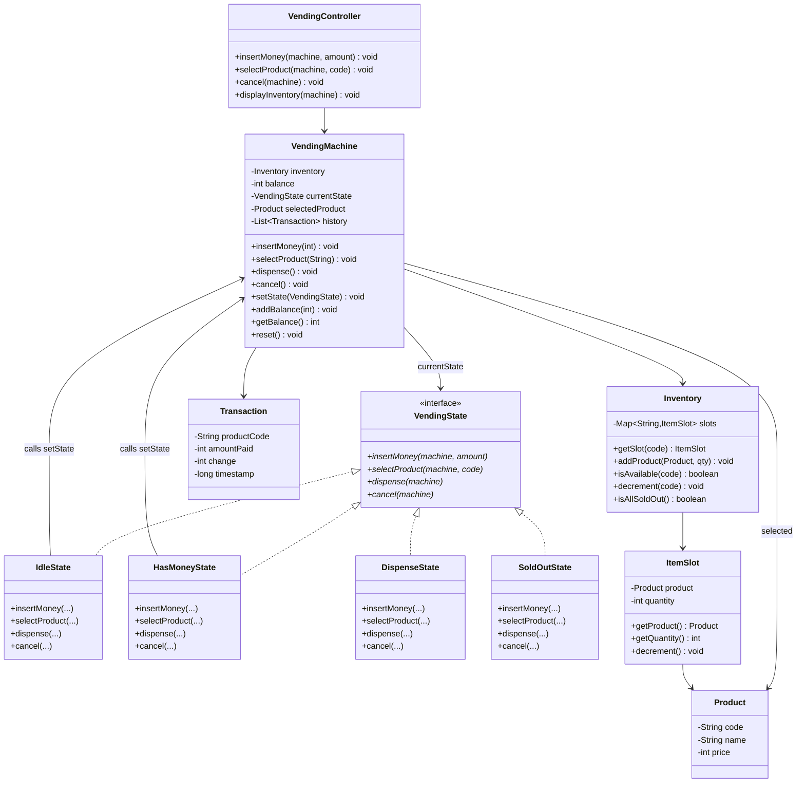
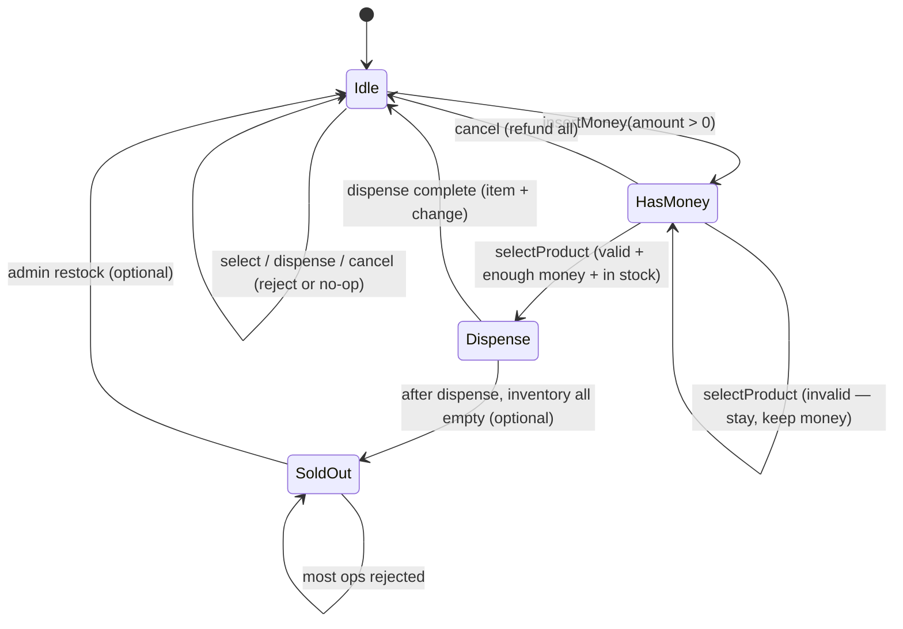
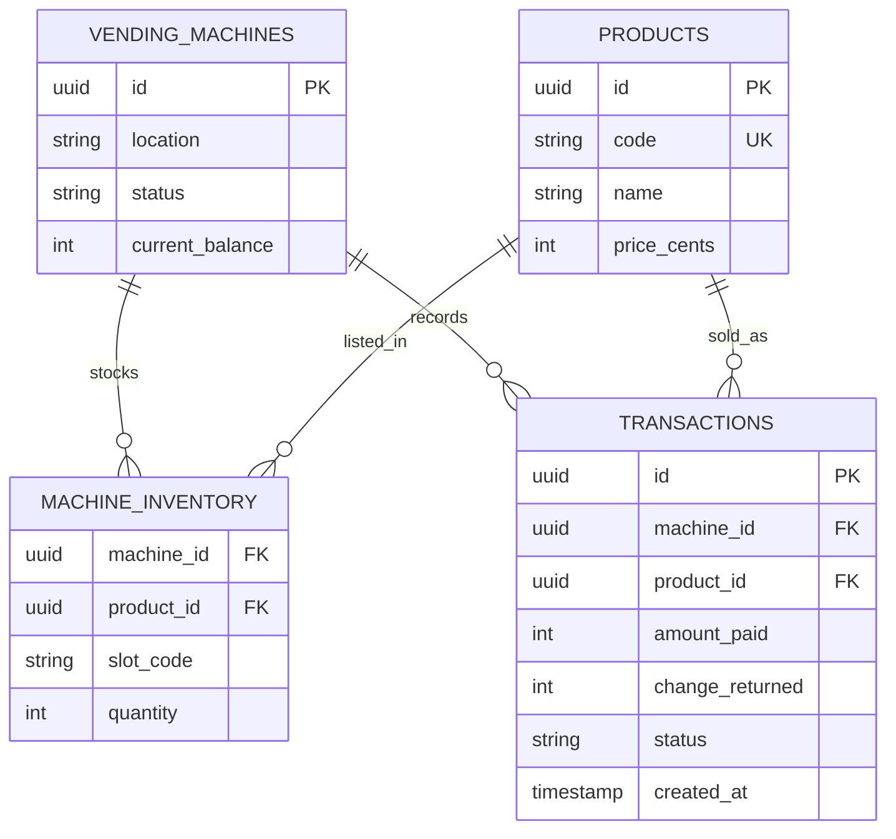
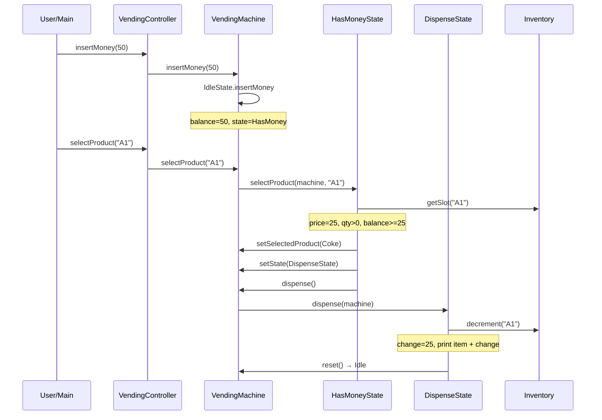

# Vending Machine — Low Level Design (Interview Guide)

> **Goal:** Understand, explain, and code this in ~60 minutes during an LLD interview.  
> **Signature pattern:** **State** — behavior changes based on machine state (Idle → HasMoney → Dispense → Idle).  
> **Reference style:** Mirrors your [Chess](../chess/LLD_CHESS.md) / [Snake & Ladder](../snakeandladder/LLD_SNAKE_AND_LADDER.md) guides — requirements → class/schema → patterns → 60-min coding plan.

---

## Code map (implemented)

Study order: `demo/VendingMachineDemo` → `models/VendingMachine` → `states/*` → `models/Inventory`.

| Feature | What | Where to read |
|---------|------|----------------|
| **1. Display inventory** | Seed products; print code/name/price/qty | `factories/ProductFactory`, `Inventory.display()` |
| **2. Insert + select** | Money accepted; validate code/stock/funds | `IdleState`, `HasMoneyState.selectProduct` |
| **3. Dispense + cancel** | Give item + change; refund on cancel | `DispenseState`, `HasMoneyState.cancel` |

**Run the demo** (no Spring needed):

- IDE: run `com.vendingmachine.vending.demo.VendingMachineDemo` (or `VendingApplication`)
- CLI (from `vending/`):

```bash
.\mvnw.cmd -q -DskipTests compile exec:java "-Dexec.mainClass=com.vendingmachine.vending.demo.VendingMachineDemo"
```

---

## Table of Contents

1. [Problem Statement](#1-problem-statement)
2. [Functional Requirements (8–10)](#2-functional-requirements-810)
3. [Out of Scope (say this upfront)](#3-out-of-scope-say-this-upfront)
4. [Clarify With Interviewer First](#4-clarify-with-interviewer-first)
5. [Package Structure](#5-package-structure)
6. [Class Diagram](#6-class-diagram)
7. [Schema Design](#7-schema-design)
8. [Design Patterns — State (deep dive)](#8-design-patterns--state-deep-dive)
9. [Core Classes — Responsibilities & Key Methods](#9-core-classes--responsibilities--key-methods)
10. [Machine Flow & Sequence Diagrams](#10-machine-flow--sequence-diagrams)
11. [Validation Rules](#11-validation-rules)
12. [60-Minute Coding Plan](#12-60-minute-coding-plan)
13. [How to Explain in Interview](#13-how-to-explain-in-interview)
14. [Sample Interview Q&A](#14-sample-interview-qa)
15. [Extension Hooks (bonus points)](#15-extension-hooks-bonus-points)
16. [Cross-Project Mapping](#16-cross-project-mapping)

---

## 1. Problem Statement

Design a **Vending Machine** that holds multiple products (code + price + quantity), accepts money (coins/notes or a balance), lets a user select a product, dispenses it if valid, and returns change. The machine must reject invalid actions depending on its **current state** (e.g. cannot dispense when idle / no money).

**Interview framing:** This is a classic **finite state machine**. The hard part is not inventory math — it is making **illegal transitions impossible** (or clearly rejected) via the **State pattern**, instead of a giant `if (state == …)` block in one class.

---

## 2. Functional Requirements (8–10)

| # | Requirement | Interview one-liner |
|---|-------------|---------------------|
| **R1** | **Inventory** — Machine stocks products identified by a code (e.g. `A1`), each with name, price, quantity. | "`Inventory` maps `code → Product` (or `ItemSlot`)." |
| **R2** | **Display / browse** — User can see available products and prices (and optionally stock). | "Read-only list; does not change state." |
| **R3** | **Insert money** — Accept coins/notes (or add to running balance). | "Increases `balance`; transition Idle → HasMoney when balance > 0." |
| **R4** | **Select product** — User enters product code. | "Only valid in HasMoney (or after enough balance); validate code + stock + price." |
| **R5** | **Dispense** — On successful selection, reduce quantity by 1 and give product to user. | "State: Dispensing → then settle change → Idle." |
| **R6** | **Change / refund** — Return leftover balance (or cancel and refund all). | "`returnChange()` / `cancel()` clears balance." |
| **R7** | **Insufficient funds / out of stock** — Fail gracefully; stay in sensible state; keep money unless cancel. | "Don't corrupt inventory; message + stay HasMoney." |
| **R8** | **State-based actions** — Same button does different things per state (or is rejected). | "**State pattern**: each state implements insert/select/cancel/dispense." |
| **R9** | **Admin restock** *(lightweight)* — Add quantity / add new product (admin mode optional). | "Mention; stub or skip in 1-hr MVP." |
| **R10** | **Transaction log** *(optional)* — Record successful purchases. | "Like Chess `Move` history — nice for schema talk." |

### Recommended MVP for 1 hour (pick with interviewer)

Agree on **3 working functionalities** to code:

1. **Setup inventory + display products**  
2. **Insert money + select product** with validation (code exists, in stock, enough balance)  
3. **Dispense + return change + reset to Idle** (plus cancel/refund)

Say explicitly: *admin restock, multi-currency, card payment, concurrency, change-making with limited coins are extensions unless time remains.*

---

## 3. Out of Scope (say this upfront)

Keep v1 small — interviewers respect scope control:

- Card / UPI / wallet payment (mention Strategy for payment later)
- Exact coin change-making with limited denomination inventory (NP-hard-ish; simplify to "return numeric change")
- Touch UI / hardware drivers / sensors
- Multi-machine network / cloud inventory sync
- Concurrent users on one machine (single session)
- Persistence / DB required for MVP (still discuss schema)
- Expiration dates, temperature, age-restricted items
- Full admin panel / cash collection reports

---

## 4. Clarify With Interviewer First

Ask these in the first **2–3 minutes** (shows product thinking):

| Question | Good default for interview |
|----------|----------------------------|
| Cash only or card too? | **Cash balance** (int / paise / cents) |
| Exact change required? | **No** — accept overpay, return change as number |
| One product per transaction? | **Yes** — then reset |
| Cancel mid-flow? | **Yes** — refund full balance |
| Sold-out machine? | Optional `SoldOutState` if all qty = 0 |
| Product identity? | Code like `A1`, `B2` (row-col) or SKU string |
| Currency unit? | Integer **cents/paise** to avoid float |

**Assumptions to state aloud:**

1. Single customer at a time.  
2. Balance is an integer.  
3. Dispense is atomic: decrement stock then clear/settle money.  
4. Invalid select does **not** take money.  
5. After successful dispense, leftover balance is returned and machine goes **Idle**.

---

## 5. Package Structure

Mirror Chess / Snake & Ladder layout:

```
vending/
├── VendingMachineMain.java              # CLI demo / game loop
├── controller/
│   └── VendingController.java           # thin: insert, select, cancel, display
├── models/
│   ├── VendingMachine.java              # context for State; holds inventory + balance
│   ├── Inventory.java                   # code → ItemSlot
│   ├── ItemSlot.java                    # product + quantity (or merge into Product)
│   ├── Product.java                     # code, name, price
│   └── Transaction.java                 # optional purchase record
├── states/
│   ├── VendingState.java                # interface
│   ├── IdleState.java
│   ├── HasMoneyState.java
│   ├── DispenseState.java               # optional; can fold into HasMoney
│   └── SoldOutState.java                # optional
├── enums/
│   ├── Coin.java                        # PENNY, NICKEL, DIME, QUARTER (or INR notes)
│   └── MachineStatus.java               # optional mirror of current state name
├── exceptions/
│   ├── InvalidProductCodeException.java
│   ├── InsufficientFundsException.java
│   ├── OutOfStockException.java
│   └── InvalidOperationException.java   # wrong action for current state
└── factories/                           # optional
    └── ProductFactory.java              # seed demo inventory
```

**Design choice to state clearly:**

| Approach | Pros | Cons |
|----------|------|------|
| **A. State pattern** — `VendingState` + Idle/HasMoney/… | Classic interview answer; OCP for new states | More classes |
| **B. Enum + switch** — `MachineStatus` + big methods | Faster to code | Ugly; violates OCP; hard to extend |

**Recommend Approach A for interview.** If severely short on time, start with enum + switch, then say *"I'd refactor to State."*

---

## 6. Class Diagram

### 6.1 Mermaid Class Diagram (draw this on whiteboard)



### 6.2 Relationships to explain verbally

| From | To | Relationship | Why |
|------|----|--------------|-----|
| `VendingController` | `VendingMachine` | Dependency | Thin API for CLI / interviewer demo |
| `VendingMachine` | `VendingState` | Composition / association | **Context** holds current state |
| `IdleState`… | `VendingState` | Implementation | Each state owns allowed behavior |
| `VendingMachine` | `Inventory` | Composition | Machine owns stock |
| `Inventory` | `ItemSlot` | Composition | Slots hold product + qty |
| `ItemSlot` | `Product` | Aggregation | Product catalog item |

### 6.3 Simplified whiteboard version (if short on time)

```
VendingController → VendingMachine
VendingMachine → Inventory (code → Product + qty)
               → balance
               → currentState: Idle | HasMoney | Dispense | SoldOut

VendingState.insertMoney / selectProduct / dispense / cancel
  Idle:      insert → HasMoney; select/dispense reject
  HasMoney:  insert ok; select → validate → Dispense; cancel → refund → Idle
  Dispense:  dispense → give item + change → Idle
```

### 6.4 State transition diagram (draw this — interviewers love it)



**One-liner:** *"Illegal operations are rejected inside the state class — the context never grows a mega-switch."*

---

## 7. Schema Design

Interviewers may ask for **in-memory structure** or **DB design**. Cover both briefly.

### 7.1 In-Memory Object Schema (primary for 1-hr coding)

```
VendingMachine
├── inventory: Inventory
├── balance: int
├── currentState: VendingState
├── selectedProduct: Product | null
└── history: List<Transaction>          // optional

Inventory
└── slots: Map<String, ItemSlot>        // key = product code

ItemSlot
├── product: Product
└── quantity: int

Product
├── code: String                        // "A1"
├── name: String                        // "Coke"
└── price: int                          // 125 = ₹1.25 or $1.25 — pick unit

Transaction (optional)
├── productCode: String
├── amountPaid: int
├── change: int
└── timestamp: long
```

**Coin enum (optional — if they want denominations):**

```
Coin: NICKEL=5, DIME=10, QUARTER=25, DOLLAR=100
insertCoin(Coin) → machine.insertMoney(coin.getValue())
```

For MVP, `insertMoney(int amount)` is enough.

### 7.2 Database Schema (if interviewer asks "production / persistence")

```text
┌──────────────────┐       ┌──────────────────┐
│  vending_machines│       │    products      │
├──────────────────┤       ├──────────────────┤
│ id (PK)          │       │ id (PK)          │
│ location         │       │ code (UNIQUE)    │
│ status           │       │ name             │
│ current_balance  │       │ price_cents      │
└────────┬─────────┘       └────────┬─────────┘
         │                          │
         │         ┌────────────────▼─────────┐
         │         │   machine_inventory      │
         │         ├──────────────────────────┤
         └────────►│ machine_id (FK)          │
                   │ product_id (FK)          │
                   │ quantity                 │
                   │ slot_code                │
                   └──────────────────────────┘

┌──────────────────┐
│  transactions    │
├──────────────────┤
│ id (PK)          │
│ machine_id (FK)  │
│ product_id (FK)  │
│ amount_paid      │
│ change_returned  │
│ status           │  // SUCCESS / CANCELLED / FAILED
│ created_at       │
└──────────────────┘
```

### 7.3 ER Diagram (Mermaid)



**Note:** Runtime `currentState` is usually **not** persisted mid-purchase for a single-user machine; persist inventory + transaction history. Session balance lives in memory.

---

## 8. Design Patterns — State (deep dive)

### 8.1 Why State here?

Without State:

```
void selectProduct(code) {
  if (status == IDLE) reject;
  else if (status == HAS_MONEY) { ... }
  else if (status == DISPENSE) reject;
  else if (status == SOLD_OUT) reject;
}
```

Every new state multiplies conditionals across **all** methods → brittle.

With State: **each state class** implements the same interface; only legal transitions call `machine.setState(...)`.

### 8.2 Pattern roles (say this)

| Role | In this design |
|------|----------------|
| **Context** | `VendingMachine` — holds state + shared data (`balance`, `inventory`) |
| **State interface** | `VendingState` — `insertMoney`, `selectProduct`, `dispense`, `cancel` |
| **Concrete states** | `IdleState`, `HasMoneyState`, `DispenseState`, `SoldOutState` |

### 8.3 Behavior matrix (memorize — whiteboard gold)

| Action \ State | Idle | HasMoney | Dispense | SoldOut |
|----------------|------|----------|----------|---------|
| `insertMoney` | ✓ → HasMoney | ✓ add more | ✗ | ✗ (or allow admin) |
| `selectProduct` | ✗ | ✓ validate → Dispense | ✗ | ✗ |
| `dispense` | ✗ | ✗ / or auto | ✓ → Idle | ✗ |
| `cancel` | no-op | ✓ refund → Idle | ✗ / rare | ✗ |

### 8.4 Other patterns (mention, don't over-build)

| Pattern | Where | Why |
|---------|-------|-----|
| **State** | Machine lifecycle | Core of this problem |
| **Factory** | Seed inventory / create states | Optional; `new IdleState()` is fine |
| **Strategy** | `PaymentStrategy` (Cash vs Card) | Extension if interviewer asks payment types |
| **Singleton** | One machine instance | Usually **avoid** unless asked — hurts testability |
| **MVC-ish** | Controller + Machine | Matches your other LLD projects |

### Patterns to mention but NOT implement in 1 hour

| Pattern | When |
|---------|------|
| **Observer** | Notify admin when stock low |
| **Command** | Undo last admin restock |
| **Decorator** | Surge pricing / discount wrapper on Product |

---

## 9. Core Classes — Responsibilities & Key Methods

> Pseudocode signatures — **no full implementation** (you will code this yourself).

### 9.1 `VendingController` (stateless)

```
insertMoney(machine, amount) → void
selectProduct(machine, code) → void
cancel(machine) → void
displayInventory(machine) → void
```

### 9.2 `VendingMachine` (Context)

```
VendingMachine(Inventory inventory):
  this.inventory = inventory
  this.balance = 0
  this.currentState = new IdleState()
  this.selectedProduct = null

// Delegate ALL user actions to current state:
insertMoney(amount):
  currentState.insertMoney(this, amount)

selectProduct(code):
  currentState.selectProduct(this, code)

dispense():
  currentState.dispense(this)

cancel():
  currentState.cancel(this)

// Helpers used BY states (package-visible or public for interview speed):
setState(VendingState s)
addBalance(int amount)
getBalance() / setBalance(int)
getInventory()
setSelectedProduct(Product p)
reset():
  balance = 0
  selectedProduct = null
  setState(new IdleState())
  // if inventory.isAllSoldOut() → SoldOutState
```

### 9.3 `VendingState` interface

```
insertMoney(VendingMachine machine, int amount)
selectProduct(VendingMachine machine, String code)
dispense(VendingMachine machine)
cancel(VendingMachine machine)
```

### 9.4 `IdleState`

```
insertMoney(machine, amount):
  if amount <= 0 → reject
  machine.addBalance(amount)
  machine.setState(new HasMoneyState())

selectProduct(...): throw InvalidOperationException("Insert money first")
dispense(...):      throw InvalidOperationException(...)
cancel(...):         no-op / message "Nothing to cancel"
```

### 9.5 `HasMoneyState`

```
insertMoney(machine, amount):
  if amount <= 0 → reject
  machine.addBalance(amount)          // stay in HasMoney

selectProduct(machine, code):
  slot = machine.inventory.getSlot(code)
  if slot == null → InvalidProductCodeException
  if slot.quantity <= 0 → OutOfStockException
  if machine.balance < slot.product.price → InsufficientFundsException
  machine.setSelectedProduct(slot.product)
  machine.setState(new DispenseState())
  machine.dispense()                  // auto-dispense (common in interviews)
  // OR wait for explicit dispense() call — pick one and say it

cancel(machine):
  change = machine.balance
  print "Refund: " + change
  machine.reset()                     // → Idle

dispense(...): reject ("Select a product first")
```

### 9.6 `DispenseState`

```
dispense(machine):
  product = machine.selectedProduct
  machine.inventory.decrement(product.code)
  change = machine.balance - product.price
  print "Dispensed: " + product.name
  print "Change: " + change
  // optional: history.add(new Transaction(...))
  machine.reset()                     // balance cleared, Idle
  if machine.inventory.isAllSoldOut():
    machine.setState(new SoldOutState())

insertMoney / selectProduct / cancel:
  reject ("Dispensing in progress")   // or allow cancel before physical dispense
```

### 9.7 `Inventory`

```
addProduct(Product p, int qty)
getSlot(code) → ItemSlot?
isAvailable(code) → qty > 0
decrement(code):
  if qty <= 0 → throw
  qty--
isAllSoldOut() → all slots qty == 0
display(): print code, name, price, qty
```

### 9.8 Minimal happy-path algorithm (say this in 30 seconds)

```
1. User inserts money → Idle → HasMoney, balance += amount
2. User may insert more money
3. User selects code → validate stock + price
4. Enter Dispense → qty--, return change, reset → Idle
5. Or user cancels → refund balance → Idle
```

---

## 10. Machine Flow & Sequence Diagrams

### 10.1 CLI main loop (demo)

```
main():
  inventory = seedProducts()   // A1 Coke 25, A2 Pepsi 35, B1 Water 20
  machine = new VendingMachine(inventory)
  controller = new VendingController()

  loop:
    print menu: 1.Display 2.Insert 3.Select 4.Cancel 5.Exit
    switch choice:
      1 → controller.displayInventory(machine)
      2 → controller.insertMoney(machine, amount)
      3 → controller.selectProduct(machine, code)
      4 → controller.cancel(machine)
```

### 10.2 Successful purchase sequence



### 10.3 Cancel / refund sequence

```
insertMoney(40) → HasMoney
cancel() → print Refund 40 → reset → Idle
```

---

## 11. Validation Rules

| Rule | When | Behavior |
|------|------|----------|
| amount ≤ 0 | insert | Reject; stay in current state |
| Unknown code | select | Exception / message; keep balance |
| qty == 0 | select | OutOfStock; keep balance |
| balance < price | select | InsufficientFunds; keep balance / allow more insert |
| Wrong state action | any | `InvalidOperationException` with clear message |
| After dispense | — | balance = 0, selected = null, Idle (or SoldOut) |

**Invariant to state:** *Never decrement stock unless payment is committed in the same successful path.*

---

## 12. 60-Minute Coding Plan

| Time | What to do |
|------|------------|
| **0–5 min** | Requirements + out of scope + MVP 3 features + assumptions |
| **5–15 min** | Draw state diagram + class sketch (Machine, State, Inventory, Product) |
| **15–25 min** | Code `Product`, `ItemSlot`, `Inventory`, seed data, display |
| **25–40 min** | Code `VendingState` + `IdleState` + `HasMoneyState` + `DispenseState` |
| **40–50 min** | Wire `VendingMachine` + controller + CLI happy path |
| **50–55 min** | Demo: insert → select → dispense+change; insert → cancel refund |
| **55–60 min** | Mention SoldOut, Payment Strategy, DB schema, concurrency as extensions |

### Must-demo scripts (practice these)

```
# Happy path
Display → Insert 50 → Select A1 (price 25) → Dispense Coke, change 25 → Idle

# Insufficient funds
Insert 10 → Select A1 (25) → error, balance still 10 → Insert 20 → Select A1 → success

# Cancel
Insert 30 → Cancel → Refund 30 → Idle

# Out of stock
Select sold-out code → error, money kept
```

### If running behind (cut order)

1. Drop `SoldOutState` — stay Idle with empty slots failing on select  
2. Drop `Transaction` history  
3. Merge `DispenseState` into `HasMoneyState.selectProduct` (dispense inline)  
4. Keep State interface with **Idle + HasMoney only** — still shows the pattern  

---

## 13. How to Explain in Interview

### Opening (60 seconds)

> "I'll design a vending machine as a state machine. Core entities: Machine, Inventory/Product, and States. User can insert money, select a product, get the item and change, or cancel for a refund. I'll use the **State pattern** so each state decides which operations are allowed, instead of a large switch on status."

### While drawing

1. Draw **state circles** first (Idle → HasMoney → Dispense → Idle).  
2. Then boxes: Machine (context), Inventory, Product.  
3. Show `Machine` delegates to `currentState`.  
4. Only then dive into method signatures.

### While coding

- Narrate transitions: *"Insert in Idle bumps balance and sets HasMoney."*  
- Show one rejection path: *"Select in Idle throws — forces correct UX."*  
- Prefer clear exceptions/messages over silent no-ops (easier for interviewer to follow).

### Closing (30 seconds)

> "MVP covers inventory display, payment, validated select, dispense with change, and cancel. Extensions: card payment via Strategy, admin restock, limited coin change-making, low-stock Observer alerts, persistence of inventory and transactions."

---

## 14. Sample Interview Q&A

**Q: Why not a single class with an enum state?**  
A: Works for 2–3 states; explodes as rules grow. State classes localize behavior and keep Machine thin. Enum+switch is a fine first draft I'd refactor.

**Q: Where do you put balance — in Machine or State?**  
A: In **Machine (context)**. States are behavior; shared data stays on context so states stay lightweight.

**Q: Should select auto-dispense or be two steps?**  
A: Either is fine. Auto-dispense after successful select is simpler for 1 hour. Two-step is closer to real hardware (press select, then confirm).

**Q: How do you handle change with limited coins in the drawer?**  
A: Separate `CashRegister` + greedy/`ChangeStrategy`. Out of scope for MVP — return numeric change assuming infinite drawer.

**Q: How is this different from ATM LLD?**  
A: Same State idea (Idle → CardInserted → PinVerified → …). ATM adds auth + banking service; vending adds inventory + change. Patterns transfer.

**Q: Thread safety?**  
A: One session per machine for MVP. Production: lock per machine or queue requests; inventory decrement must be atomic with payment commit.

**Q: Floats for money?**  
A: No — use **integer cents/paise**.

**Q: Open/Closed?**  
A: New state (e.g. `MaintenanceState`) = new class + transitions; Machine methods stay as delegations.

---

## 15. Extension Hooks (bonus points)

| Extension | Hook in design |
|-----------|----------------|
| Card / UPI | `PaymentStrategy.pay(amount)` |
| Limited coin change | `CashRegister.dispenseChange(change)` |
| Admin restock | `MaintenanceState` or admin API on Inventory |
| Low stock alert | `Observer` on decrement when qty < threshold |
| Multiple machines | `VendingMachineRepository` + machineId |
| Discounts | `PricingStrategy` on Product |
| Persistence | Tables in §7; load inventory at startup |

---

## 16. Cross-Project Mapping

| Concept | TicTacToe / Chess | Snake & Ladder | **Vending** |
|---------|-------------------|----------------|-------------|
| Orchestrator | `Game` | `Game` | `VendingMachine` |
| Controller | `GameController` | `GameController` | `VendingController` |
| Key pattern | Strategy / Polymorphism | Strategy (Dice) | **State** |
| History | `List<Move>` | `List<Move>` | `List<Transaction>` |
| Illegal action | Invalid move | Bad jumper config | Wrong-state operation |
| End / reset | Game over | Winner | Reset to Idle after dispense |

**Study tip:** If you know Chess piece polymorphism and Snake & Ladder Strategy, Vending is the third pillar — **State** for workflow machines (Vending, ATM, Elevator door/mode, Order lifecycle).

---

## Quick Revision Card (read night before)

```
REQUIREMENTS: inventory, insert money, select, dispense+change, cancel/refund
MVP CODE:     display + insert/select validation + dispense/cancel with State
PATTERN:      State — Context=VendingMachine, States=Idle/HasMoney/Dispense
DATA:         Map<code, (Product, qty)> + int balance
TRANSITIONS:  Idle --insert--> HasMoney --valid select--> Dispense --done--> Idle
FAIL PATHS:   bad code / OOS / insufficient funds → keep money, stay HasMoney
SCHEMA:       machines, products, machine_inventory, transactions
SKIP:         card pay, coin drawer algorithm, UI, concurrency
```

---

*Practice: explain state diagram in 2 minutes, then code Idle + HasMoney + Dispense without looking. That alone covers a strong 1-hour interview.*
